### **Netdiscover**

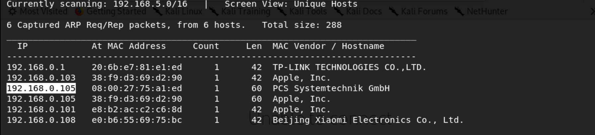

We use the tools called netdiscover scan hosts, we found the 192.168.0.106 is our target virtualbox host ip. 

------

### **Namp**

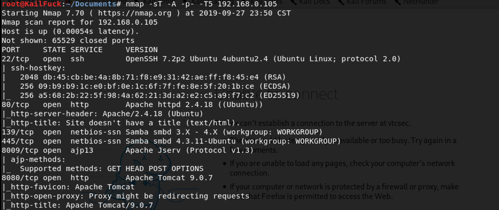

We found some services <u>SSH</u>, <u>HTTP</u>, <u>FTP</u>

------

### Solution

By using enum4linux , we found share directory and users

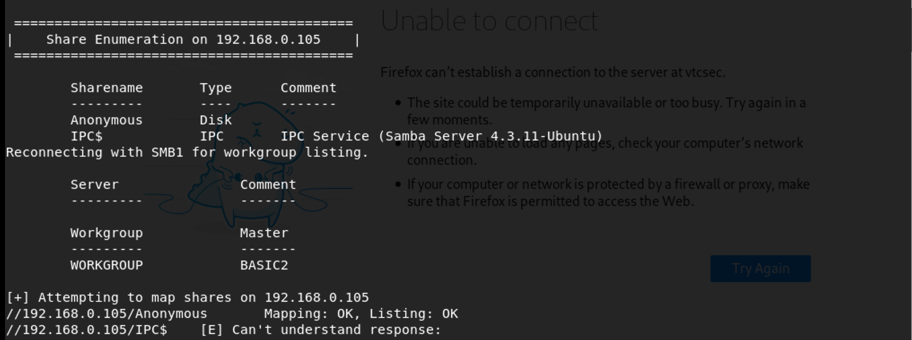

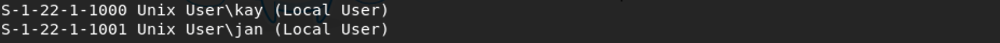

We found share directory ==>**Anonymous**

Users ==> **kay, jan**

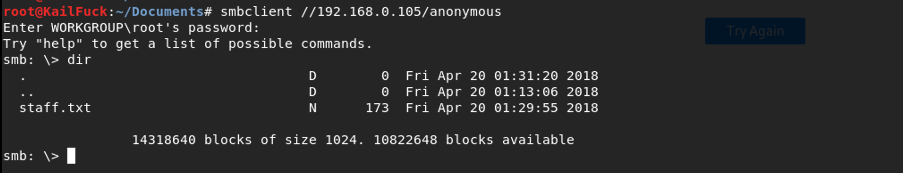

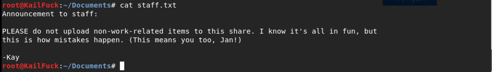

So we connect to the smb share directory and read the file.We can infered that the system may exists some vulnerable problem. So we turned to the http server.

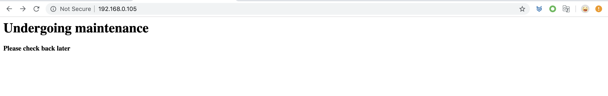

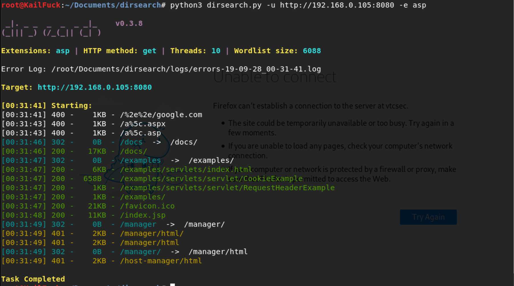

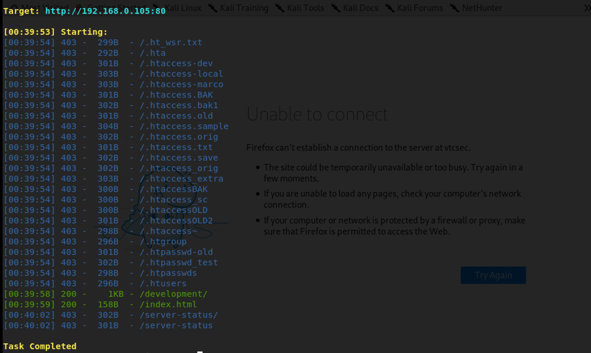

We found /manager in 8080 server and /development.Sadly i guess some password failed in /manager Page

So we use /development accroding http://192.168.0.105's hint

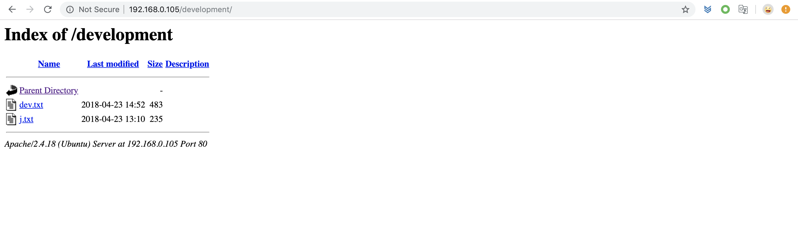

therss existed two files, we looked in j.txt.

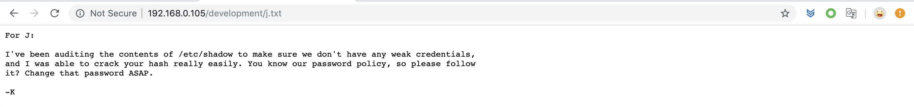

We found the password strength of jan may be weak, so we use hydra to brute force.

We got the password of jan, the password is **armando**, so we ssh in jan.

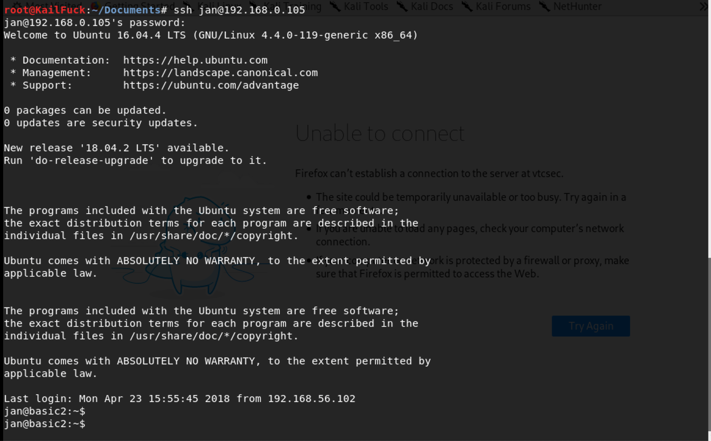

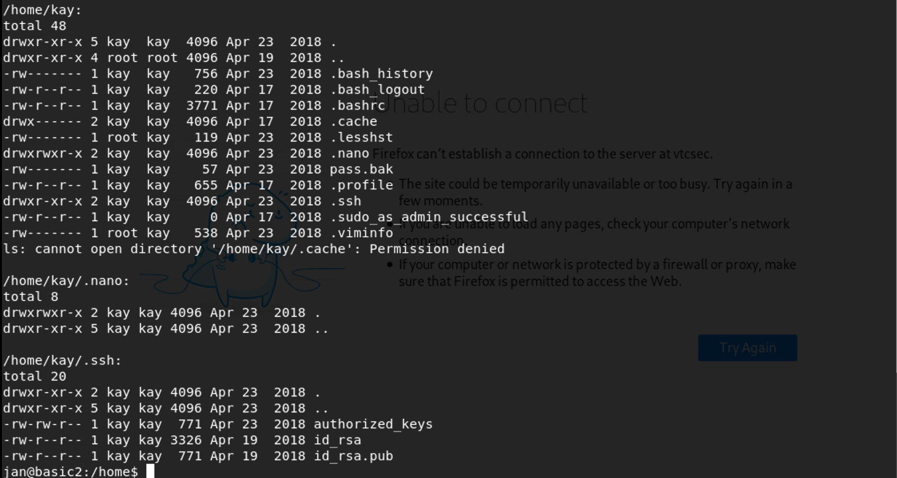

Let's find wether that jan owns sudo privilege.

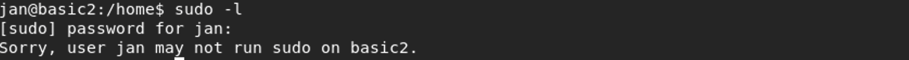

So we use find to look which owns suid privilege file.

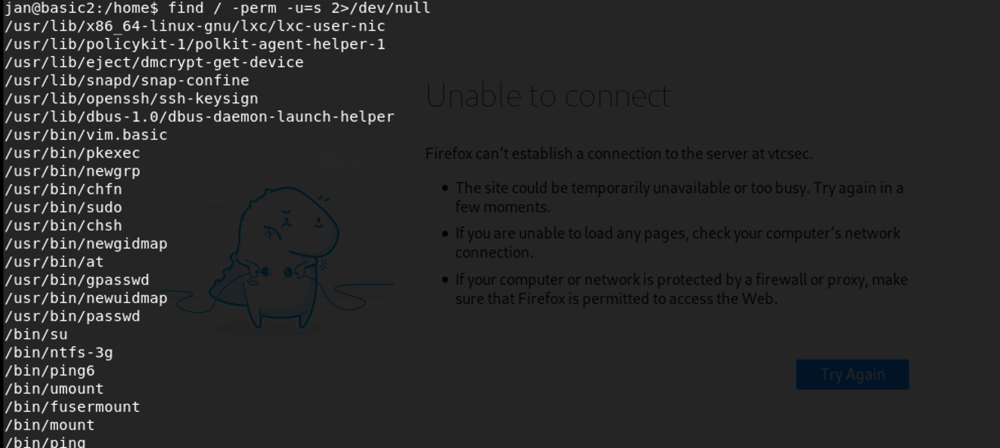

We found  /usr/bin/vim.basic owns suid, so we can use vim.basic to write or read file in root privilege.

So we read /home/kay/pass.bak, password found.

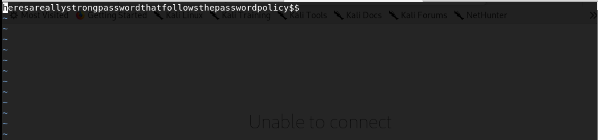

Let's ssh in kay. Successfully!!!

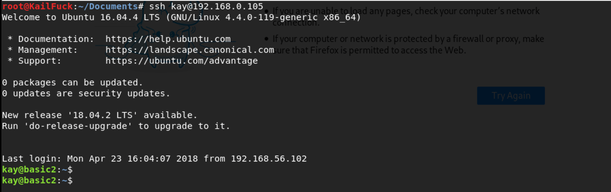

And we found kay is owns sudo privilege with all:all

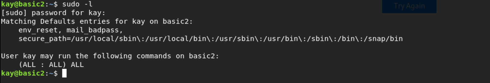

Then We su hacker

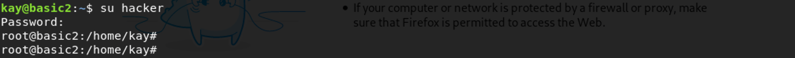

------

Otherwise, We also use vim.basic root privilege to write a root user line in /etc/passwd, so we can login root

straightly, The images is in our directory of  images/basic_pentesting2.

------

Successfully!!!

Just do it.

------

**That' all , Thanks for your watching**