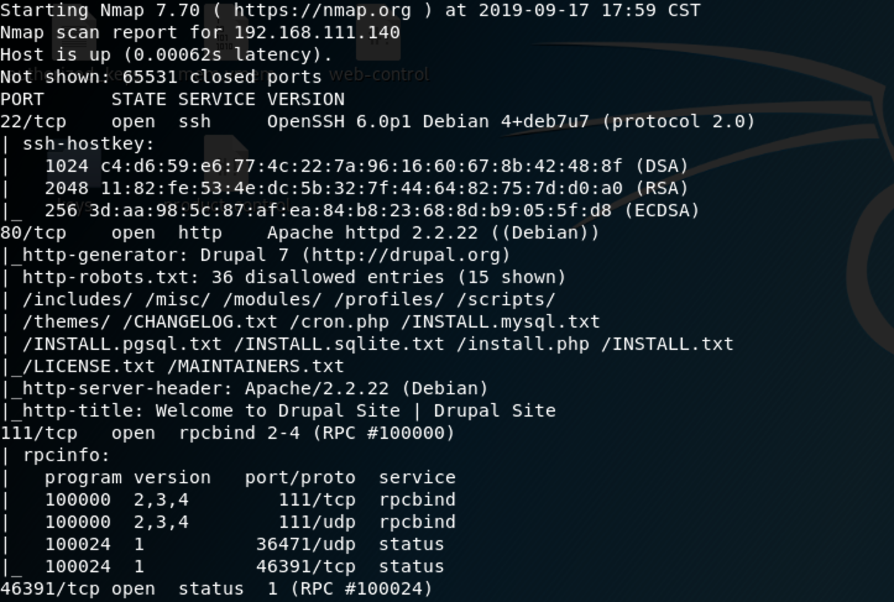
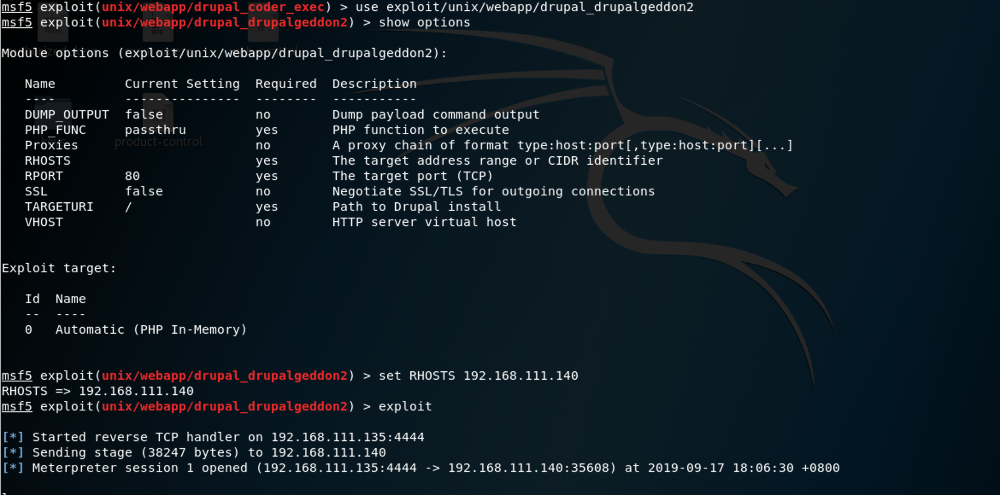
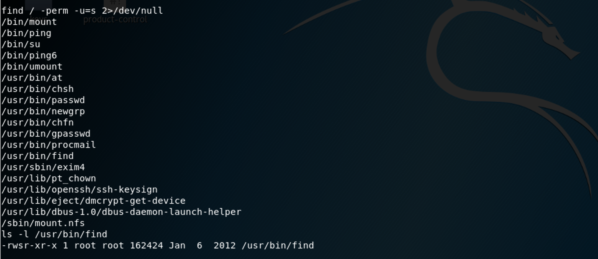
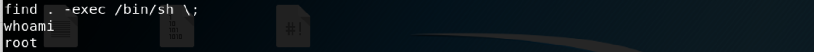

### **Netdiscover**

We use the tools called netdiscover scan hosts, we found the 192.168.111.140 is our target virtualbox host ip.

------

### **Namp**

We found some services <u>SSH</u>, <u>HTTP</u>

------

### Solution

We find wesite powered by drupal 7, so we search with msf to see whether any exploit can use.

We can find that there exists some exploit

We use unix/webapp/drupal_drupalgeddon2 to get reverse shell, so find some owns suid permission file.

Luckily, thers exists find have suid root permission. so we execute the command.

`find . -exec /bin/sh \;`

Successfully!!!

------

**That' all , Thanks for your watching**