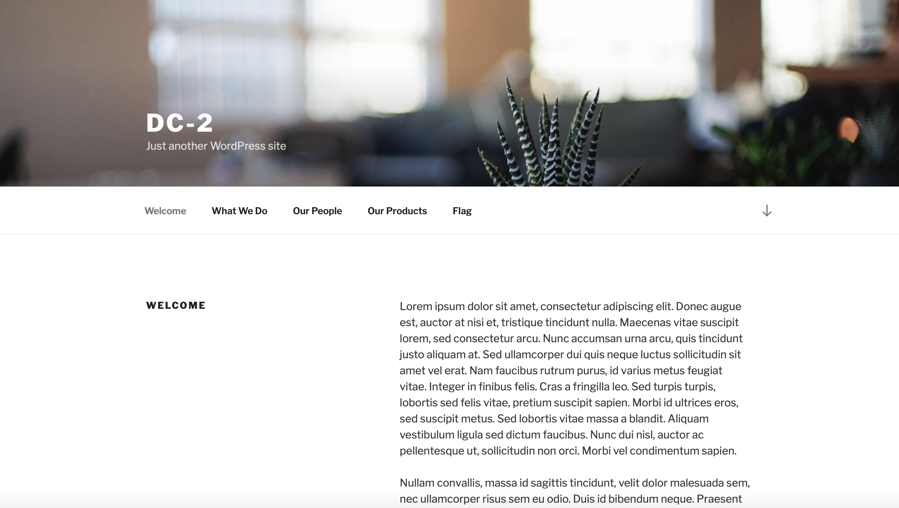
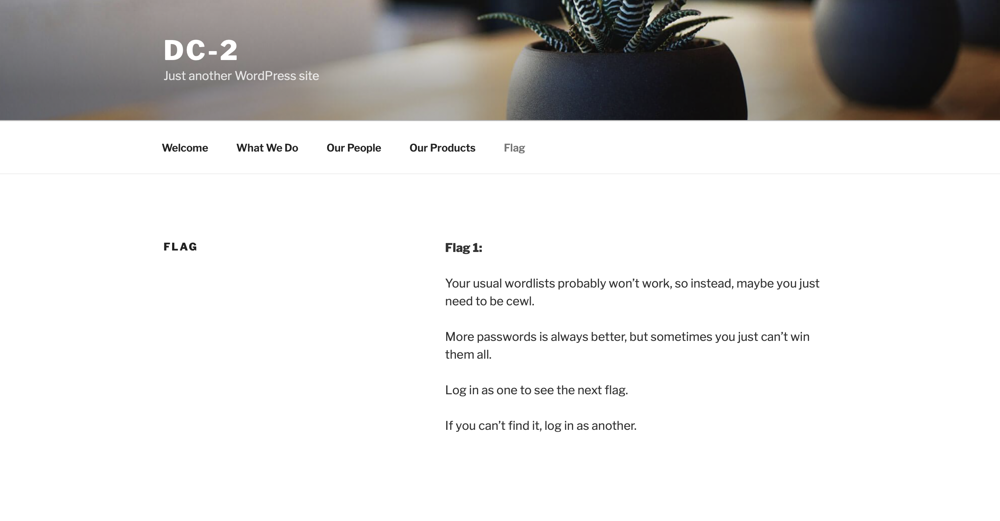
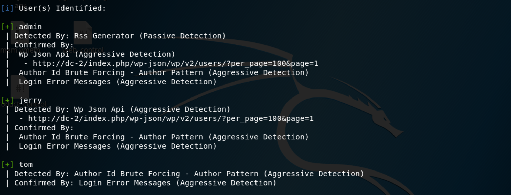
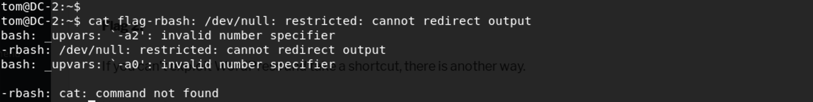
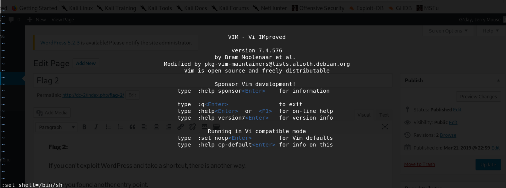
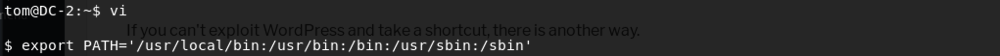
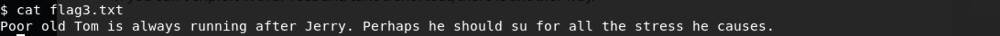
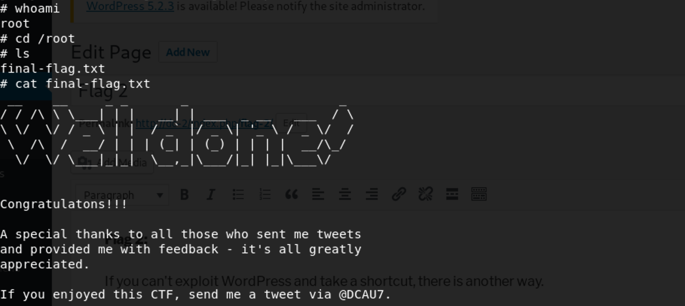

### **Netdiscover**

We use the tools called netdiscover scan hosts, we found the 192.168.0.109 is our target virtualbox host ip.

------

### **Namp**

We found some services <u>SSH</u>, <u>HTTP</u>

------

### Solution

We found this a wordpress website. we find a flag1.

his hint we just need to be cwel(a kali linux social dictionary generator)

`cewl http://dc-2/ -w word_dc2.txt`

Now we have social dictionary, but we have anything about users.

Let's to scan with wpscan(target for wordpress)

We found three users: **<u>admin, jerry, tom</u>**, we try to brute force with our social dictionary.

So let's try to login with jerry, tom, unluckily, only tom successfuly.

we can find command may be exported to PATH env, so we use a vi trick.

Now we find flag3.txt, and his hint is to su jerry. su we su - jerry with his password.

yeah, flag4 got, lack of flag2, so we login in /web-admin, we can find.

Final , we should get root privilege. At first, see whether if jerry owns sudo privilege.

So, we use git to escalation root privilege.

`sudo git config --help`

Successfully!!!

------

**That' all , Thanks for your watching**