### **Netdiscover**

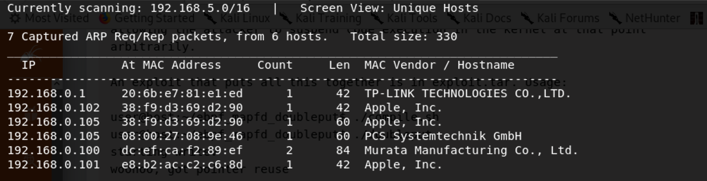

We use the tools called netdiscover scan hosts, we found the 192.168.0.106 is our target virtualbox host ip.

------

### **Namp**

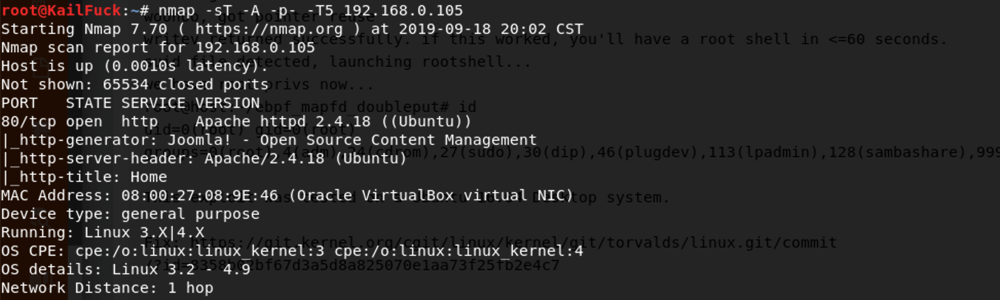

We found some services <u>HTTP</u>

------

### Searchsploit & Msf

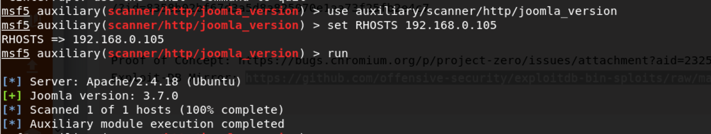

By searchsploit joomla version, we can find one exploit ways existed.we save this exploit scripts

------

### Solution

we cat exsploit and use these payload

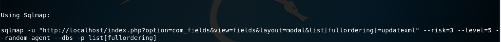

We use this payload ==> get database

`sqlmap -u "http://192.168.0.105/index.php option=com_fields&view=fields&layout=modal&list[fullordering]=updatexml" --risk=3 --level=5 --random-agent --dbs`

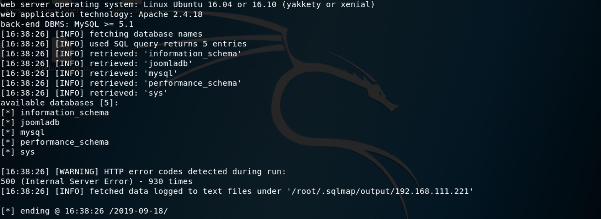

We use this payload ==> get tables

`sqlmap -u "http://192.168.0.105/index.php option=com_fields&view=fields&layout=modal&list[fullordering]=updatexml" --risk=3 --level=5 --random-agent -D joomladb --tables`

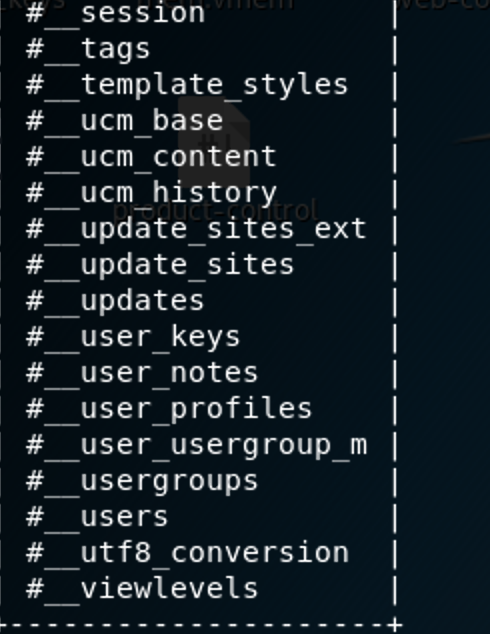

We use this payload ==> get tables

`sqlmap -u "http://192.168.0.105/index.php option=com_fields&view=fields&layout=modal&list[fullordering]=updatexml" --risk=3 --level=5 --random-agent -D joomladb --tables -T '#__users' -C name,password --dump`

So user admin's password hash is got. let's to use john to brute force it, the password is **snoopy**

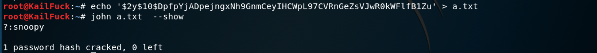

Now we login in this web admin pages.

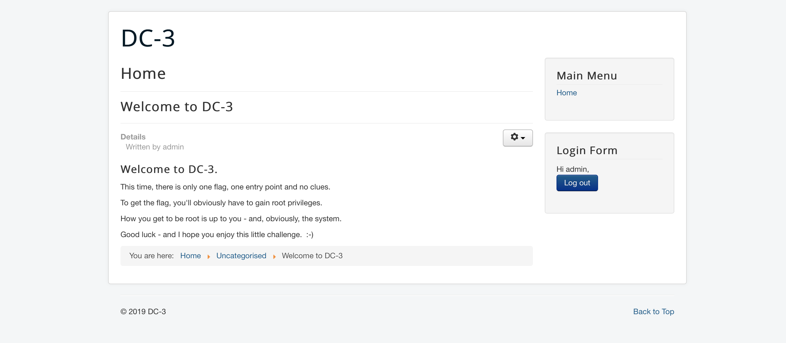

we use gobuster to scan, found /administrator, /robots.txt.dist, /templates, so we login in /administrator

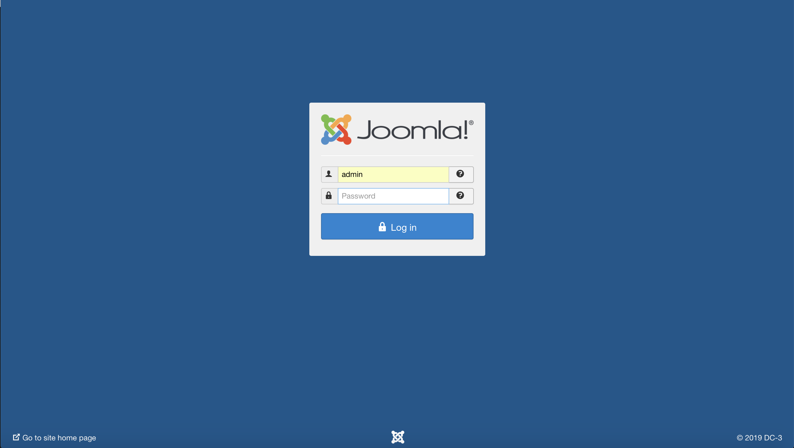

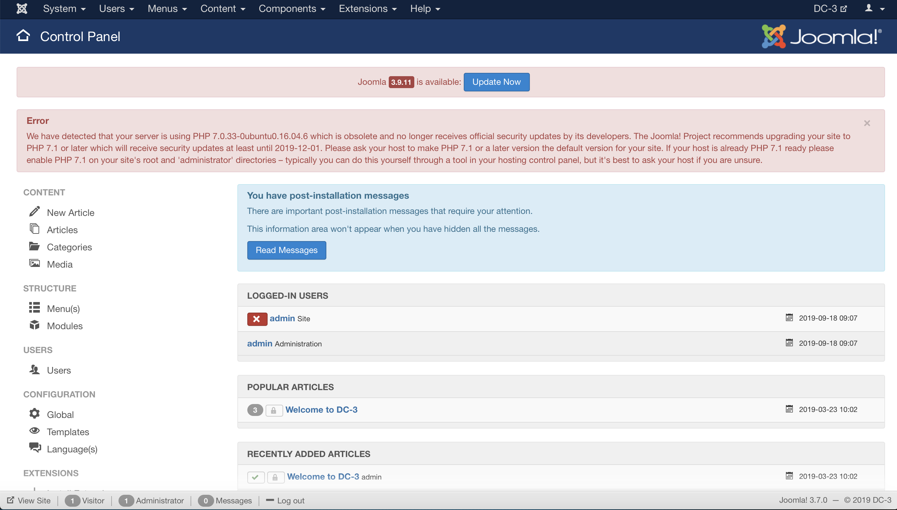

Now we should use template to reverse shell to get www-data privilege.

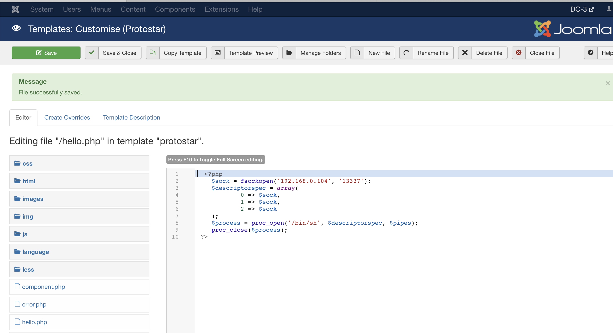

So when we link to this http://192.168.0.105/templates/protostar/hello.php,  connected successfully!!

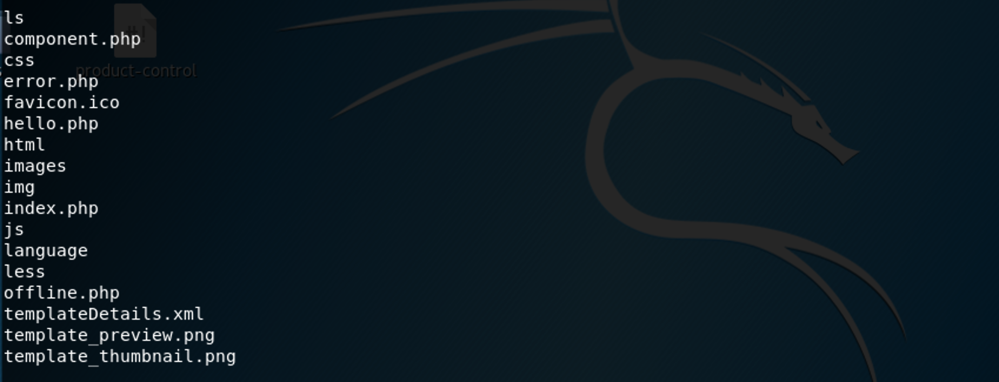

we try enum the system scripts, but found nothing. then try to find system version.

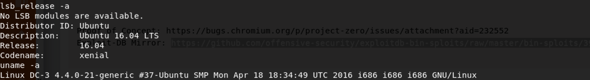

use searchsploit

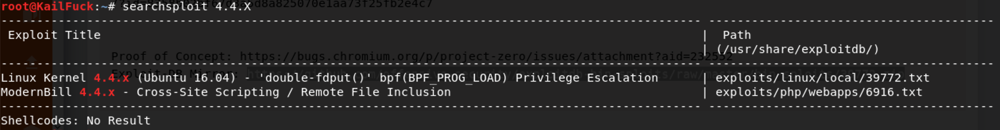

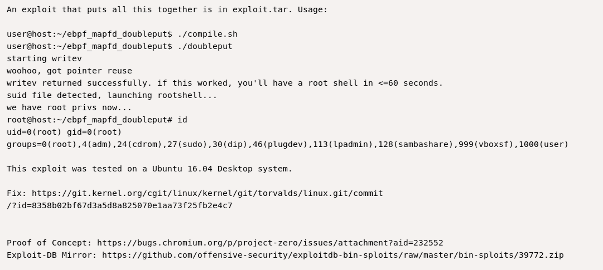

So i wget this zip from my apache server, unzip it .

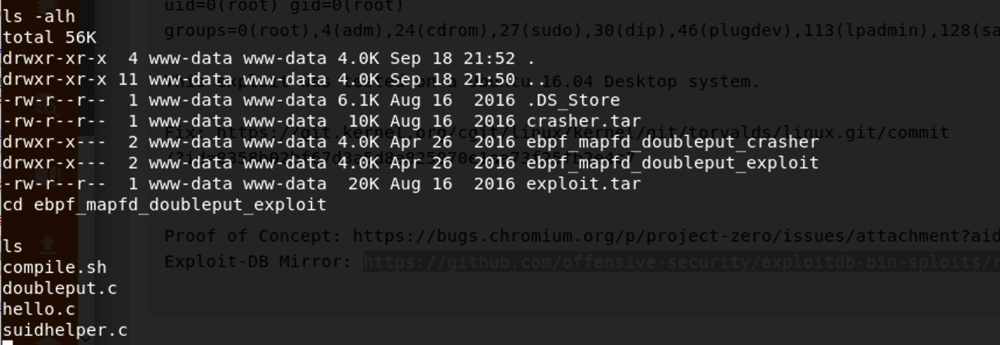

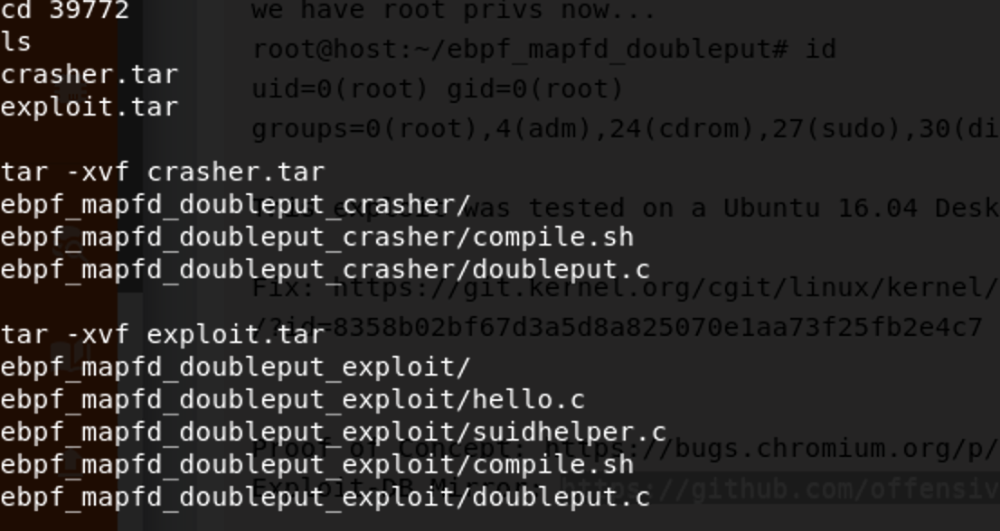

accroding to the exploit steps, we should execute ./compile.sh, then ./doubleput.

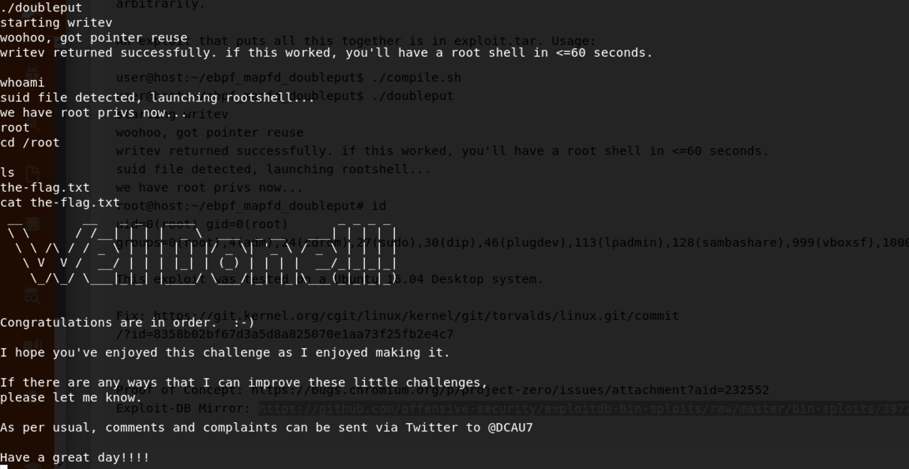

Successfully!!!

------

**That' all , Thanks for your watching**