### **Netdiscover**

We use the tools called netdiscover scan hosts, we found the 192.168.0.106 is our target virtualbox host ip.

------

### **Namp**

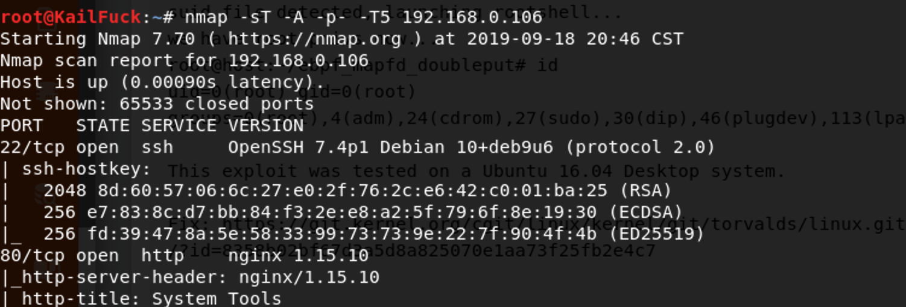

We found some services <u>HTTP</u>

------

### Gobuster

Brute force the web dir, but nothing.So we choose to brute force the php file.

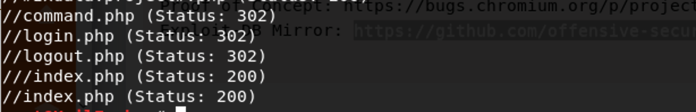

But when we  link to /command.php, found that this page is redirect to index.php

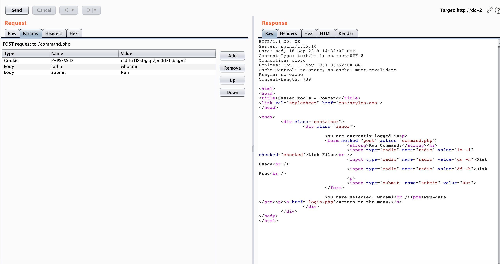

Emmmm, we should login. So we only brute force with brup suite intrude with user : admin.

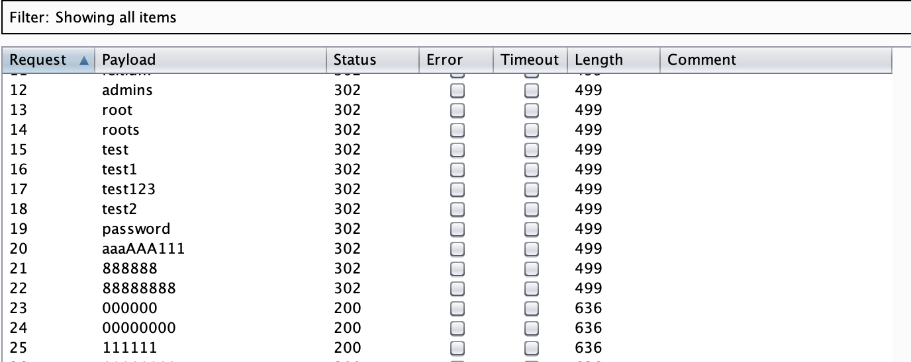

find some password with admin,  admin: root

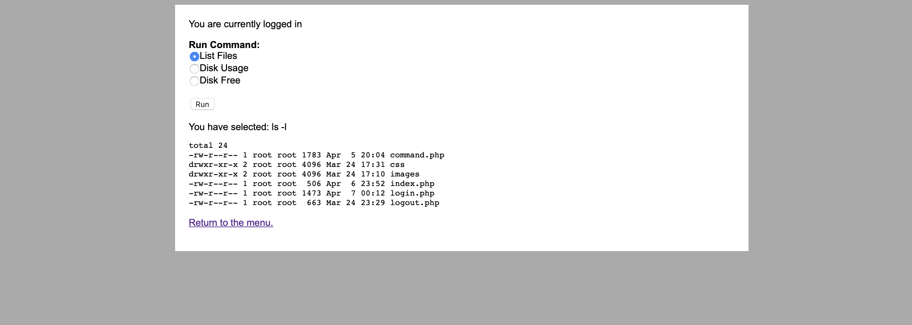

We guess that we can command line inject attack.

We execute the command `nc -nlvp 13337` to reserve a shell.

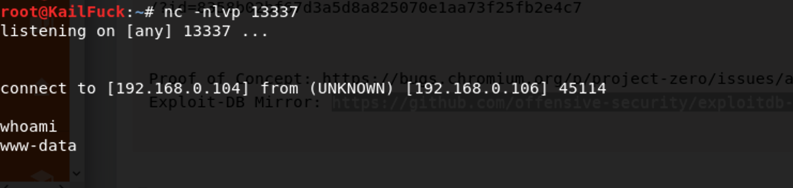

We try to find the file owning suid privilege, but nothing.

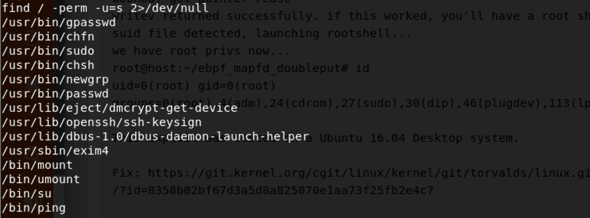

So we went into /home directory.

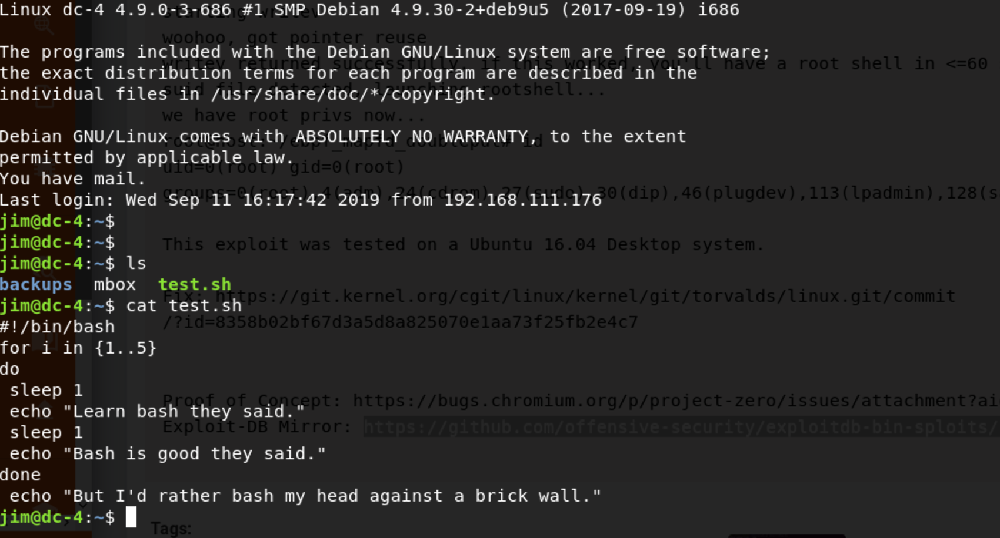

We found a interesting file ==> old-passwords.bak

we save old-passwords.bak in our local kail host.then we use hydra to brute force the old-passwords.bak

`hydra -l jim -P old-password.bak ssh://192.168.0.106`

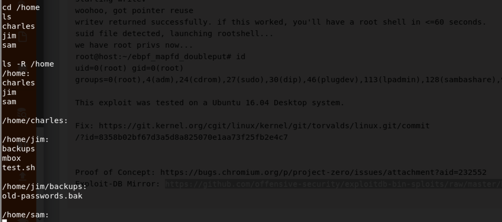

Luckily , user **jim** == > password  **jibril04**, let's ssh with jim's password.

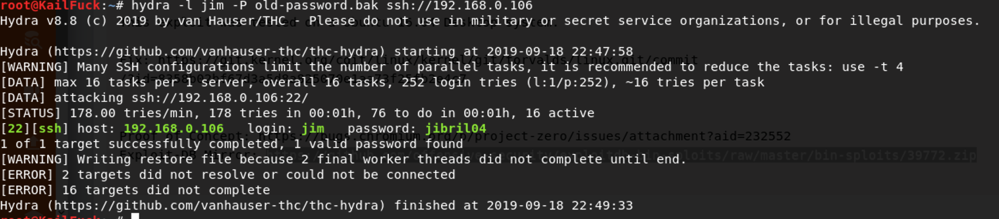

We cat  the test.sh and mbox, find mbox is a mail from root

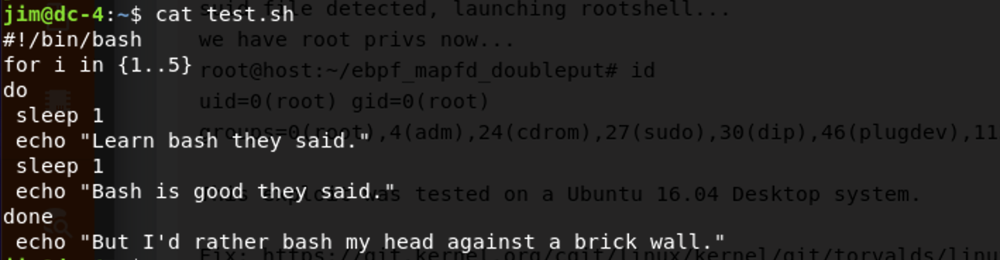

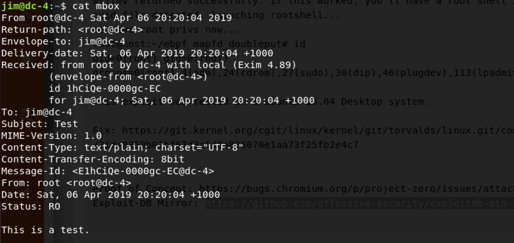

So we can go to /var/mail for a see

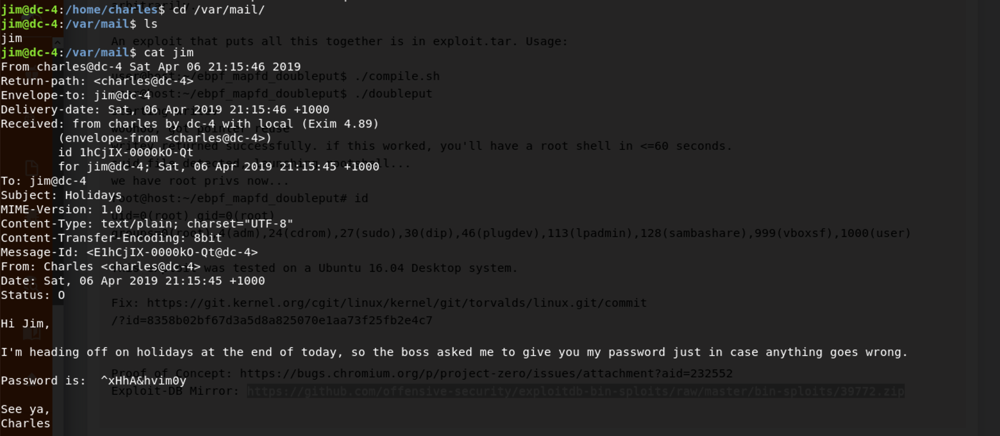

charles's password found ==> ^xHhA&hvim0y

let's login in ssh with charles

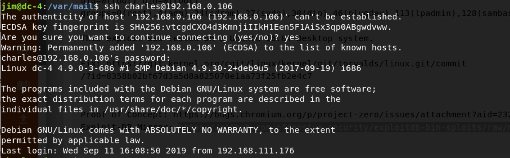

find the charles wether has a sudo permission

teehee can append line to file, so we can append a root user to /etc/passwd

`echo "hacker::0:0:::/bin/bash" | sudo teehee -a /etc/passwd`

So let's login in hacker(root privilege)

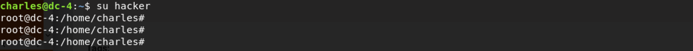

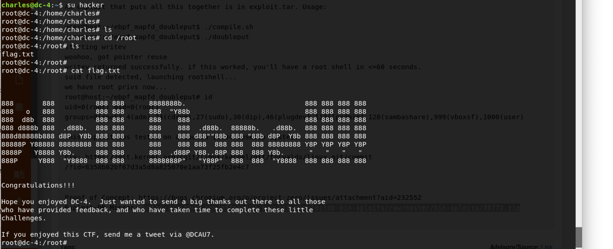Successfully!!!

------

**That' all , Thanks for your watching**