### **Netdiscover**

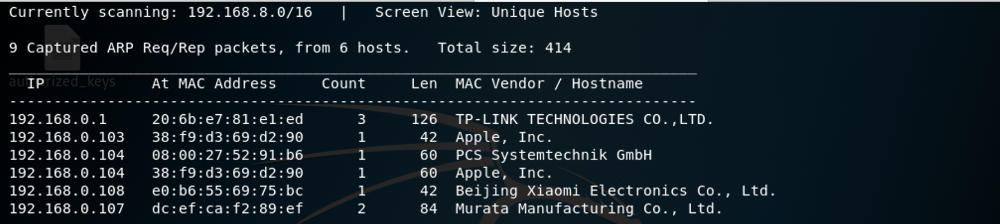

We use the tools called netdiscover scan hosts, we found the 192.168.0.104 is our target virtualbox host ip. 

------

### **Namp**

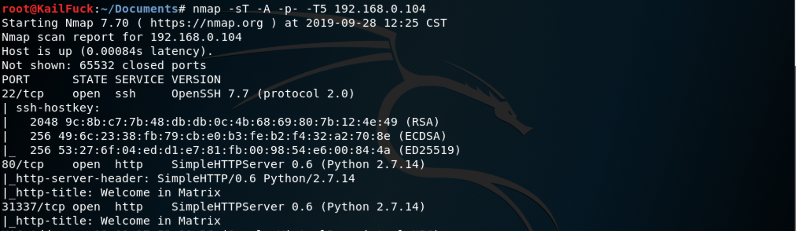

We found some services <u>SSH</u>, <u>HTTP</u>

------

### Solution

We centered into the http://192.168.0.104:80/ and http://192.168.0.104:31337/ , nothing found.

So we viewed page resource of the   http://192.168.0.104:31337/

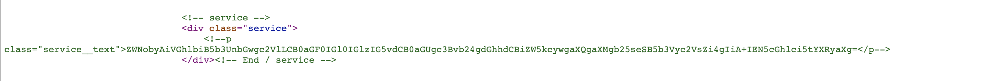

We found a string like base64 encoded. So we decoded it.

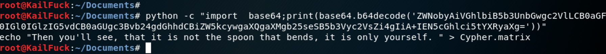

Maybe this cur directory has Cypher.matrix. In fact, this a file, we downloaded from the url.

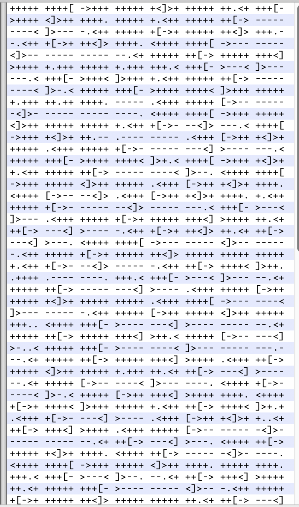

Yeah, This a brainfuck code, we decoded it from online deocde website.

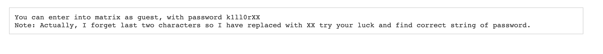

We could know his most of password, so we build brute-force dictionary.

We use hydra to brute force it.

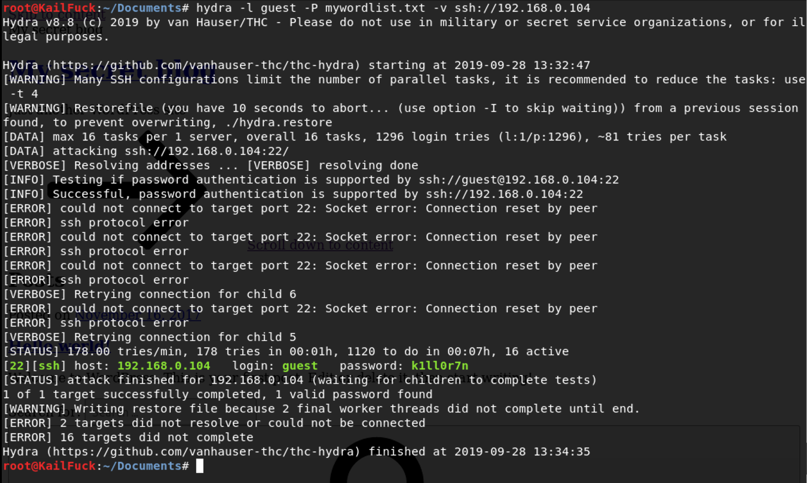

We found the password of **guest**, the password is **k1ll0r7n**

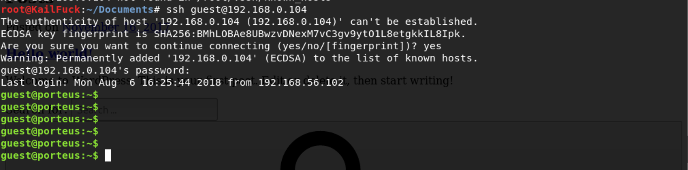

So we ssh to login with guest user, successfully!!

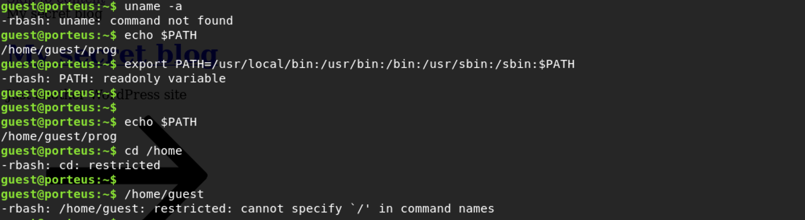

Sadlly, the bash is rbash, many commands are restricted. So we use vi trick.

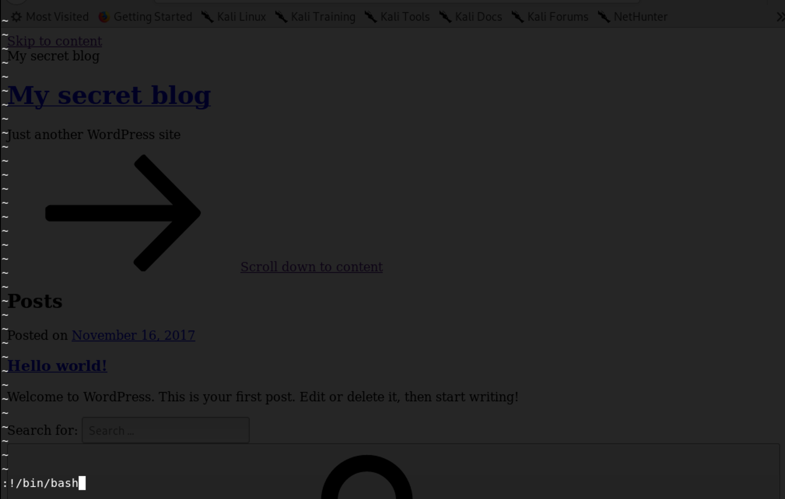

We try to use `set shell=/bin/bash ; shell` but error, So we use '!/bin/bash'.Successfully.

Then we export path to this path. 

`export PATH=/usr/bin:/bin`

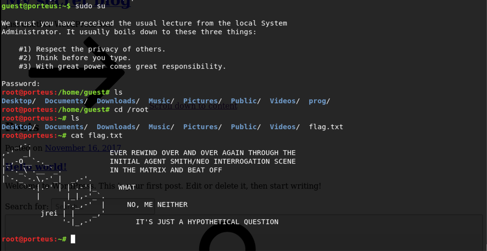

We found guest user that could exec any command, So we su root to get root privilege

Finally, we cd /root and get the flag.

Successfully!!!

------

**That' all , Thanks for your watching**