### **Netdiscover**

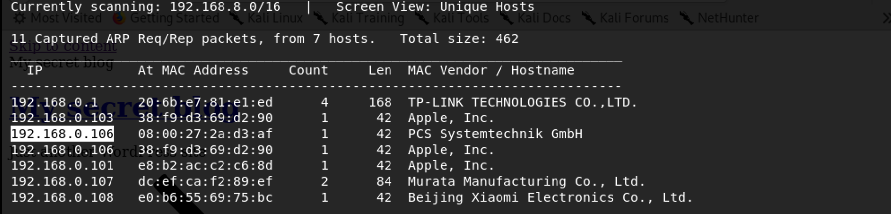

We use the tools called netdiscover scan hosts, we found the 192.168.0.106 is our target virtualbox host ip. 

------

### **Namp**

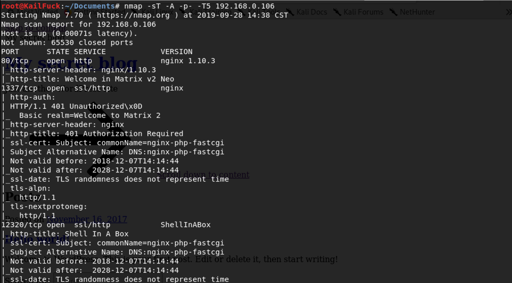

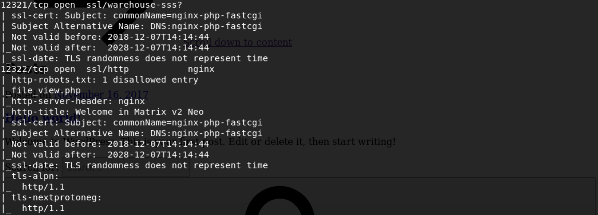

We found some services <u>HTTP</u>

------

### Solution

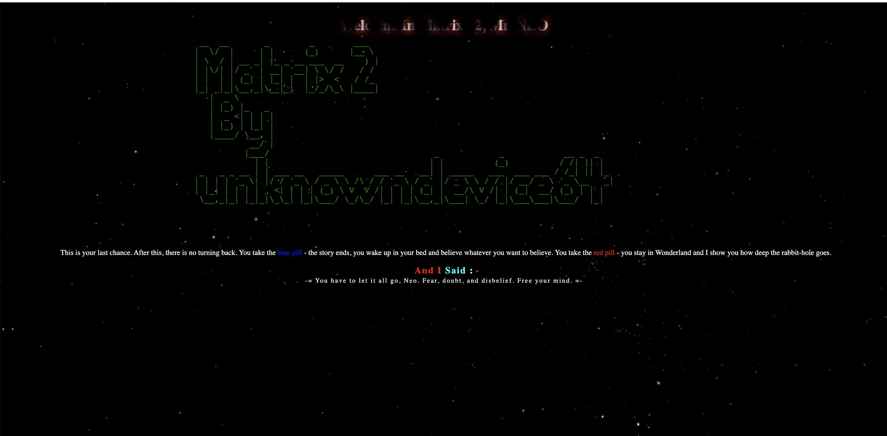

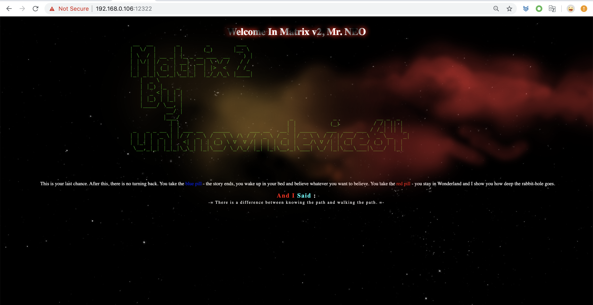

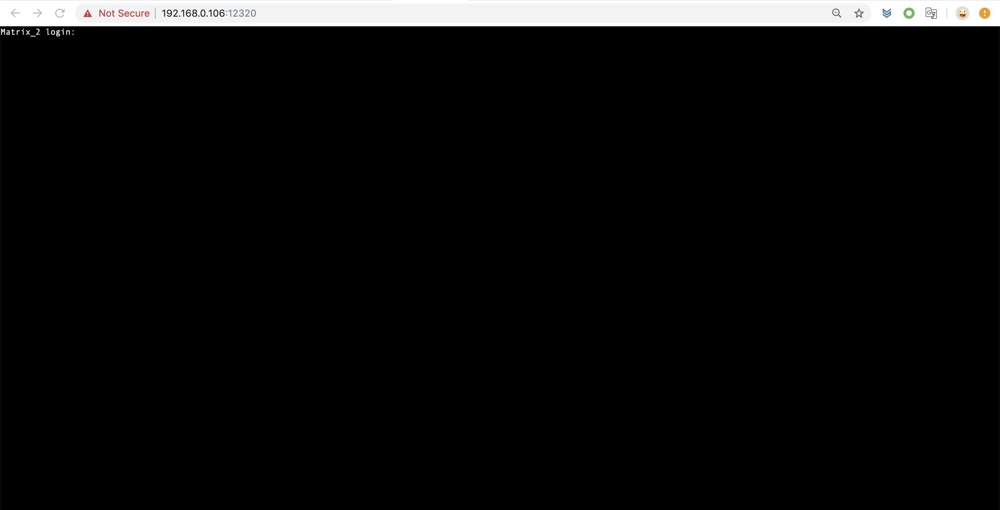

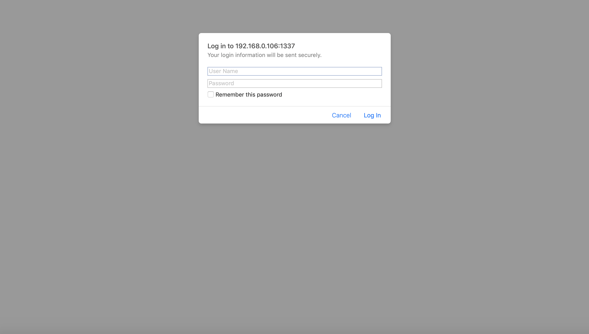

So we use dirsearch scan the web pages.

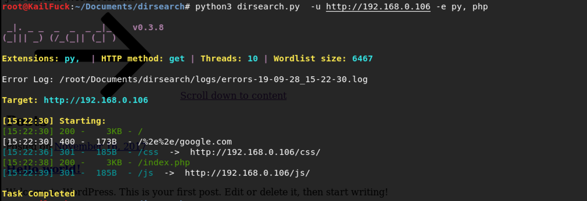

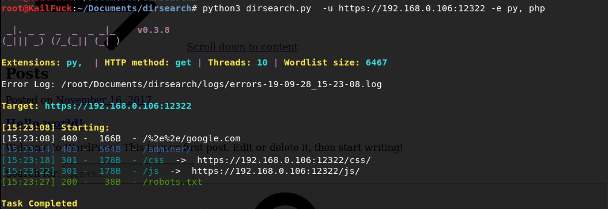

We found the robots.txt

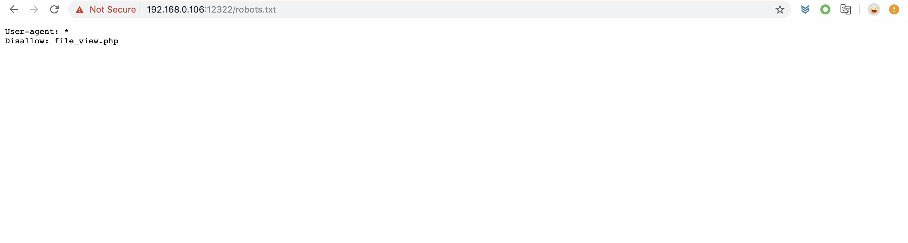

We found file_view.php accroding to this robots.txt

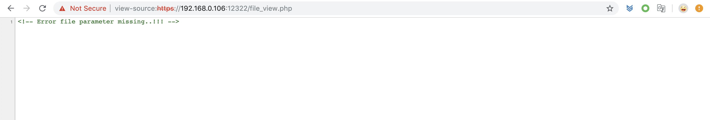

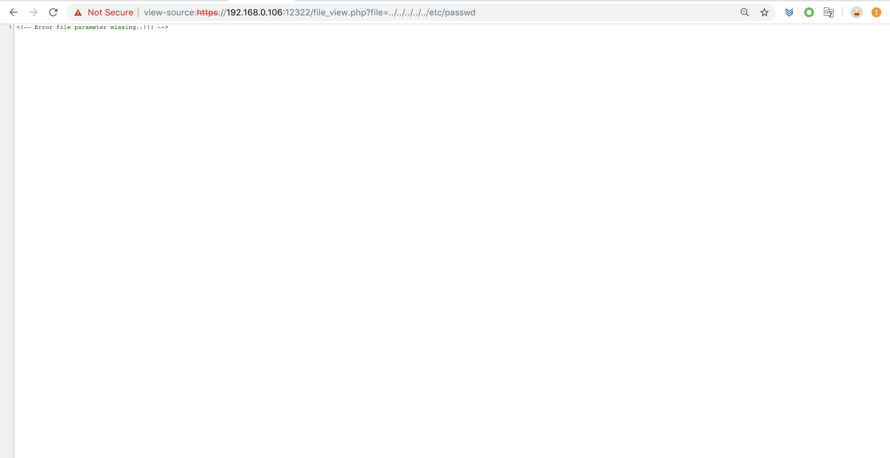

Maybe use http post method to transfer data.

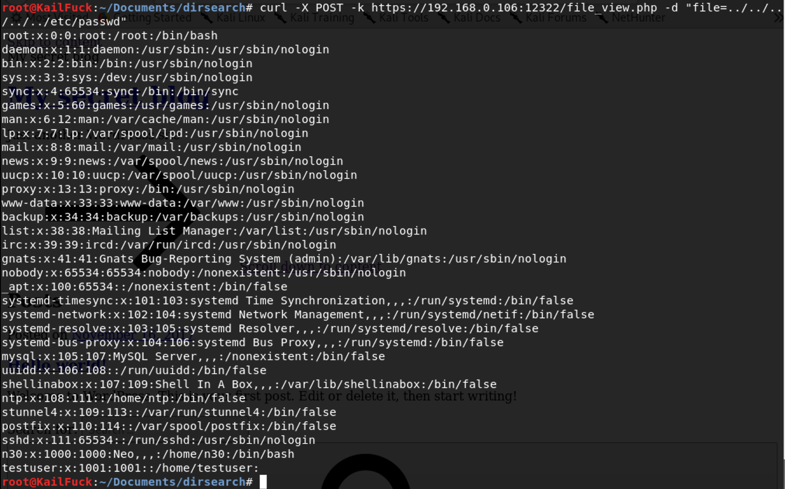

We change to use http post and use directionary bypass, we found n30 user.

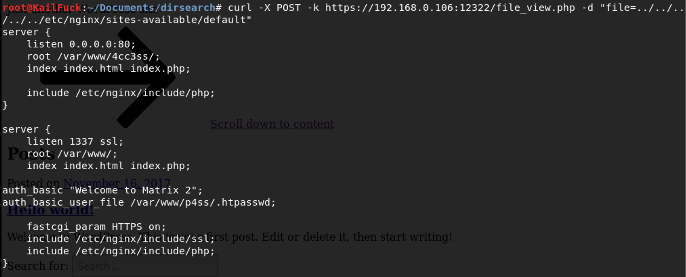

above pages, we may need to login in nginx manager, so we look his nginx config file. a passwd file found.

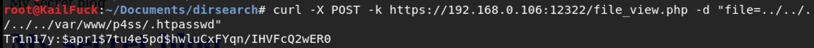

Password hash found

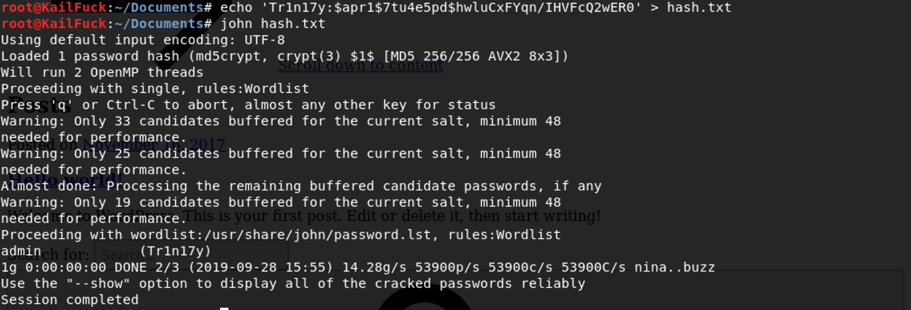

The manger user **Tr1n17y** password is **admin**,  So let's login.

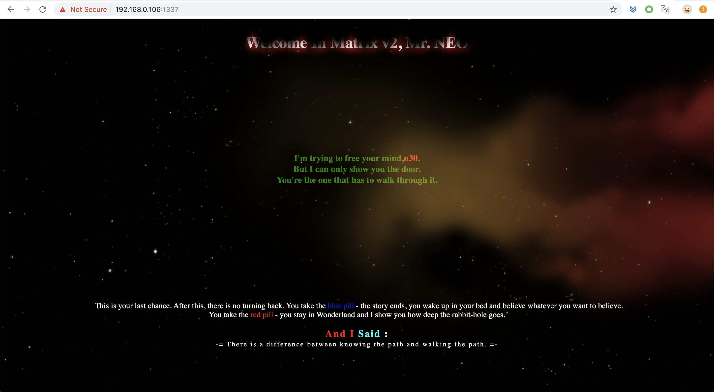

After login in this manager page successfully!! We came to this page, but found nothing.

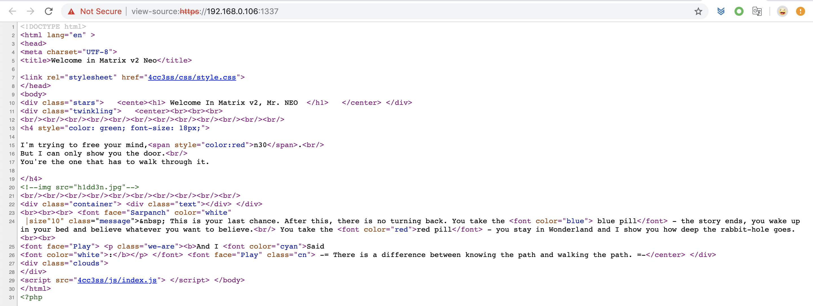

By viewing page resource , we found a hidden image. downloaded from this url.

We got this image,  By strings or binwalk, it's nothing found.

So maybe this a hidden file in this picture, we use steghide to do it.

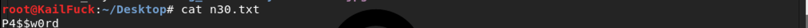

So we can login in n30 user with his password **P4$$w0rd**

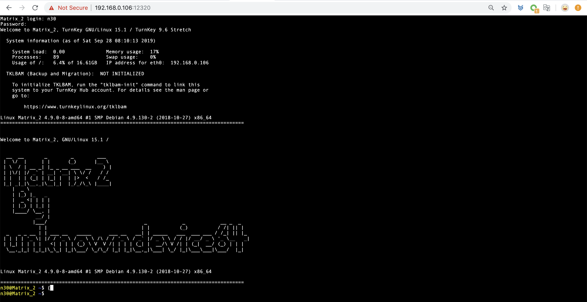

First, We use find which owns suid permission file.

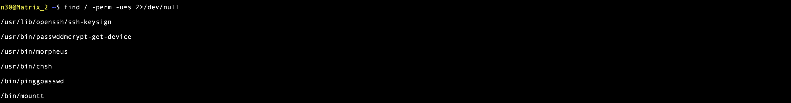

We find morpheus owns suid file, by morpheus --help, we could know his use.

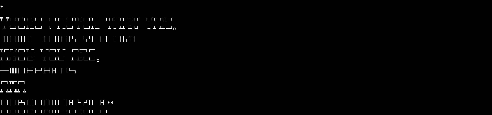

Finally, we cd /root and get the flag.

Successfully!!!

------

**That' all , Thanks for your watching**