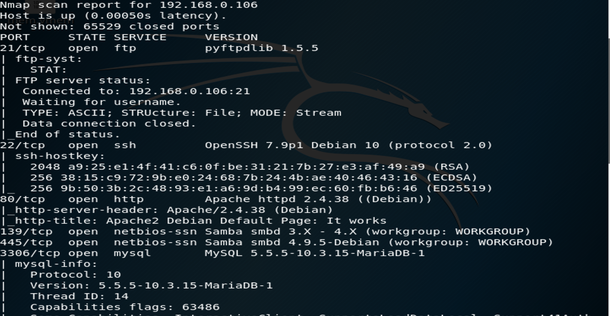
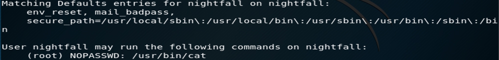
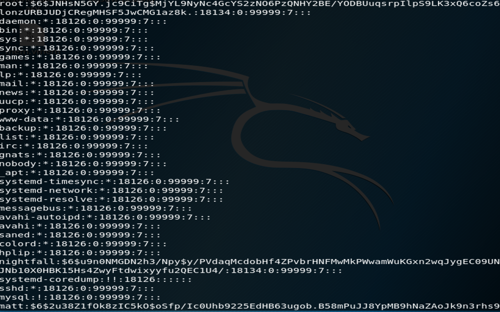
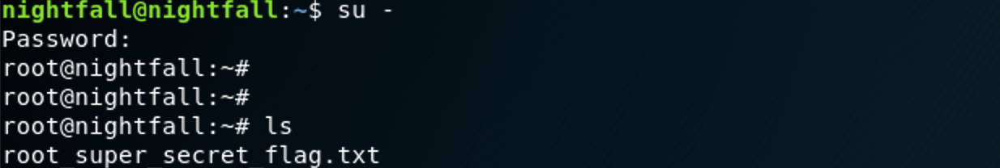

### **Netdiscover**

We use the tools called netdiscover scan hosts, we found the 192.168.0.106 is our target virtualbox host ip.

------

### **Namp**

We found some services <u>FTP</u>, <u>SSH</u>, <u>HTTP</u>, <u>SMB</u>, <u>MYSQL</u> 

------

### Enum4linux

When we see smbd service , we use enum4linux scan smbd service config and basic infomation, we not found user but we find a smb share filefolder: <u>*IPC$*</u> and user: <u>*nightfall, matt*</u>

------

### Searchsploit

By searchsploit mysql version, we can find two exploit ways existed.we save this two exploit scripts, may we use later.

------

### Gobuster

Try to use Gobuster to brute force the HTTP Server directory. regretfully, Nothing Found.

------

### Hydra

Now, We have a samba share directory, we guest that the author may use ftp and samba.We try to use hydra to  brute force ftp password with user <u>*nightfall, matt*</u>. Try to brute force the user nightfall , then failed, Luckly, we found the ftp password of user matt , the password is <u>***cheese***</u>

### Solution

We login in this user matt successfully, We found this "/" current directory. So we can use *<u>**.ssh authorized_keys</u>*** file to bypass the ssh login password. we create folder .ssh and upload authorized_keys to the .ssh filefolder. then we try to login by ssh with user matt, yeah, we login successfully .

Now, We find wether if anything can make a **Privilege Escalation**

we use linux find command, otherwise, we may use the linuxenum.sh.we found /scripts/find owned the suid permission, so we should use the ***/scripts/find*** to escalate privilege.

`/scripts/find . -exec /bin/sh -p \; -quit`

Now, We are user nightfall,  we use /home/matt/.ssh/authorizeds_keys instead of /home/nightfall/.ssh/authorized_keys, then we login successfully...

We find whether the user nightfall has sudo privilege.

user nightfall only has root privilege on **<u>/usr/bin/cat</u>**. so we decide to see what the **<u>/etc/passwd</u>** folder is.

We found the root password hash is 

`root:$6$JNHsN5GY.jc9CiTg$MjYL9NyNc4GcYS2zNO6PzQNHY2BE/YODBUuqsrpIlpS9LK3xQ6coZs6lonzURBJUDjCRegMHSF5JwCMG1az8k.:18134:0:99999:7:::`

Now we use john( brute force password tools ) by Kali Linux.

The password of root is <u>***miguel2***</u>, so we use su root with root password.Successfully, we found the flag.txt.

------

OS: Util now , We don't use mysql and samba server. →_→

------

**That' all , Thanks for your watching**
