### **Netdiscover**

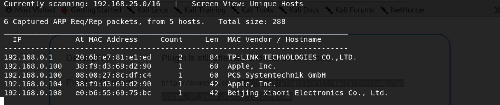

We use the tools called netdiscover scan hosts, we found the 192.168.111.140 is our target virtualbox host ip.

------

### **Namp**

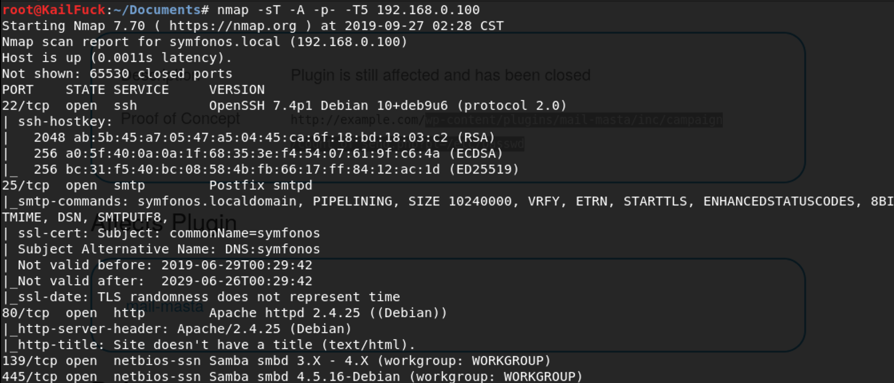

We found some services <u>ssh</u>, <u>smtp, http, smb</u>

------

### Solution


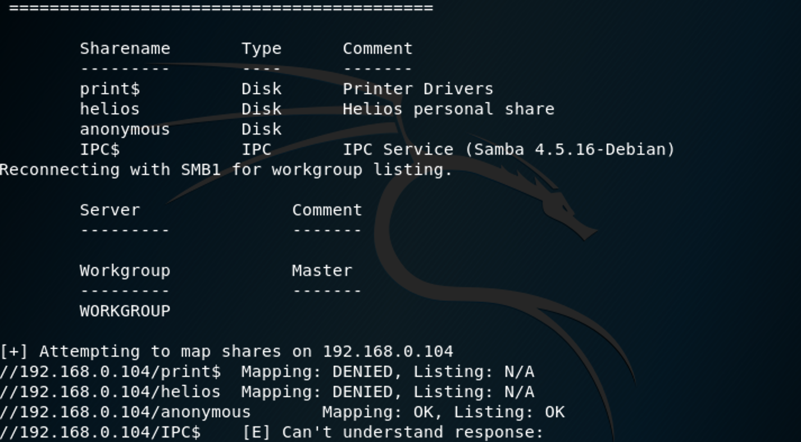

We Found a anonymous directory, by connecting from smbclient.

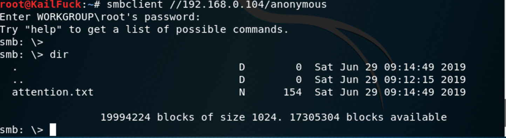

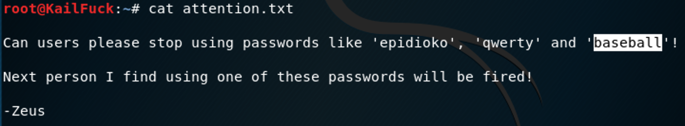

We uploads attention.txt and found some possible passwords.

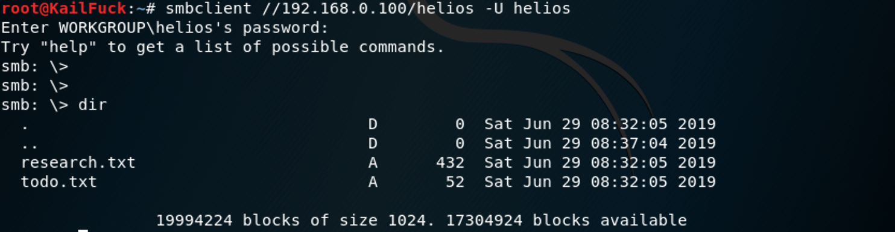

So we login in **helios** with password **qwerty**.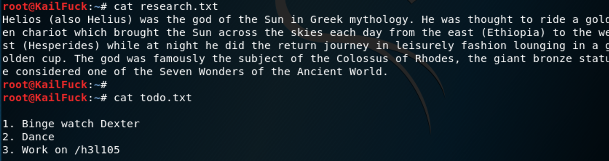

Found /h3l105 directory, so we add /etc/hosts with [symfonos.local](http://symfonos.local/)

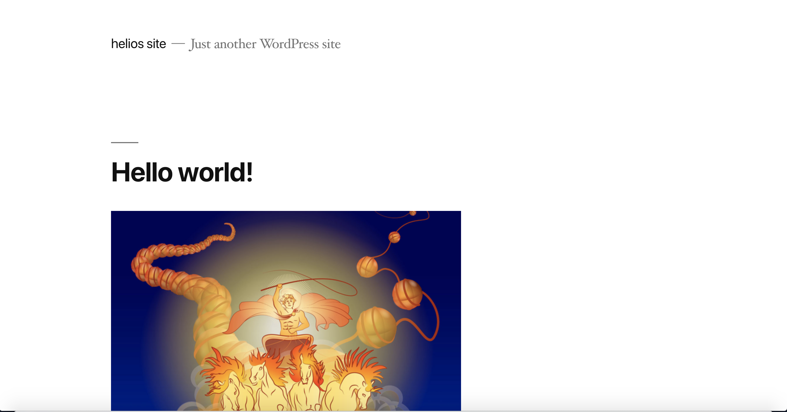

We found a wordpress website, So we use wpscan to do it.

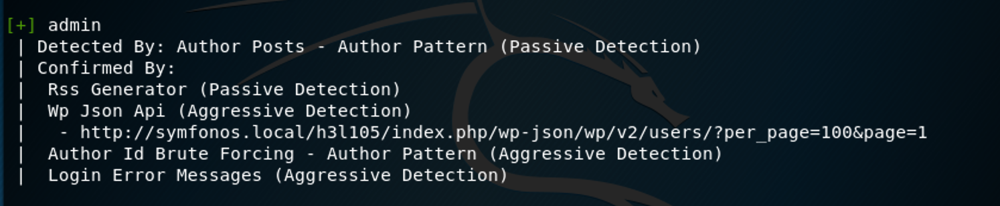

admin found

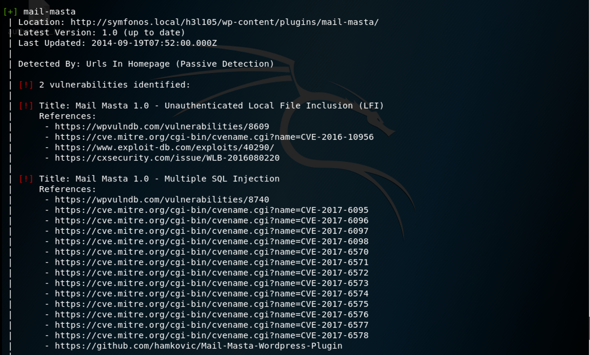

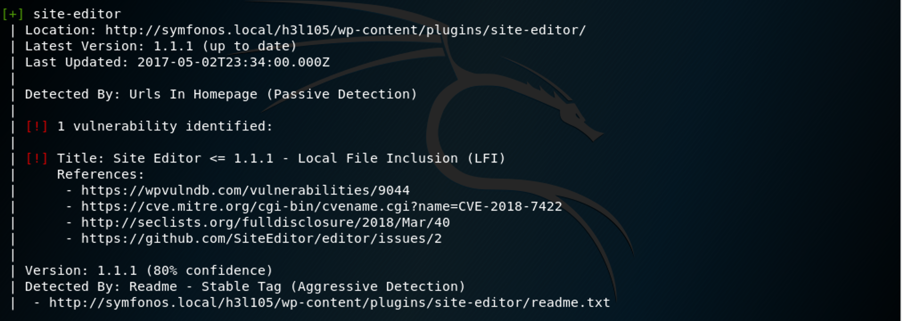

LFI found. We use Unauthenticated LFI

```HTML
wp-content/plugins/mail-masta/inc/campaign/count_of_send.php?pl=/etc/passwd
```

Successfully!!

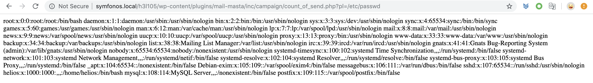

We known that exists a mail server, so we cat this user mail.

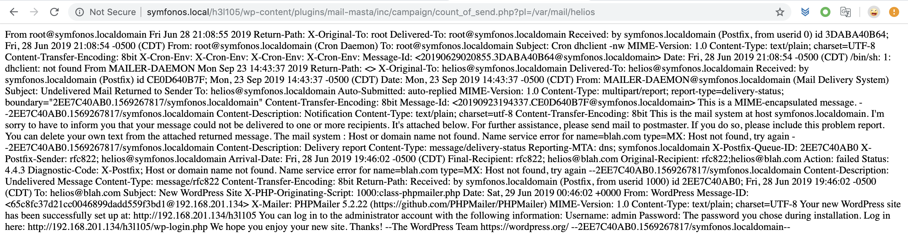

So We use php log poision attack.

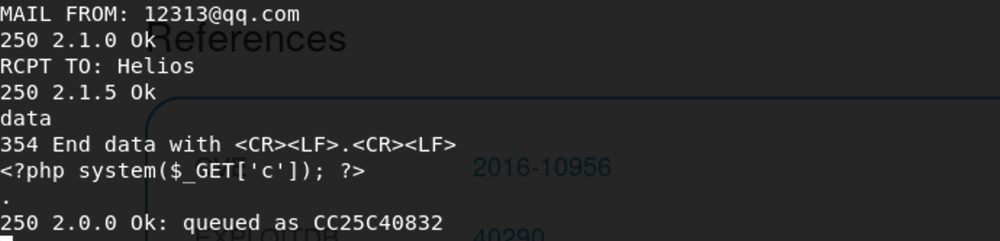

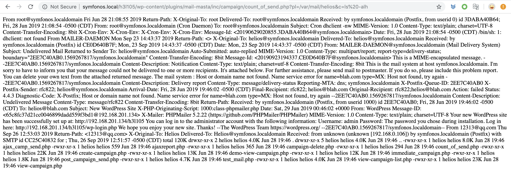

We can execute ls -al command, so we nc to reverse shell.

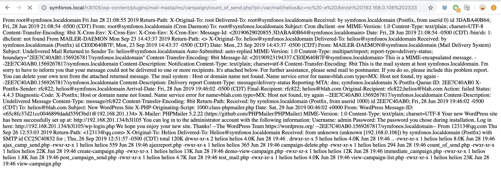

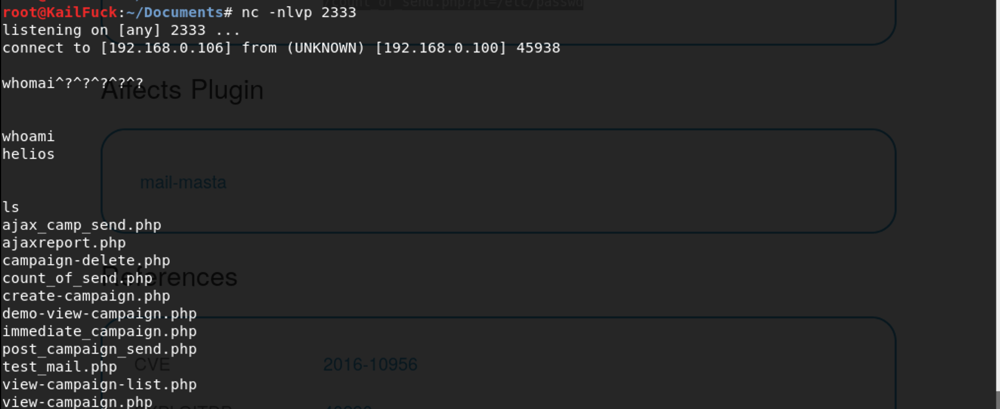

Now we are reverse shell successfully!!, let's find those which owns suid permission file.


We found **/opt/statuscheck**, check his type , return.

This is http header, we guess may something important in executeable file.

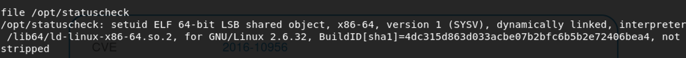

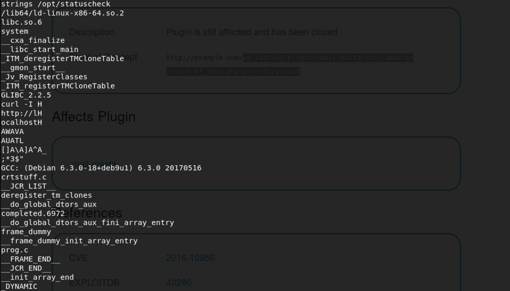

So we execute

`echo '/bin/sh' > curl`

`chmod 777 curl`

`mkdir /tmp`

`mv curl  /tmp`

`export PATH=/tmp:$PATH`

`/opt/statuscheck`

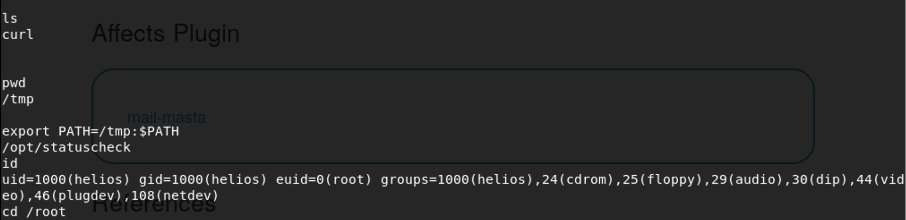

now we'are root., So let's get the flag.

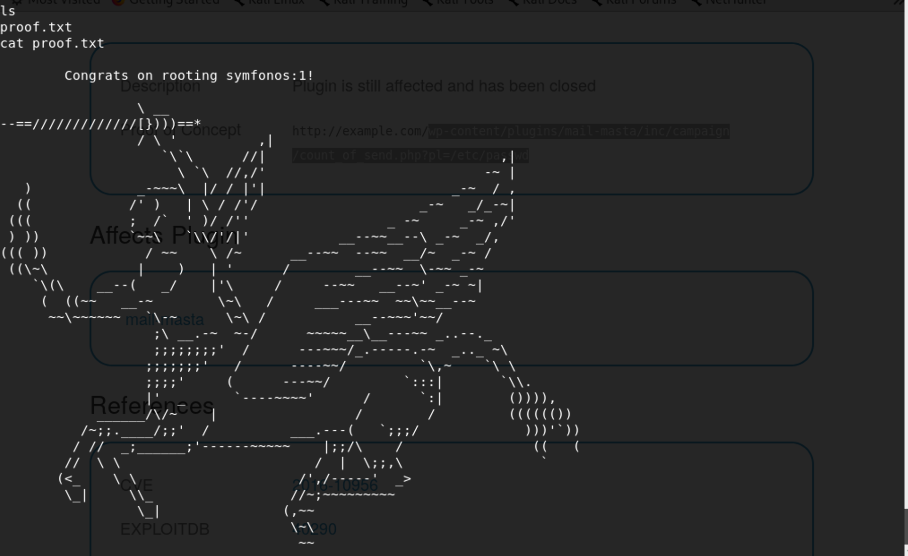

Successfully!!!

------

**That' all , Thanks for your watching**