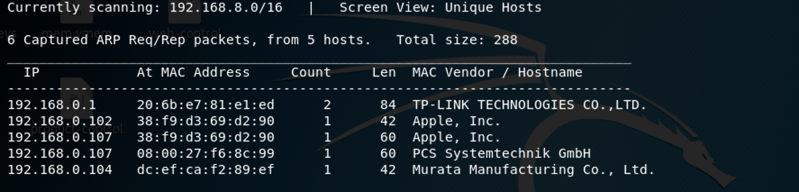
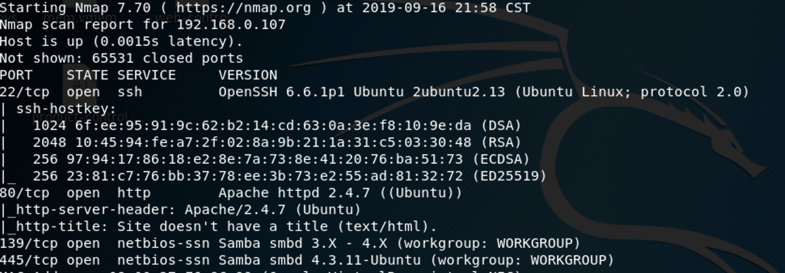
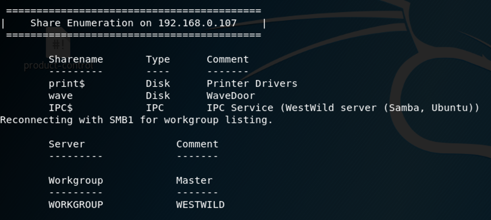
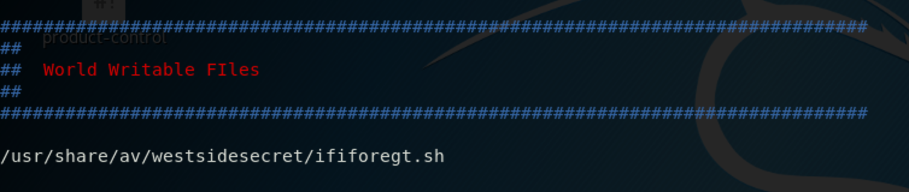
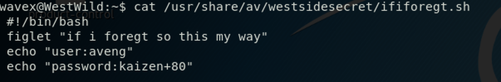

### **Netdiscover**

We use the tools called netdiscover scan hosts, we found the 192.168.0.106 is our target virtualbox host ip.

------

### **Namp**

We found some services <u>SSH</u>, <u>HTTP</u>, <u>SMB</u>

------

### Enum4linux

When we see smbd service , we use enum4linux scan smbd service config and basic infomation, we not found user but we find a smb share filefolder: <u>*wave, IPC$*</u> and user: <u>*aveng,root, wavex*</u>

------

### Solution

connected samba server, two files found. we upload these files to our localhost.

so i guess, we login in user wavex ==> find aveng user ==> root

now let's login in user wavex

We download enumlinux.sh from github. run this scripts

may aveng password in it

So we ssh or su - aveng login successfully. found aveng is owned sudo privilege.

now we su - , that's can we find flag.txt and whoami is root, congratulations

------

**That' all , Thanks for your watching**
