### **Netdiscover**

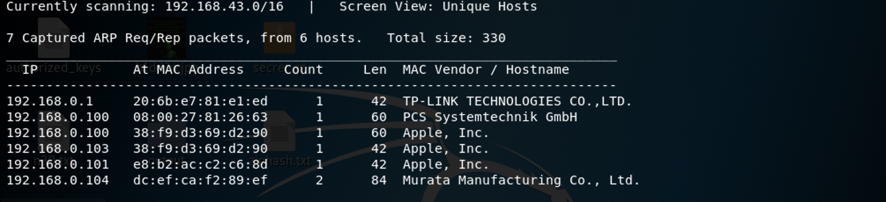

We use the tools called netdiscover scan hosts, we found the 192.168.0.110 is our target virtualbox host ip. 

------

### **Namp**

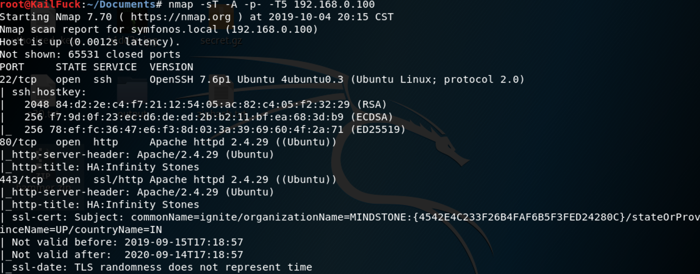

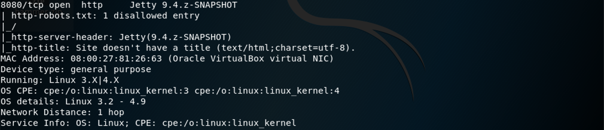

We found some services <u>HTTP, SSH</u>

------

### Solution

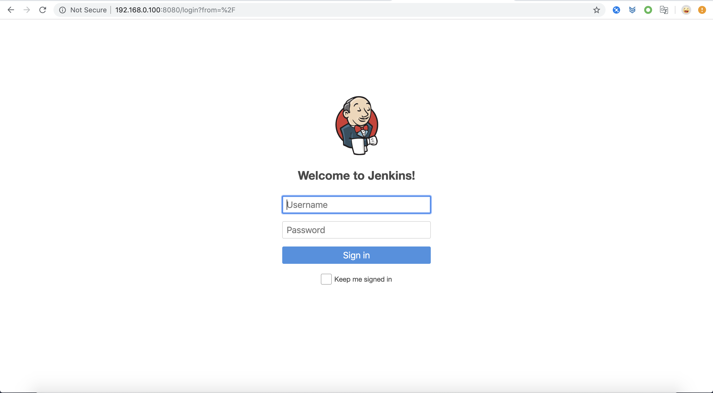

We looked the https certificate, find the stone.

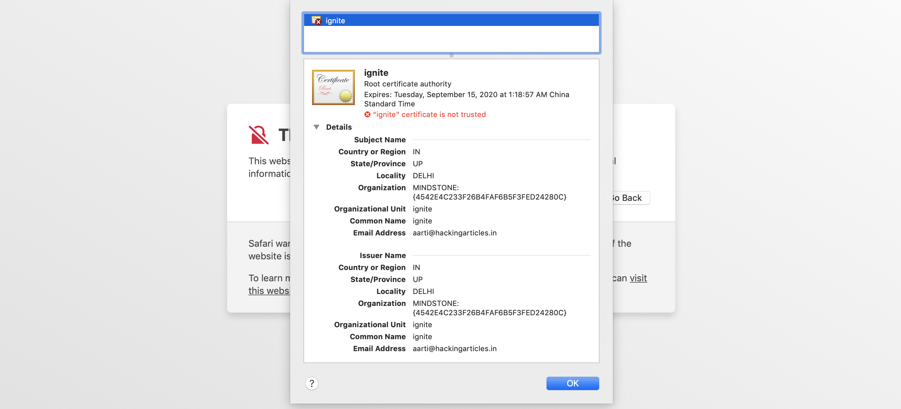

At first, We use dirb to brute the website directory.

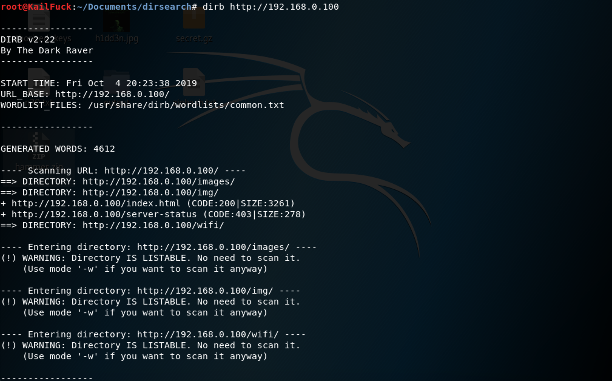

We found http://192.168.0.100/wifi and http://192.168.0.100/wfi and http://192.168.0.100/img

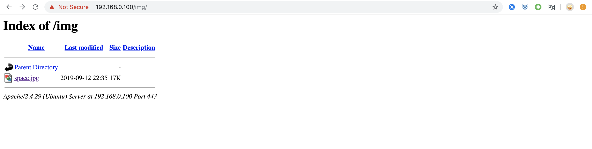

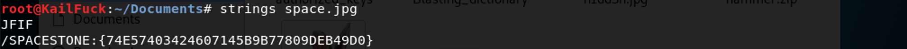

We linked to the /img, we found the space.jpg , we got the stone by **strings space.jpg**

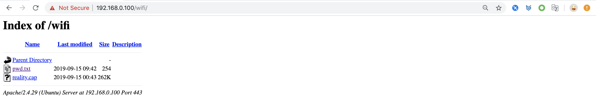

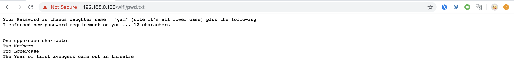

So we use python to generate wordlist dictionary auto.

We now have passowrd dictoary. but we have no user. So we tried to use the dictionary to brute force the wifi cap.

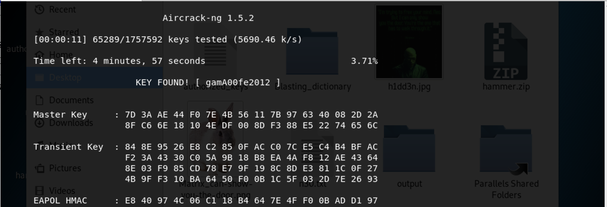

Now we have wifi password. But we have nothing else. May we should try to use the **gamA00fe2012** as web directory.

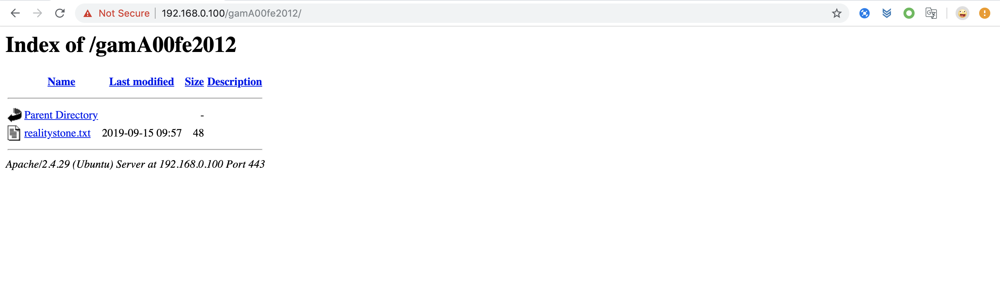

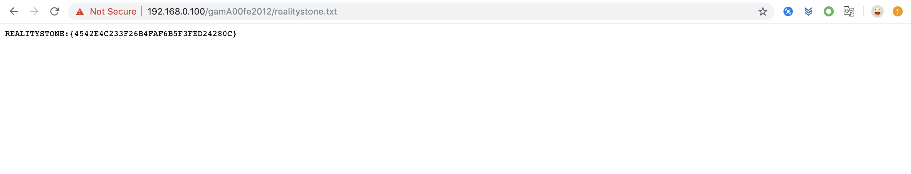

Got the stone.

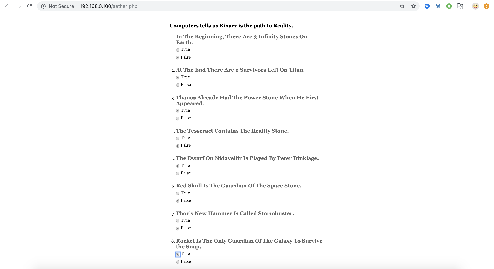

Why the author give us a suvery to do.  as we see , i thought there was a strings by 01, but it was only 8 bit,

So there may dirctory. 

direcory is http://192.168.0.100/01101001/

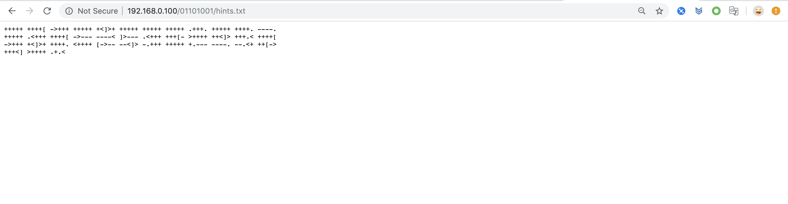

We Got the **admin:avengers**, their may jenkins user and password.

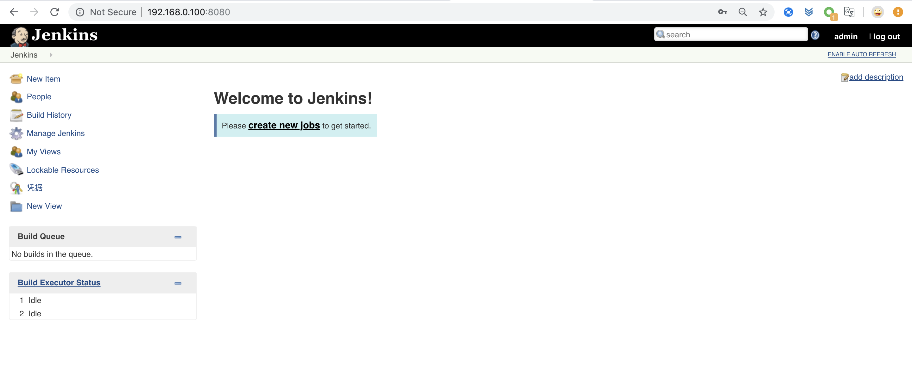

We are login in jenkins server successfully!!!

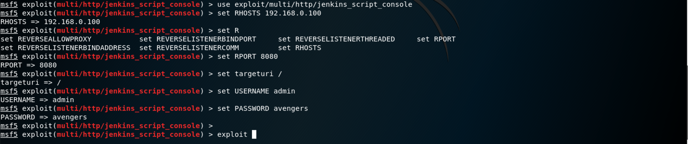

We have jenkins user and password, After a litter tries, so we use a authorized exploit.

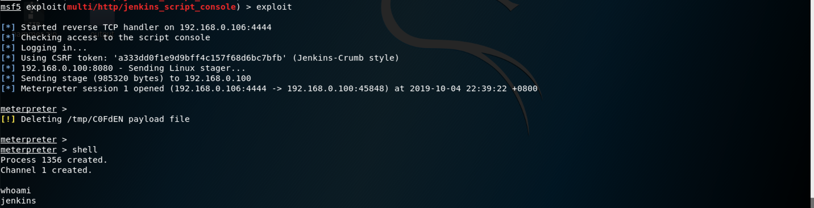

Now we got the user jenkins.

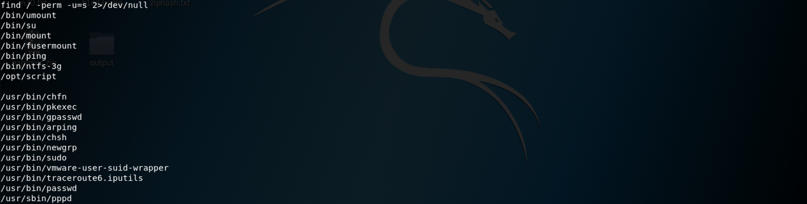

Let's find wether anything owns suid permission.

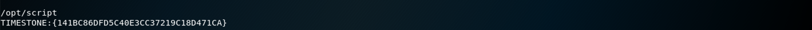

We Got a another stone.

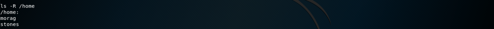

Let's to see how many users in home. we found the user morag.

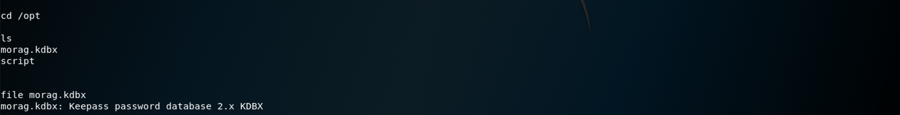

And we find the /opt exists morag.kdbx. this is a key hint. we should get the user morag, then escalate privilege to root. Let's begin.

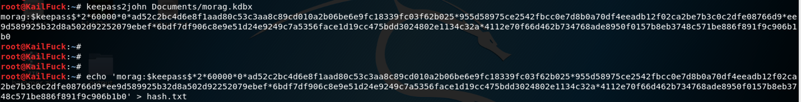

Because we have not kdbx database login password, So we use keepass2john by kail to generate hash.

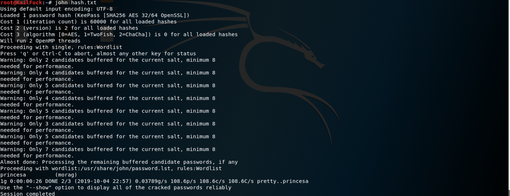

Then we got the login password. the password is **princesa**.

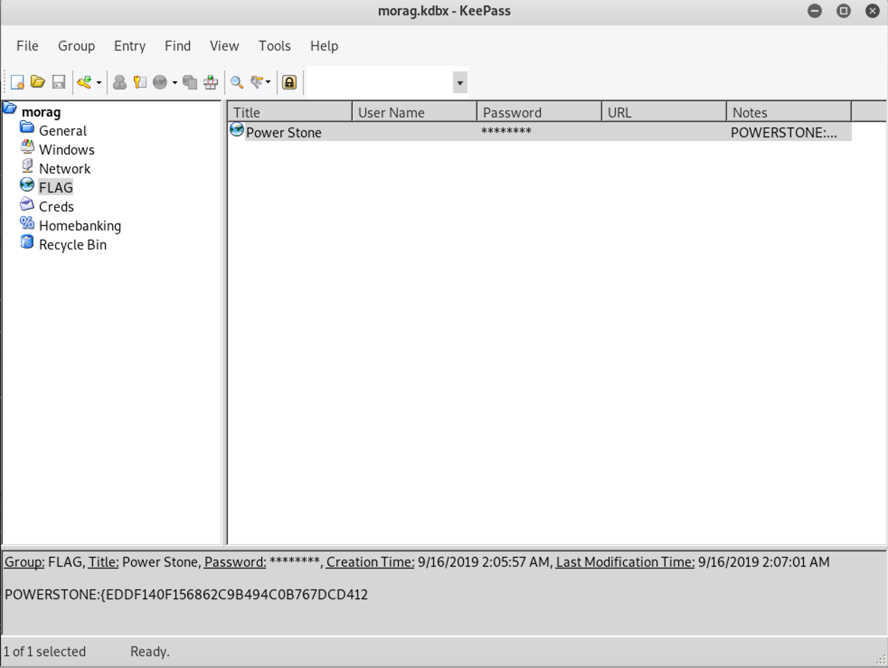

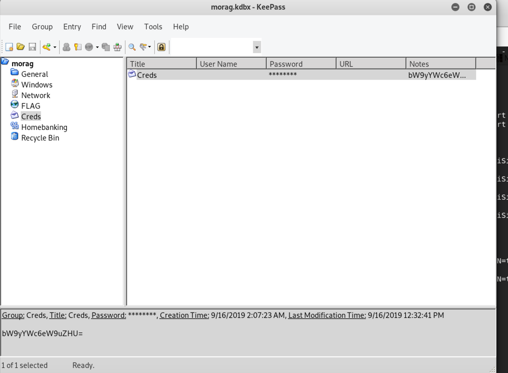

We use keepass2(linux) to do it, we open the kdbx with password. We found the FLAG and  Creds.

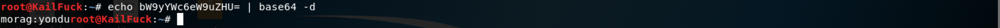

The cred strings is base64 encoded,  we decoded it. we found the password keypair==> **morag:yondu**

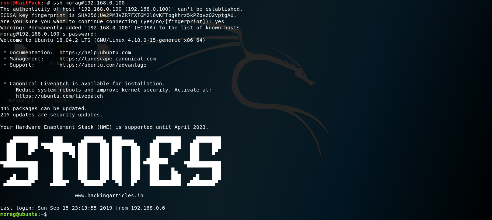

Yeah, login was okay.

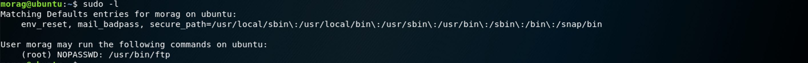

Let's we find wether exists any command to escalate our privilege.

we use /bin/sh to spawn shell env and we got root privilege.

Finally, we cd /root and get the flag.

Successfully!!!

------

**That' all , Thanks for your watching**