### **Netdiscover**

We use the tools called netdiscover scan hosts, we found the 192.168.0.107 is our target virtualbox host ip. 

------

### **Namp**

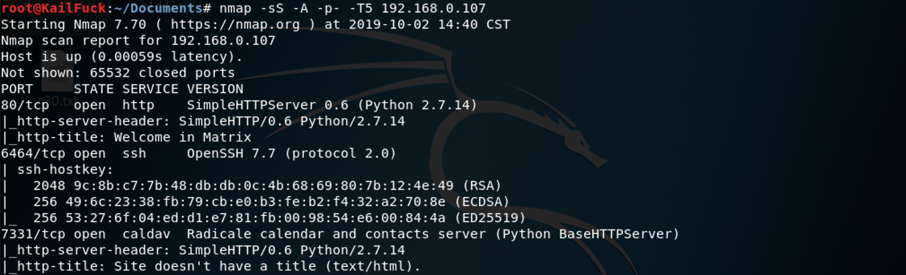

We found some services <u>HTTP, SSH, caldav</u>

------

### Solution

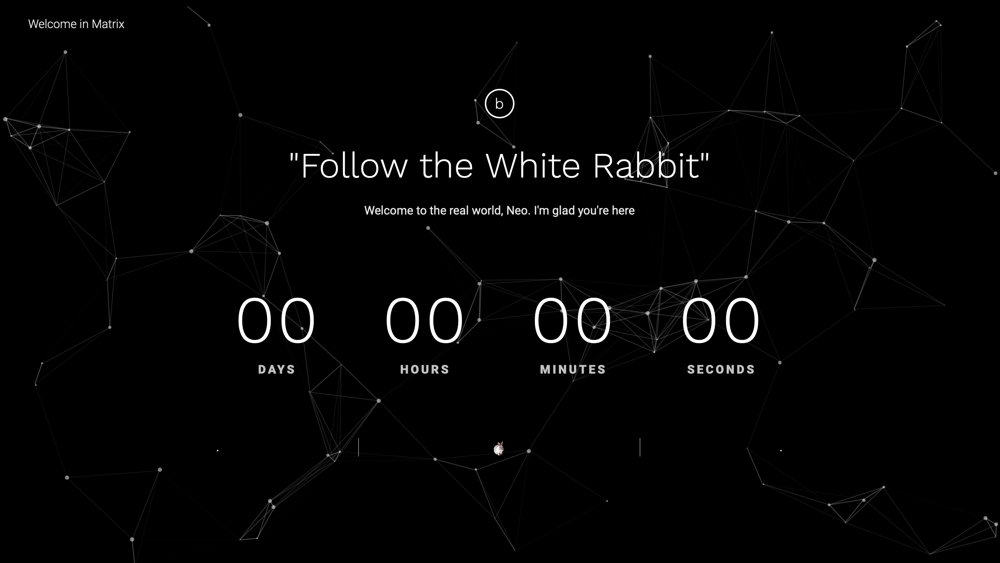

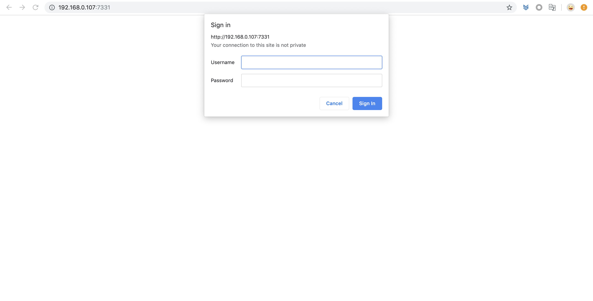

We could infered that we should get the manger user:admin to get something www-data or ssh users.

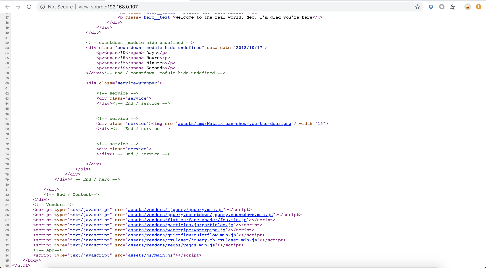

We watched page source of the http://192.168.0.107:80 code.

found  assets/img/Matrix_can-show-you-the-doo.png

At first, i used some ctf ways to find wether has something hidden. Sadly, nothing found.

So may the Matrix is the directory.

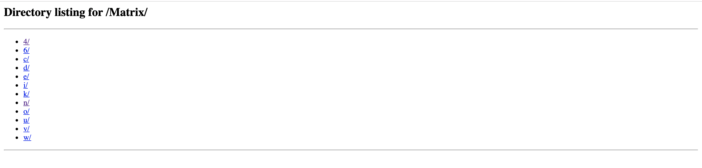

At first, we concate this chars, but nothing found. So we thought back the Matrix2,  the key **neo**

So we centered into this http://192.168.0.107/Matrix/n/e/o/6/4

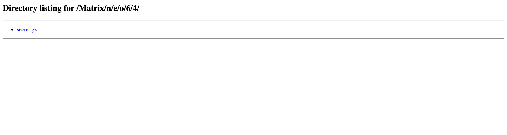

Found a secret.gz. After uncompressed failed , i decided to find the file type.

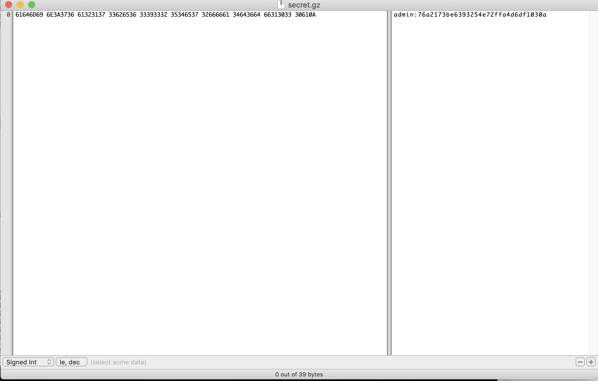

this is txt file, and we found his user, password.

***user:admin, password-hash:76a2173be6393254e72ffa4d6df1030a***

we queried from online md5 decryption pagesite, the password is **passwd**

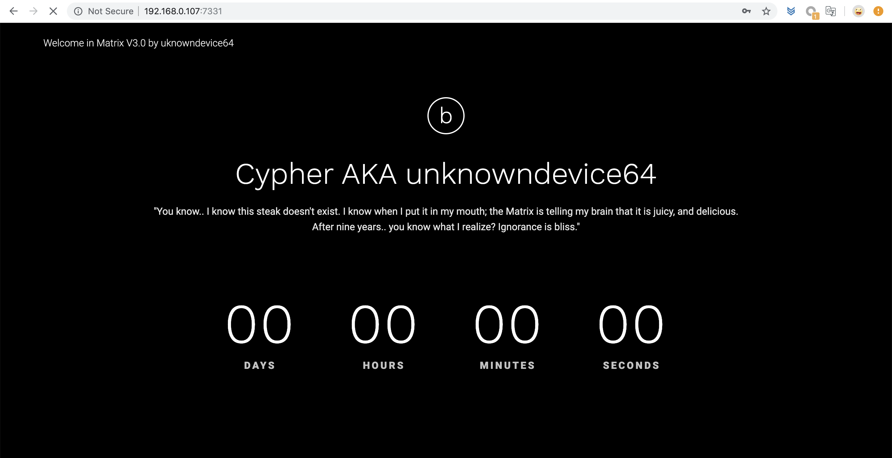

So we logan in this page of http://192.168.0.107:7331

By viewing page resource, we found nothing. So we decided to use gobuster or dirb to scan his web directory

We found /data/data, we downloaded it. found EXE file header ***4D5A90***

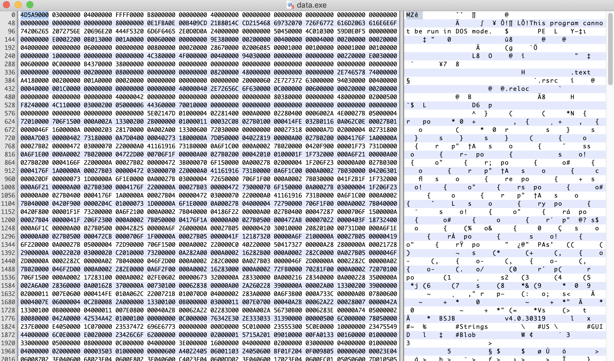

This is a key hint, At first we scan from this txt, but nothing found, So we use EXE resource tools to do it.

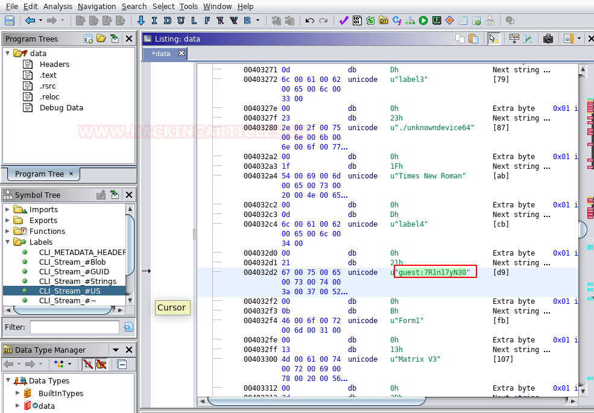

We found the user **guest** and his password **7R1n17yN30**.

the user-password keypair may ssh user and password. 

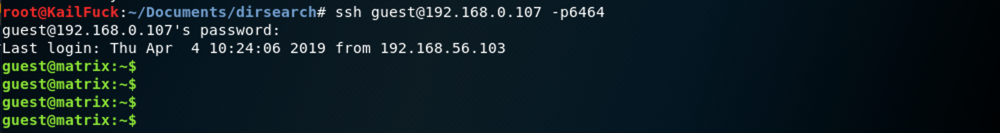

Successfully!!!, Now we should to escalate our privilege.

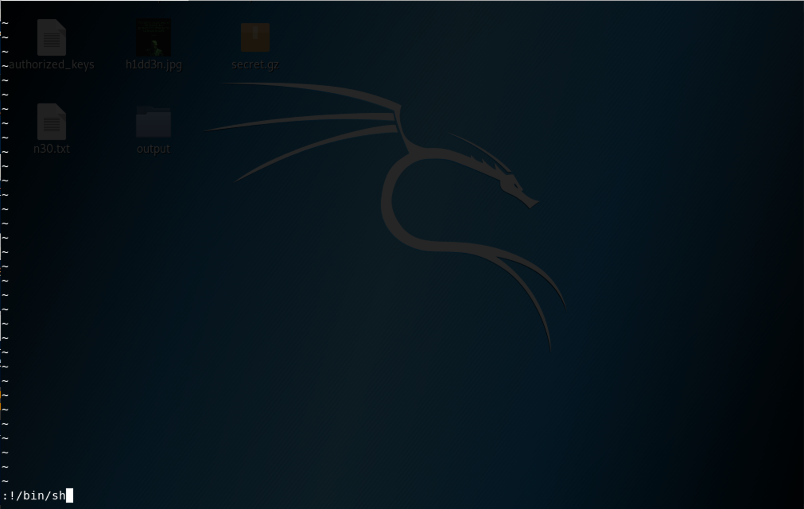

We found this a rbash env, we use vi strick to jump the rbash.

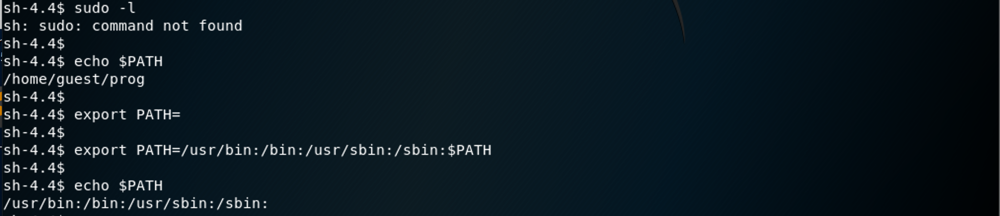

Ok, we saw the commnd not found , maybe the PATH is not assigned. So we exported by manual.

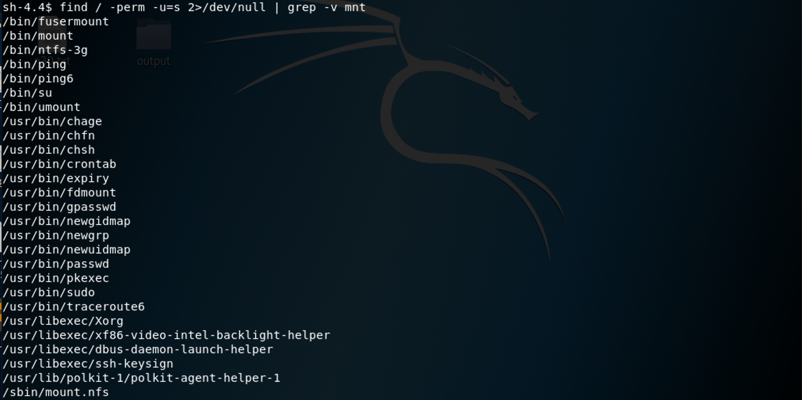

Let's look those which owns suid permission file. Nothing found.

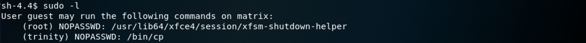

We find wether the user guest's sudo privilege. We found trinity cp sudo privilege.

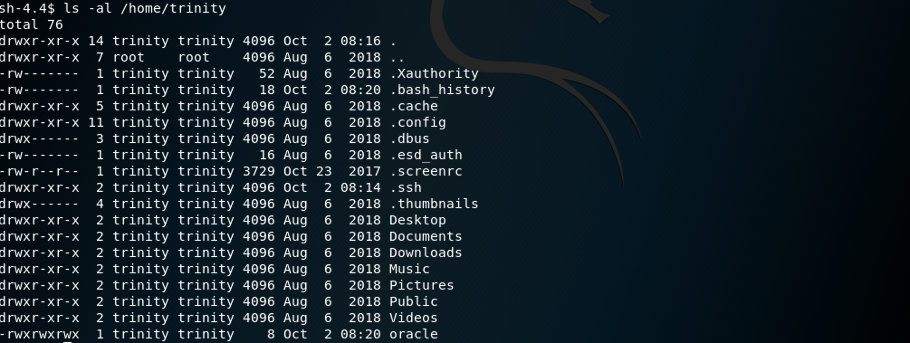

So let's look trinity home directory. Found a .ssh directory, according sudo cp permisson, We can cp authorized_keys to login with trinity without password.

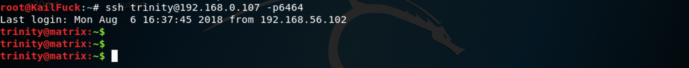

Now we can login with user trinity, Let's see sudo privilege.

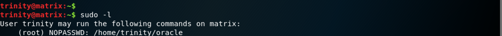

So let's use oracle to escalate privilege to root, but the file wasn't found.

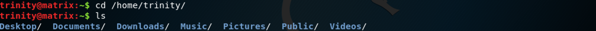

So we can make a script called oracle to escalate root privilege.

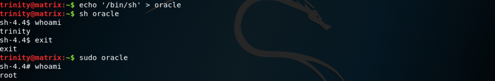

Finally, we cd /root and get the flag.

Successfully!!!

------

**That' all , Thanks for your watching**