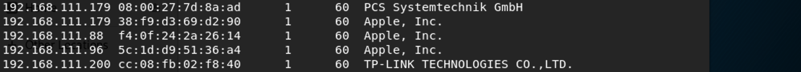
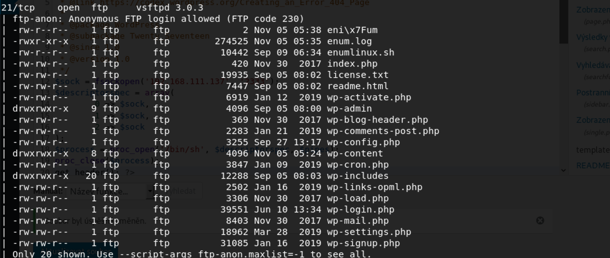
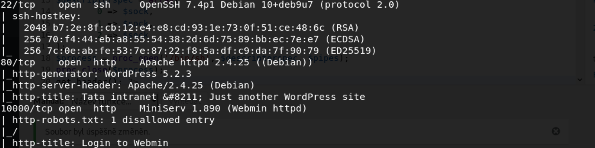
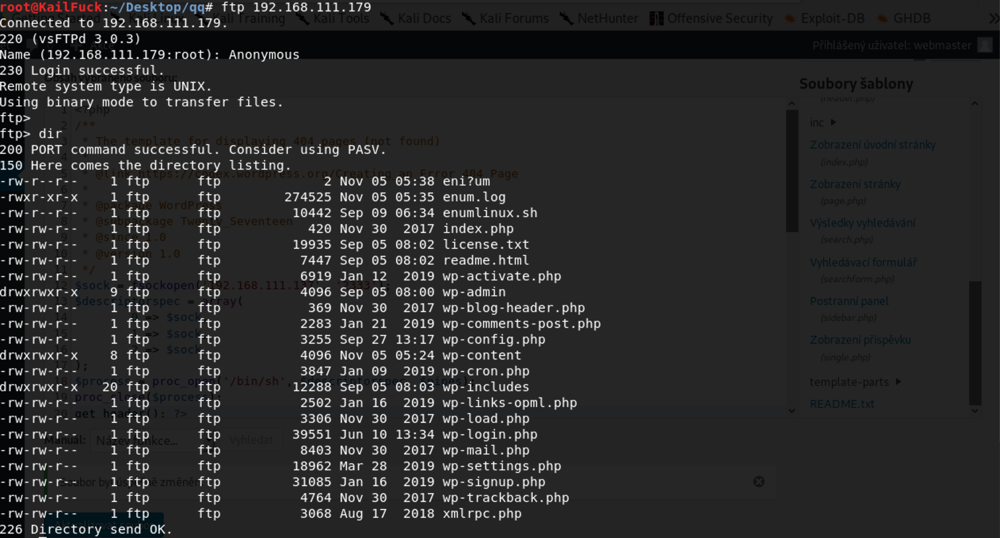
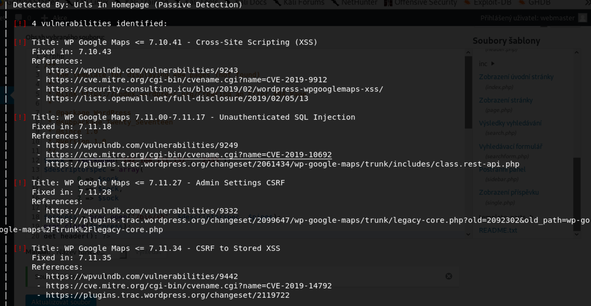
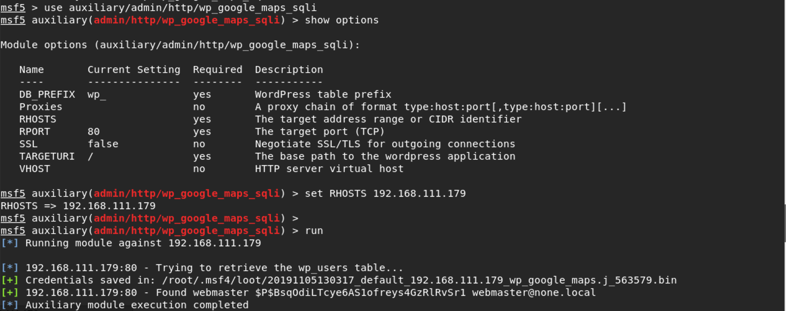
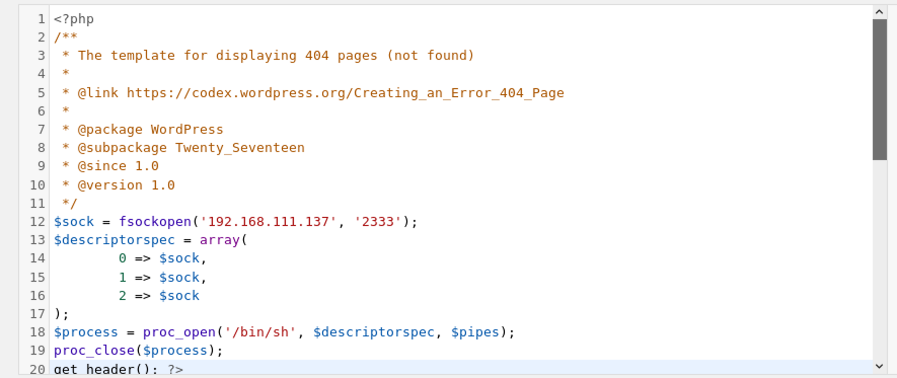
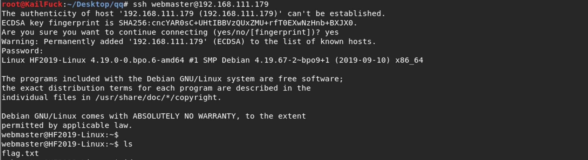
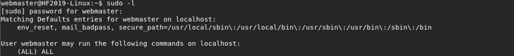
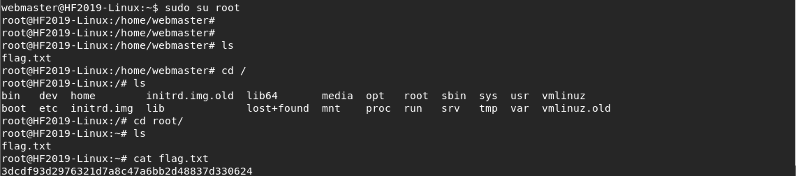

### **Netdiscover**

We use the tools called netdiscover scan hosts, we found the 192.168.111.179 is our target virtualbox host ip.

------

### **Namp**

We found some services <u>FTP, SSH</u>, <u>HTTP, WEBMIN</u>

------

### Solution

At first, we use the anonymous to login ftp service successfully!!!

But we only have read permission, So we pay attention to the web server.

Then we find the website built by wordpress, So we enum the user . Found webmaster, But We didn't found his password.

So we should look around wether any plugin exploit we can use, We found sqli exploit.

So we got the password of the webmaster. Now let's use john to brute force the hash.

The password is **<u>kittykat1</u>**

Now we gone into this web admin page, as usual, we add shell code in 404.php.

By visiting http://192.168.111.179/wp-content/themes/twentyseventeen/404.php.

We can connect our shell. But we not found some suid program which can be used.

So we tried the webmaster password for ssh.

Success,  and we saw this flag.

We looked around this users privilege. To my suprise, he could exec any cmd, So we **<u>sudo su root</u>** to be root

Successfully!!!

------

**That' all , Thanks for your watching**