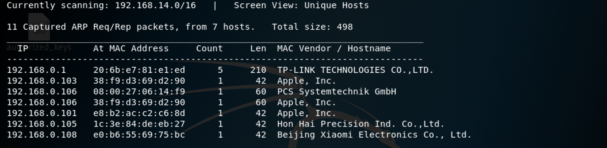
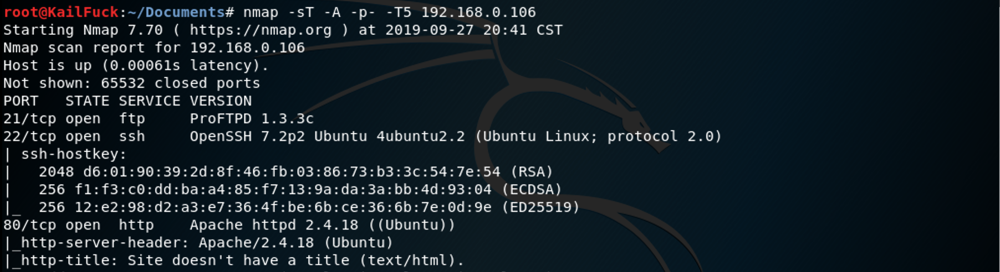
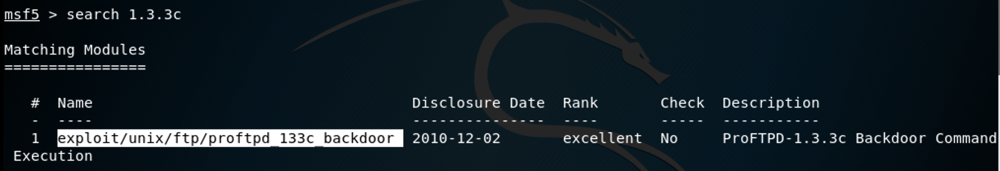
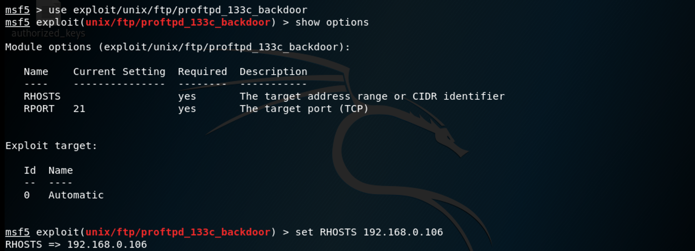
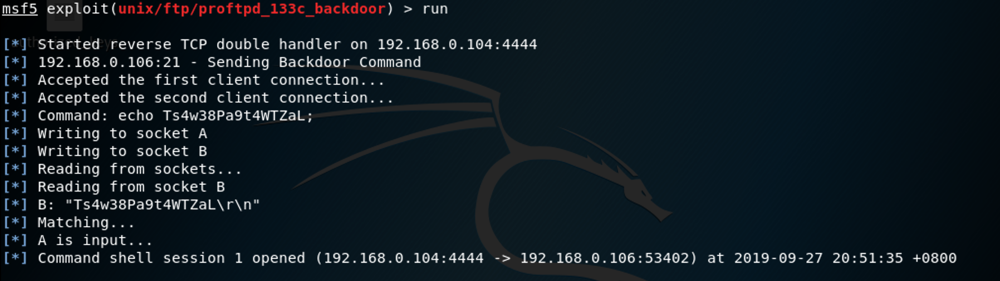
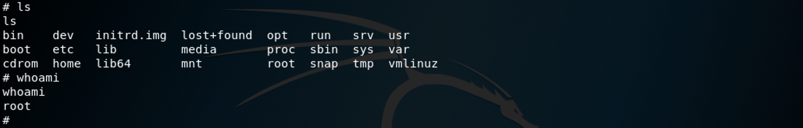

### **Netdiscover**

We use the tools called netdiscover scan hosts, we found the 192.168.0.106 is our target virtualbox host ip. 

------

### **Namp**

We found some services <u>SSH</u>, <u>HTTP</u>, <u>FTP</u>

------

### Solution

By searchspolit and metasploit search, then we use exploit.

Successfully!!!

Of course, We also by web pentesting to do it, some of my hint images in the images folders.

Just do it.

------

**That' all , Thanks for your watching**