### **Netdiscover**

We use the tools called netdiscover scan hosts, we found the 192.168.111.231 is our target virtualbox host ip.

------

### **Namp**

We found some services <u>SSH</u>, <u>HTTP</u>

------

### Solution

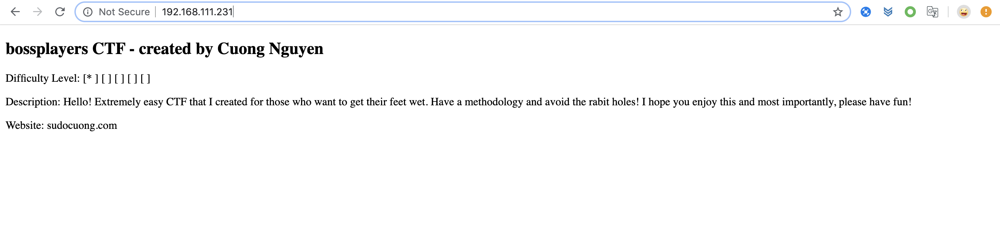

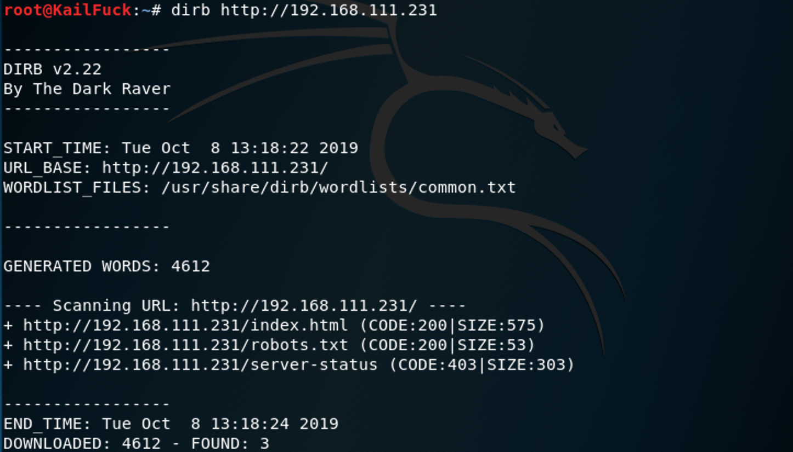

We found http://192.168.111.231/robots.txt

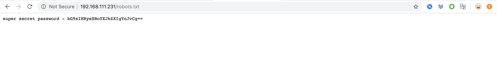

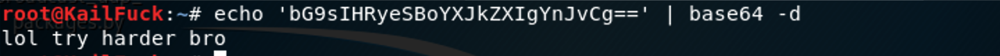

The strings maybe a password.  

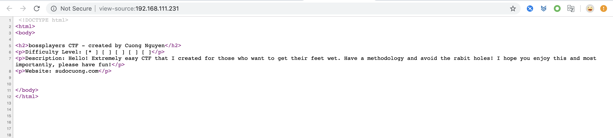

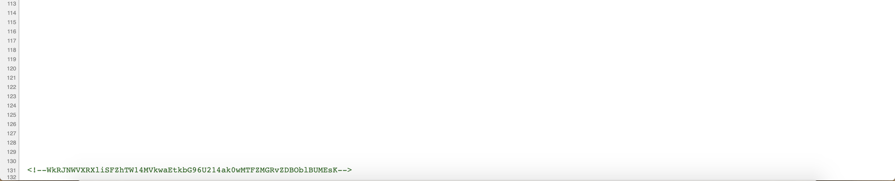

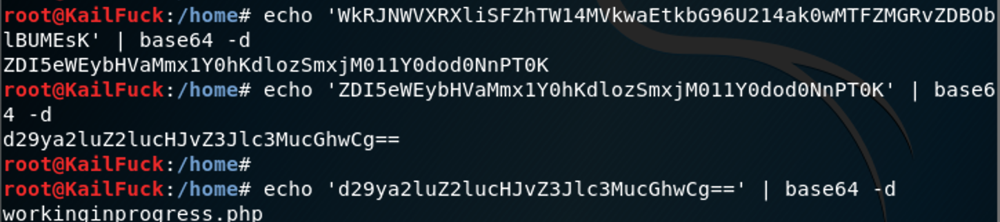

We found a hidden php page. http://192.168.111.231/workinginprogress.

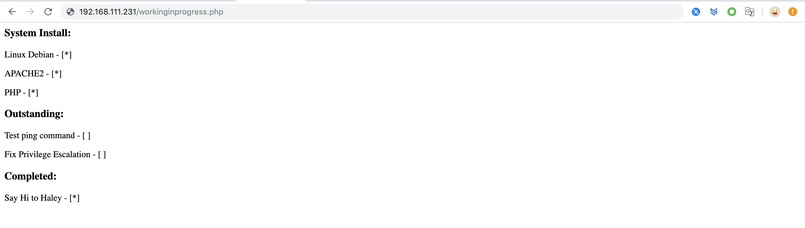

After i tried params: file, command,cmd, found the param is cmd

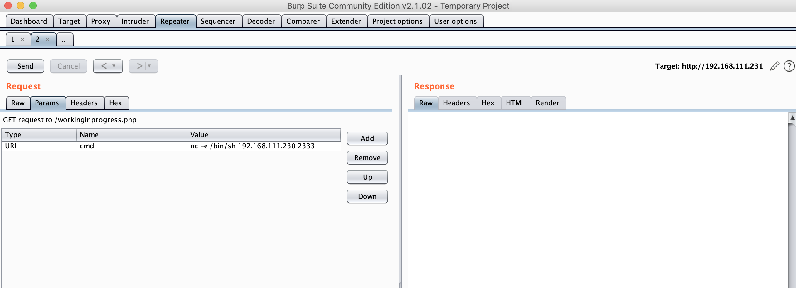

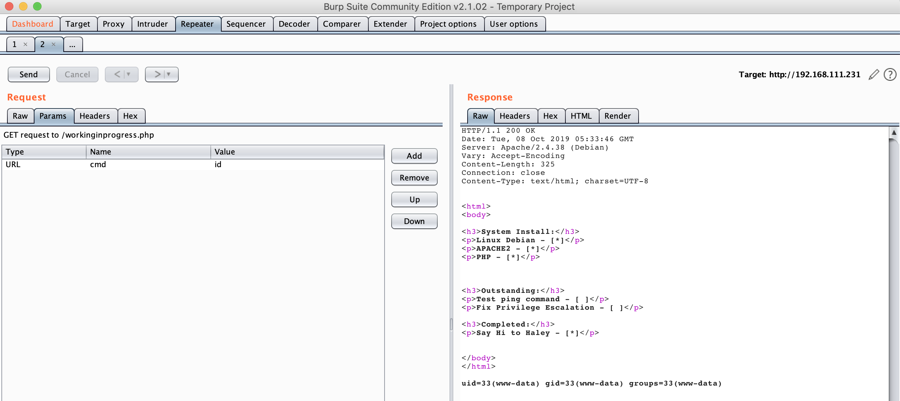

So we use cmd to reverse the shell.

Let's look around the home directory.

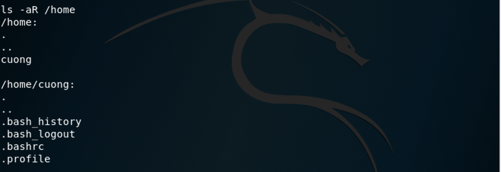

Let's find wether somethings owns suid permission.

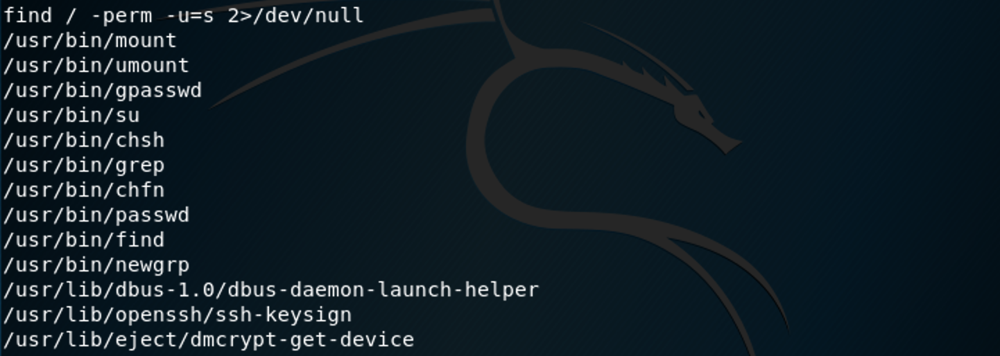

Yeah, we could use find to escalate our privilege.

`find . -exec '/bin/sh' -p \;`

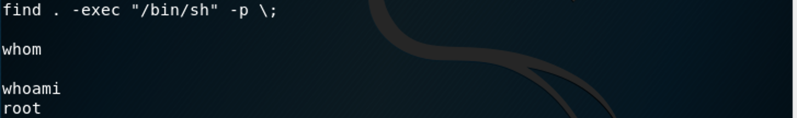

We Got the root user. So let's go to the /root directory to get the flag.

Successfully!!!

------

**That' all , Thanks for your watching**